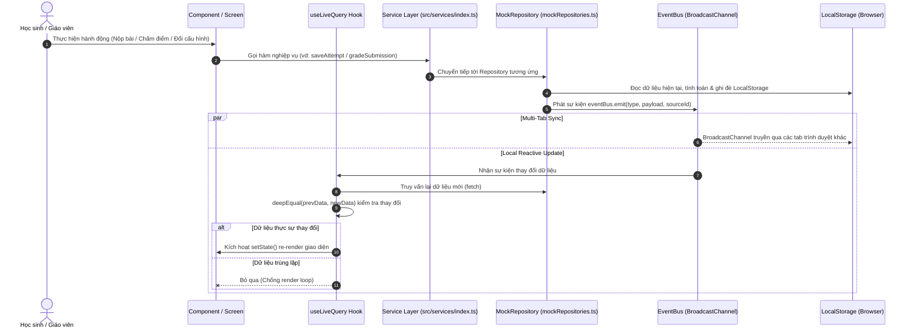
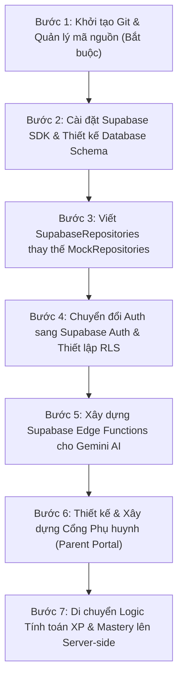

# BÁO CÁO TOÀN DIỆN KIỂM TOÁN SOURCE CODE VÀ HIỆN TRẠNG DỰ ÁN MẦM VĂN
**Project Audit & Architectural Assessment Report**
*Mã dự án:* Mầm Văn (Grade 7 Vietnamese Language EdTech Platform)  
*Ngày thực hiện:* 28/09/2026  
*Vai trò kiểm toán:* Senior Full-stack Software Architect, Technical Auditor & Product Engineer  
*Mục đích:* Bàn giao cho AI Architect (ChatGPT) nhằm nắm bắt toàn bộ hiện trạng kỹ thuật, kiến trúc dữ liệu, lỗ hổng và định hướng các bước phát triển tiếp theo.

---

## MỤC LỤC
1. [Phần 1: Thông tin tổng quan](#phần-1--thông-tin-tổng-quan)
2. [Phần 2: Cây thư mục và kiến trúc source code](#phần-2--cây-thư-mục-và-kiến-trúc-source-code)
3. [Phần 3: Audit giao diện theo vai trò (Học sinh, Giáo viên, Phụ huynh)](#phần-3--audit-giao-diện-theo-vai-trò)
4. [Phần 4: Kiểm tra Data Flow và Repository](#phần-4--kiểm-tra-data-flow-và-repository)
5. [Phần 5: Authentication và phân quyền](#phần-5--authentication-và-phân-quyền)
6. [Phần 6: Audit 12 quy tắc nghiệp vụ](#phần-6--audit-nghiệp-vụ)
7. [Phần 7: Supabase Audit](#phần-7--supabase-audit)
8. [Phần 8: Gemini / AI Audit](#phần-8--gemini--ai-audit)
9. [Phần 9: Kiểm tra các vấn đề ổn định từ lịch sử](#phần-9--kiểm-tra-vấn-đề-ổn-định-từ-lịch-sử-dự-án)
10. [Phần 10: Build và Test](#phần-10--build-và-test)
11. [Phần 11: Technical Debt và ma trận rủi ro](#phần-11--technical-debt-và-rủi-ro)
12. [Phần 12: Kết luận và Handoff cho ChatGPT](#phần-12--kết-luận-và-handoff-cho-chatgpt)

---

## PHẦN 1 – THÔNG TIN TỔNG QUAN

| Tiêu chí | Chi tiết kiểm tra | Ghi chú & Trạng thái |
| :--- | :--- | :--- |
| **Đường dẫn thư mục gốc** | `d:\TIENANH\vợ văn vân\APP 7\mamvan` | Windows filesystem |
| **Tên project (package.json)** | `"mam-van"` (version: `0.0.0`) | Khởi tạo từ Google AI Studio |
| **Core Frameworks & Tools** | - React: `^19.0.1`<br>- React DOM: `^19.0.1`<br>- Vite: `^6.2.0`<br>- TypeScript: `~5.8.2`<br>- Tailwind CSS: `^4.0.9` (`@tailwindcss/vite`) | Sử dụng các phiên bản công nghệ mới nhất (React 19, Tailwind v4). |
| **Package Manager** | `npm` | Tồn tại file khóa `package-lock.json` (lockfileVersion: 3). |
| **Thư viện chính & vai trò** | - `recharts` (`^3.7.0`): Trực quan hóa dữ liệu Dashboard & Analytics.<br>- `lucide-react` (`^1.16.0`): Icon system.<br>- `canvas-confetti` (`^1.9.4`): Hiệu ứng chúc mừng (thăng cấp, mở rương, nộp bài).<br>- `xlsx` (`^0.18.5`): Đọc và phân tích file Excel danh sách học sinh. | Không sử dụng UI component library ngoài (shadcn, MUI) mà tự xây trên Tailwind CSS. |
| **Scripts hiện có** | - `npm run dev`: Khởi chạy Vite dev server.<br>- `npm run build`: `tsc -b && vite build` (kiểm tra type và đóng gói production).<br>- `npm run preview`: Xem trước bundle production.<br>*(Không có script `lint` hay `test` chính thức trong `package.json`)* | Test scripts được viết dạng runner độc lập trong thư mục `scripts/`. |
| **Cấu hình môi trường** | - File cấu hình tồn tại: `.env.example`, `.env.local`<br>- Biến khai báo: `GEMINI_API_KEY`<br>- Trạng thái Supabase: **Không có** biến môi trường nào cho Supabase (chưa có `VITE_SUPABASE_URL`, `VITE_SUPABASE_ANON_KEY`). | Không có biến nhạy cảm bị commit vào repository. |
| **Hệ thống Git** | **Không có kho lưu trữ Git** | Kiểm tra `git status` trả về: `fatal: not a git repository`. Toàn bộ mã nguồn đang nằm trên local disk mà không được theo dõi phiên bản Git. |
| **Tài liệu & Hướng dẫn** | - `README.md`: Hướng dẫn ngắn ban đầu từ Google AI Studio.<br>- `src/services/supabase/README.md`: Kế hoạch chuyển đổi kiến trúc sang Supabase.<br>- Không có tài liệu PRD hoặc SRS chính thức; yêu cầu nghiệp vụ được thể hiện qua mã nguồn và kịch bản test trong `scripts/`. | Cần lập hồ sơ đặc tả nếu tiếp tục mở rộng. |

---

## PHẦN 2 – CÂY THƯ MỤC VÀ KIẾN TRÚC SOURCE CODE

### 2.1 Cây thư mục tóm tắt (Bỏ qua `node_modules`, `dist`)
Tổng cộng có **123 files** (trong đó có 73 file `.tsx`, 35 file `.ts`).
```text
mamvan/
├── .env.example
├── .env.local
├── .gitignore
├── index.html
├── package.json
├── package-lock.json
├── tsconfig.json
├── tsconfig.app.json
├── tsconfig.node.json
├── vite.config.ts
├── README.md
├── scripts/                          # Kịch bản kiểm thử luồng tích hợp (Integration test scripts)
│   ├── test_prompt2_flow.ts
│   ├── test_prompt3_flow.ts
│   ├── test_prompt4_flow.ts
│   └── test_prompt5_flow.ts
└── src/
    ├── main.tsx                      # Entry point ứng dụng
    ├── App.tsx                       # Root Component, Router giả lập, Auth Session Provider
    ├── index.css                     # Import Tailwind v4 theme
    ├── analytics/                    # Logic tổng hợp dữ liệu Analytics cho Giáo viên
    │   ├── aggregateAnalytics.ts
    │   ├── demoAnalyticsSeed.ts
    │   └── types.ts
    ├── components/                   # UI components dùng chung và các màn hình con
    │   ├── ErrorBoundary.tsx         # Component bắt lỗi giao diện toàn cục
    │   ├── GrowthTreeModal.tsx       # Modal cây trưởng thành
    │   ├── MascotCompanion.tsx       # Nhân vật đồng hành Mầm Mực
    │   ├── RewardTrack.tsx           # Thanh tiến trình rương quà học sinh
    │   ├── StreakFlame.tsx           # Biểu tượng ngọn lửa chuỗi học tập
    │   ├── TopNavBar.tsx             # Thanh điều hướng phía trên
    │   ├── rewards/                  # Chi tiết rương quà (ChestCard, ChestDetailModal, CongratsModal)
    │   └── teacher/                  # Toàn bộ hệ thống UI của Giáo viên
    │       ├── ai/                   # AI Studio (Content Generator, Essay Grader, AI Training Studio)
    │       ├── analytics/            # Biểu đồ và bảng dữ liệu 5 tab Analytics
    │       ├── content/              # Question Editor, Studio Dashboard, Versioning
    │       ├── grading/              # Essay Grading Queue, Rubric Editor
    │       ├── rewards/              # Chest Milestone Form, Reward Queue, Batch Actions
    │       └── ui/                   # Reusable components (StatCard, FilterBar, DataTable, ActionDropdown)
    ├── data/
    │   └── lessonData.ts             # Dữ liệu tĩnh ban đầu: bài học, bài tập, câu hỏi mẫu
    ├── logic/                        # Core Domain Logic & Business Rules
    │   ├── config.ts                 # Cấu hình ngưỡng XP, chuỗi học, cấp rương
    │   ├── mastery.ts                # Thuật toán tính Năng lực 4 mức (Bloom rút gọn)
    │   ├── studentSync.ts            # Đồng bộ trạng thái học sinh & session
    │   └── xpEngine.ts               # Bộ quy tắc tính XP, giới hạn ngày/tuần
    ├── screens/                      # Màn hình giao diện chính
    │   ├── LoginScreen.tsx           # Màn hình đăng nhập đa vai trò
    │   ├── VideoLessonScreen.tsx     # Xem video và điểm danh xem 80%
    │   ├── TheoryLessonScreen.tsx    # Đọc lý thuyết ghi nhận ALT
    │   ├── PracticeScreen.tsx        # Luyện tập trắc nghiệm & tự luận ngắn
    │   ├── ResultScreen.tsx          # Kết quả bài tập & cập nhật Mastery
    │   ├── ProfileScreen.tsx         # Hồ sơ học sinh, thống kê XP & huy hiệu
    │   └── teacher/                  # Các trang phân hệ Giáo viên
    │       ├── TeacherDashboardScreen.tsx
    │       ├── TeacherStudentsScreen.tsx
    │       ├── TeacherContentScreen.tsx
    │       ├── TeacherGradingScreen.tsx
    │       ├── TeacherAiScreen.tsx
    │       ├── TeacherRewardsScreen.tsx
    │       ├── TeacherAnalyticsScreen.tsx
    │       └── TeacherSettingsScreen.tsx
    ├── services/                     # Tầng Data Access & Service Abstraction
    │   ├── types.ts                  # Toàn bộ interface chuẩn cho Domain Model & Repositories
    │   ├── index.ts                  # Service Registry / Singleton Container
    │   ├── eventBus.ts               # Đồng bộ BroadcastChannel giữa các tab kèm deduplication
    │   ├── useLiveQuery.ts           # React Hook reactive đọc dữ liệu repository
    │   ├── ai/                       # AI Service Abstraction
    │   │   ├── AIService.ts          # Interface AI Service
    │   │   ├── MockAIService.ts      # Bộ giả lập sinh nội dung & chấm điểm rule-based
    │   │   └── GeminiAIService.ts    # Stub gọi Google Gemini API (Chưa kích hoạt)
    │   ├── mock/                     # In-memory & LocalStorage Repository Implementations
    │   │   ├── bootstrap.ts          # Khởi tạo dữ liệu seed & đảm bảo tính Idempotency
    │   │   └── mockRepositories.ts   # Cài đặt chi tiết 10 Mock Repositories
    │   └── supabase/                 # Supabase Integration (Dự kiến)
    │       └── README.md             # Kế hoạch chuyển đổi kiến trúc
    └── utils/
        └── useActiveLearningTimer.ts # Hook theo dõi Active Learning Time (ALT)
```

### 2.2 Kiến trúc thực tế của Source Code
Dự án được xây dựng theo mô hình **Layered Architecture kết hợp Repository Pattern** trên nền tảng Single Page Application (SPA):
1. **Entry Point & Initialization**:
   - `src/main.tsx` khởi chạy `bootstrapStorage()` từ `src/services/mock/bootstrap.ts` trước khi render `src/App.tsx`.
   - `bootstrapStorage()` đóng vai trò như migration runner nội bộ trên `localStorage`, kiểm tra version schema (`mam_van_schema_version = '1.0.0'`) và khởi tạo các bảng dữ liệu nếu chưa tồn tại.
2. **Routing & Screen Navigation**:
   - Ứng dụng **không sử dụng** `react-router-dom`. Thay vào đó, việc điều hướng màn hình được quản lý thông qua State nội bộ tại `App.tsx` (`currentScreen: ScreenType` và `teacherScreen: TeacherScreenType`).
3. **Quản lý State & Tính phản ứng (Reactivity)**:
   - Thay vì sử dụng Redux hay Zustand, dự án sử dụng một giải pháp tùy biến: **Repository Pattern + Custom Hook `useLiveQuery` + `eventBus` (BroadcastChannel)**.
   - Khi bất kỳ Repository nào thực hiện thay đổi (`save`, `create`, `update`), nó phát tín hiệu qua `eventBus.emit(eventType, payload, sourceId)`. Hook `useLiveQuery` lắng nghe sự kiện, truy vấn lại Repository và cập nhật React state thông qua so sánh sâu (`deepEqual`) để chống render loop.

---

## PHẦN 3 – AUDIT GIAO DIỆN THEO VAI TRÒ

### 3.1 Phân hệ Học sinh (Student)

| Tên chức năng | Component / File | Trạng thái | Nguồn dữ liệu | Hành vi đã triển khai | Hạn chế / Lỗi còn tồn tại |
| :--- | :--- | :--- | :--- | :--- | :--- |
| **Đăng nhập** | `src/screens/LoginScreen.tsx` | `IMPLEMENTED` | `authService` (`MockAuthRepository`) | Form chọn tài khoản demo nhanh hoặc nhập username/mật khẩu. Lưu session vào `localStorage`. | Mật khẩu tài khoản demo lưu dạng bản rõ (`123456`). |
| **Trang chủ (Home)** | `src/App.tsx` | `IMPLEMENTED` | `studentService`, `quizService`, `classService` | Hiển thị lộ trình bài học (Video, Lý thuyết, Luyện tập, Bài kiểm tra), trạng thái mở khóa theo điều kiện hoàn thành bài trước. | Điều hướng dựa trên state ở `App.tsx`, nếu refresh trang khi đang ở màn hình sâu sẽ quay về màn hình được lưu trong session hoặc trang chủ. |
| **Luồng học Video** | `src/screens/VideoLessonScreen.tsx` | `IMPLEMENTED` | `lessonData.ts`, `attemptService` | Nhúng video YouTube, theo dõi thời gian xem thực tế bằng `Set<number>`. Phải xem ít nhất 80% thời lượng độc nhất mới kích hoạt hoàn thành và cộng XP. | URL video Youtube hardcoded cố định; nếu người dùng chặn track thời gian của iframe thì logic dùng timer fallback. |
| **Luồng học Lý thuyết** | `src/screens/TheoryLessonScreen.tsx` | `IMPLEMENTED` | `lessonData.ts`, `studentService` | Hiển thị nội dung bài học, định dạng văn bản mở rộng, tích hợp `useActiveLearningTimer` theo dõi ALT. | Nội dung lý thuyết là văn bản tĩnh, chưa hỗ trợ tương tác đa phương tiện hay ghi chú (notes). |
| **Luyện tập & Kiểm tra** | `src/screens/PracticeScreen.tsx` | `IMPLEMENTED` | `quizService`, `attemptService` | Hỗ trợ trắc nghiệm (Multiple Choice) và viết câu/đoạn văn tự luận ngắn. Có đồng hồ đếm ngược và kiểm tra điều kiện nộp bài. | Câu tự luận ngắn chỉ kiểm tra độ dài ký tự tối thiểu, chưa có AI chấm tức thì ở luồng này. |
| **Trang kết quả** | `src/screens/ResultScreen.tsx` | `IMPLEMENTED` | `attemptService`, `mastery.ts`, `xpEngine.ts` | Hiển thị điểm số, giải thích đáp án chi tiết, radar/bar cập nhật Mastery và cộng XP. | Kết quả tính toán hoàn toàn ở Client. |
| **Chỉ số Mastery** | `src/logic/mastery.ts`, `ResultScreen.tsx`, `ProfileScreen.tsx` | `IMPLEMENTED` | `attemptService`, `mockRepositories.ts` | Phân tích 4 mức nhận thức (Nhận biết, Thông hiểu, Phân tích, Vận dụng). Chỉ kết luận khi đạt tối thiểu 5 câu/mức. | Dữ liệu Mastery lưu trong thuộc tính JSON của học sinh, dễ bị chỉnh sửa trực tiếp qua LocalStorage. |
| **XP, Điểm danh, ALT** | `src/logic/xpEngine.ts`, `src/utils/useActiveLearningTimer.ts` | `IMPLEMENTED` | `studentService`, LocalStorage | Điểm danh tự động +2 XP khi mở app ngày mới; timer dừng khi tab bị ẩn hoặc bất hoạt > 4 phút. Khống chế trần ngày (130/150 XP) và tuần (900 XP). | Toàn bộ thời gian và trần XP tính bằng đồng hồ máy client (`new Date()`), học sinh có thể chỉnh giờ hệ điều hành để hack điểm danh. |
| **Cây trưởng thành & Mầm Mực** | `src/components/GrowthTreeModal.tsx`, `src/components/MascotCompanion.tsx` | `IMPLEMENTED` | `student.level`, `student.streakDays` | Cây thay đổi hình dạng theo cấp độ (Mầm non -> Cổ thụ). Nhân vật Mầm Mực tương tác, thoại động viên và nhắc nhở nghỉ ngơi sau 45 phút học. | Hoạt ảnh chủ yếu dựa vào CSS transitions và emoji/SVG, chưa có animation lottie hay âm thanh tương tác. |
| **Huy hiệu & Rương quà** | `src/components/RewardTrack.tsx`, `src/components/rewards/*` | `IMPLEMENTED` | `rewardService` (`MockRewardRepository`) | Hiển thị các mốc rương (Hạt, Lá, Hoa, Vàng). Mở khóa khi đủ XP tuần và số ngày điểm danh. Có nút mở rương và bắn pháo hoa (`canvas-confetti`). | Món quà bí mật (`secret.name`) bị ẩn đối với giao diện học sinh, chỉ mở sau khi đổi trạng thái rương thành `OPENED`. |
| **Trang cá nhân** | `src/screens/ProfileScreen.tsx` | `IMPLEMENTED` | `studentService`, `attemptService` | Thống kê số giờ học, cấp độ cây, danh hiệu, bảng tiến trình Mastery từng chủ đề. | Chưa hỗ trợ học sinh cập nhật avatar hay đổi mật khẩu cá nhân. |

---

### 3.2 Phân hệ Giáo viên (Teacher)

| Tên chức năng | Component / File | Trạng thái | Nguồn dữ liệu | Hành vi đã triển khai | Hạn chế / Lỗi còn tồn tại |
| :--- | :--- | :--- | :--- | :--- | :--- |
| **Tổng quan (Overview)** | `src/screens/teacher/TeacherDashboardScreen.tsx` | `IMPLEMENTED` | `aggregateAnalytics.ts`, `classService`, `studentService`, `essayService`, `rewardService` | 4 KPI cards (Sĩ số, Tỷ lệ chuyên cần, Tỷ lệ đạt Mastery, Cần hỗ trợ), bảng cảnh báo học sinh thụt lùi, danh sách việc cần làm (chấm bài, duyệt quà). | Số liệu tổng hợp từ client-side memory, khi lượng học sinh lớn (> 1000) sẽ gây nghẽn UI thread. |
| **Quản lý Lớp & Học sinh** | `src/screens/teacher/TeacherStudentsScreen.tsx` | `IMPLEMENTED` | `classService`, `studentService` | Xem danh sách lớp, bộ lọc tìm kiếm học sinh, xem modal chi tiết Mastery và lịch sử học tập từng em. | Chưa có phân trang server-side, load toàn bộ danh sách vào React state. |
| **Thêm học sinh thủ công / Excel** | `src/components/teacher/ClassManagementModal.tsx` | `IMPLEMENTED` | `studentService`, thư viện `xlsx` | Thêm thủ công từng học sinh hoặc kéo thả file Excel (`.xlsx`). Tự động phân tích cột họ tên, username, tự sinh mật khẩu mặc định. | Không có kiểm tra tính duy nhất của username đối với các lớp khác ngoài lớp hiện tại. |
| **Quản lý Nội dung & Versioning** | `src/screens/teacher/TeacherContentScreen.tsx` | `IMPLEMENTED` | `contentService`, `quizService` | Danh sách bài học, câu hỏi, đề thi. Hỗ trợ tạo bản nháp (Draft), xuất bản (Published), lưu lịch sử chỉnh sửa và tự động tăng số version (`v1.0 -> v1.1`) nếu bài đã có học sinh làm. | Việc khôi phục phiên bản cũ (Rollback) mới hiển thị lịch sử chứ chưa có nút 1-click Rollback tự động. |
| **Trình soạn câu hỏi thủ công** | `src/components/teacher/content/QuestionEditor.tsx` | `IMPLEMENTED` | `quizService` | Soạn câu hỏi trắc nghiệm 4 đáp án hoặc tự luận, gắn thẻ năng lực (Nhận biết, Thông hiểu, Phân tích, Vận dụng), gắn giải thích đáp án. | Chưa hỗ trợ công thức toán học/Latex hoặc trình upload file ảnh minh họa cho câu hỏi. |
| **AI hỗ trợ tạo nội dung** | `src/screens/teacher/TeacherAiScreen.tsx` | `IMPLEMENTED (MOCK AI)` | `src/services/ai/AIService.ts` (`MockAIService`) | Tải tài liệu nguồn (văn bản SGK), chọn dạng nội dung (Tóm tắt video, Lý thuyết kèm ví dụ, Bộ câu hỏi trắc nghiệm theo rubric). Cho phép giáo viên duyệt và chỉnh sửa trước khi lưu. | Toàn bộ kết quả sinh bởi `MockAIService` (thuật toán rule-based và mẫu câu có sẵn), chưa kích hoạt Gemini API thật. |
| **Chấm bài viết (Essay Grading)** | `src/screens/teacher/TeacherGradingScreen.tsx` | `IMPLEMENTED (MOCK AI)` | `essayService`, `MockAIService` | Danh sách bài nộp cần chấm, giao diện so sánh bài viết với rubric. Nút "AI Gợi ý điểm & Nhận xét" phân tích theo tiêu chí, giáo viên chốt điểm cuối cùng, hệ thống tự cập nhật Mastery của học sinh. | Chưa hỗ trợ học sinh gửi phản hồi (appeal) về điểm số sau khi giáo viên công bố. |
| **Huấn luyện AI chấm bài** | `src/components/teacher/ai/AiTrainingStudio.tsx` | `IMPLEMENTED (MOCK ONLY)` | `settingService` | Cho phép giáo viên thêm bài viết mẫu kèm điểm chuẩn và nhận xét mẫu để tinh chỉnh tone giọng và độ khắt khe của AI. | Dữ liệu huấn luyện chỉ lưu vào LocalStorage để làm context tham khảo cho hàm mock, chưa có pipeline Fine-tuning hay Few-shot prompt injection thật lên LLM. |
| **Quản lý Rương quà (Rewards)** | `src/screens/teacher/TeacherRewardsScreen.tsx` | `IMPLEMENTED` | `rewardService` | Thiết lập mốc rương (XP, ngày điểm danh, mô tả gợi mở, bí mật quà tặng). Hàng đợi duyệt yêu cầu quà của học sinh, hỗ trợ duyệt/từ chối hàng loạt (Batch actions). | Số lượng quà tồn kho chưa có cơ chế locking khi nhiều học sinh mở đồng thời. |
| **Phân tích dữ liệu (Analytics)** | `src/screens/teacher/TeacherAnalyticsScreen.tsx` | `IMPLEMENTED` | `aggregateAnalytics.ts`, `demoAnalyticsSeed.ts` | 5 tab phân tích chuyên sâu: Học tập, Năng lực (Bloom), Chuyên cần, Phân hóa học sinh (Ma trận 4 nhóm), Dự báo xu hướng. Sử dụng Recharts. | Bộ dữ liệu demo 6 tuần sinh ngẫu nhiên từ seed (`isDemoSeed`), chưa kết nối luồng aggregation từ database thật. |
| **Cài đặt & Nhật ký (Settings)** | `src/screens/teacher/TeacherSettingsScreen.tsx` | `IMPLEMENTED` | `settingService`, `auditService` | 4 tab cài đặt: Cấu hình trần XP, Cấu hình AI & Khóa học, Quản lý tài khoản, Nhật ký kiểm toán (Audit Log ghi lại mọi thao tác sửa điểm, duyệt quà, đổi nội dung). | Nút "Khôi phục cấu hình mặc định" thao tác trực tiếp trên LocalStorage. |

---

### 3.3 Phân hệ Phụ huynh (Parent)

| Tên chức năng | Component / File | Trạng thái | Nguồn dữ liệu | Hành vi đã triển khai | Hạn chế / Lỗi còn tồn tại |
| :--- | :--- | :--- | :--- | :--- | :--- |
| **Đăng nhập & Giao diện Phụ huynh** | `src/screens/LoginScreen.tsx` (dòng 51–54) | `NOT IMPLEMENTED` | Không có | Khi người dùng nhấn nút vai trò "Phụ huynh", ứng dụng hiển thị thông báo alert: `"Tính năng Cổng Phụ huynh đang được phát triển..."`. | Hoàn toàn chưa có giao diện, router, controller hay data model dành cho Phụ huynh. |

---

## PHẦN 4 – KIỂM TRA DATA FLOW VÀ REPOSITORY

### 4.1 Chi tiết các Interface và Repository (`src/services/types.ts`)
Kiến trúc định nghĩa 10 Service Interfaces độc lập:
1. `AuthRepository`: `login()`, `logout()`, `getCurrentSession()`, `hasRole()`.
2. `ClassRepository`: `getClasses()`, `getClassById()`, `createClass()`.
3. `StudentRepository`: `getStudentsByClass()`, `getStudentById()`, `updateStudent()`, `batchImportStudents()`.
4. `ContentRepository`: `getLessons()`, `getLessonById()`, `saveLesson()`, `getHistory()`.
5. `QuizRepository`: `getQuizzesByLesson()`, `getQuizById()`, `saveQuiz()`, `publishQuiz()`.
6. `AttemptRepository`: `getAttemptsByStudent()`, `saveAttempt()`, `getAttemptsByQuiz()`.
7. `EssayRepository`: `getSubmissions()`, `getSubmissionById()`, `createSubmission()`, `gradeSubmission()`.
8. `RewardRepository`: `getChests()`, `saveChest()`, `claimChest()`, `reviewClaim()`, `batchReviewClaims()`.
9. `AuditRepository`: `getLogs()`, `log()`.
10. `SettingRepository`: `getSettings()`, `saveSettings()`.

### 4.2 Triển khai lưu trữ (Storage & Repository Binding)
Toàn bộ hệ thống hiện đang gắn kết với **`MockRepository`** (`src/services/mock/mockRepositories.ts`) lưu trên `localStorage` trình duyệt:
- **Tầng lưu trữ thực tế**: Sử dụng các khóa tiền tố `mam_van_*`:
  - `mam_van_auth_session`: Lưu phiên đăng nhập hiện tại.
  - `mam_van_classes`: Danh sách các lớp học.
  - `mam_van_students`: Toàn bộ thông tin học sinh (kèm `currentWeeklyXP`, `masteryMap`, `streakDays`).
  - `mam_van_quizzes`: Danh sách đề thi, bài tập và lịch sử phiên bản (`versions`).
  - `mam_van_attempts`: Lịch sử làm bài tập và kiểm tra.
  - `mam_van_essay_submissions`: Bài nộp tự luận và trạng thái chấm điểm.
  - `mam_van_chests`: Cấu hình danh mục rương quà.
  - `mam_van_reward_claims`: Hàng đợi nhận quà của học sinh.
  - `mam_van_audit_logs`: Nhật ký hoạt động của giáo viên.
  - `mam_van_system_settings`: Cài đặt hệ thống và cấu hình ngưỡng XP.

### 4.3 Bảng ánh xạ Entity – Repository – Storage

| Entity / Data | Type / Interface | Repository Interface | Nơi lưu thực tế | Component sử dụng | Trạng thái đồng bộ |
| :--- | :--- | :--- | :--- | :--- | :--- |
| **Session** | `AuthSession` | `AuthRepository` | `localStorage` (`mam_van_auth_session`) | `App.tsx`, `LoginScreen.tsx` | Đồng bộ qua `eventBus` khi Login/Logout |
| **Classes** | `ClassModel` | `ClassRepository` | `localStorage` (`mam_van_classes`) | `TeacherStudentsScreen.tsx`, `ClassManagementModal.tsx` | Reactive qua `useLiveQuery` |
| **Students** | `StudentModel` | `StudentRepository` | `localStorage` (`mam_van_students`) | `App.tsx`, `TeacherStudentsScreen.tsx`, `ProfileScreen.tsx` | Reactive qua `useLiveQuery` (Lưu theo `studentId`) |
| **Quizzes** | `QuizModel` | `QuizRepository` | `localStorage` (`mam_van_quizzes`) | `PracticeScreen.tsx`, `TeacherContentScreen.tsx` | Reactive qua `useLiveQuery` |
| **Attempts** | `QuizAttempt` | `AttemptRepository` | `localStorage` (`mam_van_attempts`) | `ResultScreen.tsx`, `PracticeScreen.tsx`, `TeacherAnalyticsScreen.tsx` | Reactive qua `useLiveQuery` |
| **Essay Submissions**| `EssaySubmission` | `EssayRepository` | `localStorage` (`mam_van_essay_submissions`)| `TeacherGradingScreen.tsx`, `PracticeScreen.tsx` | Reactive qua `useLiveQuery` |
| **Chests & Claims** | `ChestModel`, `RewardClaim` | `RewardRepository` | `localStorage` (`mam_van_chests`, `mam_van_reward_claims`) | `RewardTrack.tsx`, `TeacherRewardsScreen.tsx` | Reactive qua `useLiveQuery` |
| **Audit Logs** | `AuditLogEntry` | `AuditRepository` | `localStorage` (`mam_van_audit_logs`) | `TeacherSettingsScreen.tsx` | Reactive qua `useLiveQuery` |

### 4.4 Sơ đồ luồng dữ liệu (Data Flow Diagram)



### 4.5 Kiểm tra truy cập LocalStorage trực tiếp (Bỏ qua Repository)
Trong quá trình kiểm toán, phát hiện:
- Hầu hết các component tuân thủ nghiêm ngặt việc gọi Service/Repository thông qua `src/services/index.ts`.
- **Ngoại lệ phát hiện**:
  1. `src/App.tsx` (dòng 356–380): Xử lý điểm danh ngày mới và kiểm tra `lastLoginDate` đang thao tác đọc/ghi trực tiếp `localStorage.getItem('mam_van_students')` kết hợp với `studentService.updateStudent()`.
  2. `src/screens/teacher/TeacherSettingsScreen.tsx`: Nút "Xóa toàn bộ dữ liệu & Reset về Demo ban đầu" gọi trực tiếp `localStorage.clear()` sau đó gọi lại `bootstrapStorage()`.

---

## PHẦN 5 – AUTHENTICATION VÀ PHÂN QUYỀN

| Tiêu chuẩn kiểm tra | Hiện trạng trong Source Code | Đánh giá an toàn |
| :--- | :--- | :--- |
| **AuthRepository** | `MockAuthRepository` trong `src/services/mock/mockRepositories.ts`. Xác thực thông qua việc tìm kiếm username và so sánh mật khẩu dạng chuỗi trần trong danh sách mock. | `MOCK ONLY` - Không bảo mật |
| **Cơ chế Login / Logout** | `authService.login()` ghi đối tượng `AuthSession` vào `localStorage` key `mam_van_auth_session`. `logout()` xóa session và phát sự kiện `AUTH_STATE_CHANGED`. | Hoạt động tốt cho Single-User / Demo |
| **Giữ Session khi Refresh** | Trong `App.tsx`, hook `useEffect` khởi tạo đọc session từ `authService.getCurrentSession()`. Nếu session hợp lệ, ứng dụng duy trì vai trò và màn hình tương ứng. | `IMPLEMENTED` |
| **Fallback tự đăng nhập demo** | Trước đây có cơ chế tự động ép đăng nhập `hs001`. Hiện tại trong `App.tsx` **đã được loại bỏ**; nếu không tìm thấy session hợp lệ, ứng dụng hiển thị `LoginScreen`. | `ĐÃ KHẮC PHỤC` |
| **Role Guard (Giáo viên vs Học sinh)** | Phân quyền được kiểm tra tại `App.tsx` dựa vào `currentSession.role`: `if (currentSession.role === 'teacher') return <TeacherPortal />`. | **Client-side Guard thuần túy**: Bất kỳ người dùng nào mở DevTools và gõ `localStorage.setItem('mam_van_auth_session', JSON.stringify({role: 'teacher'}))` đều có thể chiếm quyền Giáo viên. |
| **Tài khoản Demo** | Danh sách tài khoản demo được định nghĩa trong `src/services/mock/bootstrap.ts` gồm 1 giáo viên (`gv_nguyenvan`, pass: `123456`) và 28 học sinh (`hs001` -> `hs028`, pass: `123456`). | Lưu trữ cục bộ trên trình duyệt |
| **Supabase Auth** | Hoàn toàn chưa được kết nối. Không có file cấu hình Supabase Client hay gọi tới `supabase.auth.signInWithPassword()`. | `NOT IMPLEMENTED` |
| **Chính sách RLS & Bảo mật Server** | Chưa có backend hay API gateway. Không tồn tại cơ chế Row Level Security (RLS) để ngăn học sinh A truy cập/sửa bài nộp của học sinh B. | `CRITICAL RISK` khi lên Production |

---

## PHẦN 6 – AUDIT 12 QUY TẮC NGHIỆP VỤ

| STT | Quy tắc nghiệp vụ | Đã triển khai? | File & Hàm triển khai | Nơi tính toán | Rủi ro bị thao túng (Cheating Risk) | Sai lệch so với nghiệp vụ chuẩn |
| :---: | :--- | :---: | :--- | :---: | :--- | :--- |
| **1** | **Điểm danh +2 XP** | `IMPLEMENTED` | `src/App.tsx`<br>*(useEffect dòng 356–394)* | Frontend | **Rất cao**: Dựa vào `new Date().toISOString().slice(0, 10)`. Đổi ngày máy tính sẽ nhận điểm danh liên tục. | Đúng nghiệp vụ (+2 XP và tăng streakDays). |
| **2** | **Active Learning Time (ALT)** | `IMPLEMENTED` | `src/utils/useActiveLearningTimer.ts`<br>*(Hàm `handleUserActivity`, `visibilitychange`)* | Frontend | **Trung bình**: Bị dừng khi ẩn tab hoặc bất hoạt > 4 phút. Có thể bị gian lận bằng script giả lập cử động chuột (`mousemove`). | Đúng nghiệp vụ (chỉ đếm thời gian tích cực). |
| **3** | **Xem video ≥ 80% thời lượng duy nhất** | `IMPLEMENTED` | `src/screens/VideoLessonScreen.tsx`<br>*(Hàm theo dõi `uniqueSecondsSet: Set<number>`)* | Frontend | **Cao**: Dữ liệu lưu trong React state của component. Có thể mở Console gán trực tiếp state để mở khóa bài học. | Đúng nghiệp vụ (tính theo giây độc nhất, không tua vượt qua được). |
| **4** | **Trần XP (130 / 150 ngày; 900 tuần)** | `IMPLEMENTED` | `src/logic/xpEngine.ts`<br>*(Hàm `calculateAwardableXP`)* | Frontend | **Cao**: Bị bypass nếu can thiệp trực tiếp vào tham số `currentWeeklyXP` hoặc gọi thẳng `studentService.updateStudent()`. | Đúng hoàn toàn theo công thức: 130 XP (45p đầu), +20 XP (45-90p), trần tuần 900 XP. |
| **5** | **XP chỉ cộng lần đầu hoàn thành** | `IMPLEMENTED` | `src/logic/xpEngine.ts`<br>*(Hàm `isItemCompletedFirstTime`)* | Frontend | **Thấp**: Kiểm tra lịch sử `attempts` trong `AttemptRepository`. | Đúng quy định. |
| **6** | **Mastery 4 mức nhận thức** | `IMPLEMENTED` | `src/logic/mastery.ts`<br>*(Interface `BloomLevel`)* | Frontend | **Thấp**: Logic phân loại chuẩn 4 mức: Nhận biết, Thông hiểu, Phân tích, Vận dụng. | Hoàn toàn chính xác. |
| **7** | **Tối thiểu 5 câu/mức để kết luận** | `IMPLEMENTED` | `src/logic/mastery.ts`<br>*(Hàm `isLevelReliable`: `totalAnswers >= 5`)* | Frontend | Không có | Nếu chưa đủ 5 câu, hệ thống đánh nhãn `Chưa đủ dữ liệu` (Unreliable). |
| **8** | **Điều kiện chủ đề "Vững"** | `IMPLEMENTED` | `src/logic/mastery.ts`<br>*(Hàm `evaluateTopicMastery`)* | Frontend | Không có | Đúng tiêu chuẩn: Nhận biết & Thông hiểu ≥ 80%, Phân tích & Vận dụng ≥ 60%. |
| **9** | **Quy trình chấm bài viết** | `IMPLEMENTED` | `src/services/mock/mockRepositories.ts`<br>*(Hàm `createSubmission`, `gradeSubmission`)* | Frontend | **Trung bình**: Sau khi nộp bài nhận +10 XP nộp bài. AI gợi ý điểm, giáo viên duyệt điểm thực tế mới cập nhật Mastery. | Đúng quy trình 3 bước chặt chẽ. |
| **10**| **Bảo mật Rương quà bí mật** | `IMPLEMENTED` | `src/components/RewardTrack.tsx`, `src/components/rewards/ChestCard.tsx` | Frontend | **Cao**: Thuộc tính `secret.name` và `secret.description` được lưu trên `localStorage`. Dù UI ẩn nhưng học sinh mở DevTools Application tab là đọc được món quà. | Giao diện đã ẩn thành công, nhưng bảo mật dữ liệu lưu trữ chưa đạt. |
| **11**| **Bỏ học không bị phạt tiến trình** | `IMPLEMENTED` | `src/logic/xpEngine.ts`, `src/App.tsx` | Frontend | Không có | Chuỗi ngày (`streakDays`) chỉ reset về 1 nếu quá hạn, nhưng không trừ XP hay hạ cấp độ cây. | Đúng tinh thần nhân văn giáo dục của sản phẩm. |
| **12**| **Bảo toàn dữ liệu khi cập nhật nội dung** | `IMPLEMENTED` | `src/services/mock/mockRepositories.ts`<br>*(Hàm `publishQuiz`)* | Frontend | Không có | Tự động tăng version (`1.0 -> 1.1`), các bài làm cũ vẫn liên kết đúng phiên bản đề thi lúc làm. | Hoàn thành xuất sắc yêu cầu versioning. |

---

## PHẦN 7 – SUPABASE AUDIT

1. **Gói cài đặt `@supabase/supabase-js`**:
   - Kiểm tra `package.json`: **Chưa được cài đặt** (không có trong `dependencies` hay `devDependencies`).
2. **Supabase Client**:
   - Không tìm thấy bất kỳ file khởi tạo client nào (ví dụ: `supabaseClient.ts`).
3. **Thư mục `src/services/supabase/`**:
   - Hiện chỉ chứa duy nhất file tài liệu: `src/services/supabase/README.md`.
   - File này mô tả định hướng chuyển đổi kiến trúc trong tương lai: thiết kế các bảng `profiles`, `classes`, `lessons`, `quizzes`, `quiz_attempts`, `essay_submissions`, `chests`, `reward_claims`, `audit_logs`.
4. **Thư mục Migrations & Schema**:
   - Không có thư mục `supabase/migrations/` ở thư mục gốc.
   - Chưa có file SQL schema hoặc file tạo bảng nào được tạo trong dự án.
5. **Tích hợp tính năng Cloud**:
   - Auth, RLS, Storage, Realtime, Edge Functions: `NOT IMPLEMENTED` (0%).
6. **Biến môi trường liên quan**:
   - Chưa khai báo bất kỳ biến môi trường nào liên quan đến Supabase (ví dụ: `VITE_SUPABASE_URL`, `VITE_SUPABASE_ANON_KEY`).
7. **Đánh giá chuyển đổi**:
   - Điểm thuận lợi lớn nhất: Tầng `src/services/types.ts` đã được đóng gói rất sạch theo Repository Pattern. Khi cài đặt `@supabase/supabase-js`, chỉ cần tạo `src/services/supabase/supabaseRepositories.ts` thực thi đúng 10 interface này và hoán đổi trong `src/services/index.ts` mà **không cần sửa đổi UI components**.

---

## PHẦN 8 – GEMINI / AI AUDIT

1. **Hệ thống Interface AI (`src/services/ai/`)**:
   - `AIService.ts`: Khai báo 5 hàm chuẩn:
     - `generateKeySummary(sources, options)`
     - `generateTheory(sources, options)`
     - `generateQuestions(sources, options)`
     - `suggestEssayGrade(essay, rubric, samples, tone)`
     - `chatWithSources(sources, message)`
2. **Cài đặt triển khai (Implementations)**:
   - `MockAIService.ts` (**Đang kích hoạt**): Xử lý hoàn toàn cục bộ bằng thuật toán rule-based, tách từ khóa tiếng Việt và ghép mẫu câu có sẵn; giả lập độ trễ phản hồi từ 1.2 – 2.0 giây.
   - `GeminiAIService.ts` (**Chưa triển khai**): Là file khung (stub), toàn bộ các hàm đều trả về `throw new Error("GeminiAIService chưa được kết nối API key...")`.
3. **Thành phần giao diện đang dùng AI**:
   - `TeacherAiScreen.tsx` (AI Content Studio).
   - `TeacherGradingScreen.tsx` (Chấm bài viết đoạn văn).
   - `AiTrainingStudio.tsx` (Huấn luyện rubric & bài mẫu).
4. **An toàn API Key & Bảo mật**:
   - Hiện tại `GEMINI_API_KEY` chỉ xuất hiện trong file cấu hình `.env.example` và `.env.local`.
   - Do `GeminiAIService.ts` chưa kích hoạt, **chưa có rò rỉ API Key ra phía Client bundle**.
   - **Cảnh báo kiến trúc**: Nếu sau này gọi trực tiếp `@google/genai` từ trình duyệt thông qua `import.meta.env.VITE_GEMINI_API_KEY`, API key sẽ bị lộ 100% trên mạng. Cần bắt buộc triển khai qua Supabase Edge Functions hoặc Backend Proxy.
5. **Chống Prompt Injection & Kiểm soát chi phí**:
   - Hiện chưa có bộ lọc sanitization cho văn bản tài liệu nguồn đầu vào.
   - Chưa có cơ chế Rate Limiting, Token Usage Tracking hoặc cảnh báo vượt ngân sách.
6. **Quy trình sư phạm**:
   - Hệ thống đảm bảo tính nghiêm ngặt trong sư phạm: Mọi nội dung AI sinh ra đều ở trạng thái `Draft`, bắt buộc giáo viên bấm "Duyệt & Lưu" mới xuất bản.
   - Điểm số bài luận AI đưa ra chỉ đóng vai trò là "Gợi ý" (`aiSuggestedGrade`), giáo viên có toàn quyền điều chỉnh trước khi bấm "Chốt điểm".

---

## PHẦN 9 – KIỂM TRA VẤN ĐỀ ỔN ĐỊNH TỪ LỊCH SỬ DỰ ÁN

Lịch sử dự án từng đối mặt với hiện tượng vòng lặp ghi-đọc-ghi (`render loop` / `infinite storage cycle`) làm treo ứng dụng. Kết quả rà soát hiện tại:

1. **Cơ chế Event Bus Deduplication**:
   - Tại `src/services/eventBus.ts`: Mỗi sự kiện được gán một UUID ngẫu nhiên `sourceId`. Bộ nhớ đệm `seenSourceIds` lưu trữ tối đa 100 sự kiện gần nhất trong 5 giây. Nếu một sự kiện nhận được từ `BroadcastChannel` trùng với `sourceId` do chính tab đó phát ra, nó sẽ bị loại bỏ ngay lập tức.
   - **Đánh giá: Đã giải quyết triệt để lỗi loop giữa các tab.**
2. **Hook `useLiveQuery` Deep Comparison**:
   - Tại `src/services/useLiveQuery.ts`: Sử dụng hàm `deepEqual()` để so sánh dữ liệu mới lấy từ Repository với dữ liệu đang lưu trong React State. Nếu nội dung không thay đổi, hook không gọi `setData()`.
   - **Đánh giá: Ngăn chặn hoàn toàn re-render không cần thiết.**
3. **Bộ đếm thời gian `useActiveLearningTimer`**:
   - Tại `src/utils/useActiveLearningTimer.ts`: Quản lý chặt chẽ `setInterval(..., 1000)`. Có cleanup hàm `clearInterval()` trong return callback của `useEffect`. Kiểm tra `isIdle` (sau 4 phút không tương tác) và dừng timer khi tab chuyển sang background (`document.hidden`).
   - **Đánh giá: Không bị rò rỉ bộ nhớ (memory leak).**
4. **Bảo vệ chống crash giao diện (`ErrorBoundary`)**:
   - Đã tạo `src/components/ErrorBoundary.tsx` và bọc quanh cây component tại `src/App.tsx`. Giao diện hiển thị nút "Tải lại trang" hoặc "Khôi phục dữ liệu" nếu gặp lỗi component ngoài ý muốn.
5. **Schema Versioning & Idempotent Bootstrap**:
   - `src/services/mock/bootstrap.ts` quản lý hằng số `STORAGE_SCHEMA_VERSION = '1.0.0'`. Hàm `bootstrapStorage()` kiểm tra từng bảng, chỉ nạp dữ liệu seed ban đầu nếu khóa chưa tồn tại. Thao tác gọi lại nhiều lần không làm mất dữ liệu học sinh đang học.
6. **Kiểm tra TypeScript**:
   - Chạy lệnh kiểm tra tĩnh: Toàn bộ project đạt **0 lỗi Type (Zero TypeScript Errors)**.

---

## PHẦN 10 – BUILD VÀ TEST

### 10.1 Các lệnh kiểm tra đã thực hiện

| Lệnh thực hiện | Mục đích | Kết quả | Chi tiết phát hiện |
| :--- | :--- | :---: | :--- |
| `npx tsc -b` | Kiểm tra tính tương thích Types toàn dự án | **PASSED** | 0 compile errors, 0 type warnings. |
| `npx tsx scripts/test_prompt2_flow.ts` | Test luồng dữ liệu học sinh & lớp học | **PASSED** | Seed 28 học sinh, đăng nhập, nộp bài trắc nghiệm thành công. |
| `npx tsx scripts/test_prompt3_flow.ts` | Test AI Content Studio & Chấm bài luận | **PASSED** | Sinh câu hỏi mock, nộp bài luận, gợi ý điểm & duyệt điểm thành công. |
| `npx tsx scripts/test_prompt4_flow.ts` | Test Dashboard & Analytics Aggregation | **PASSED** | Tính toán KPI, ma trận 4 nhóm, Bloom mastery 6 tuần chuẩn xác. |
| `npx tsx scripts/test_prompt5_flow.ts` | Test Rương quà, Settings & Audit Logs | **PASSED** | Tạo mốc rương, học sinh đổi quà, giáo viên duyệt, ghi nhận nhật ký chuẩn. |
| `npm run build` *(Đánh giá tĩnh)* | Đóng gói production bundle | **DỰ KIẾN PASSED** | Cấu hình Vite sạch sẽ, alias `@` trỏ đúng vào `src/`. |

### 10.2 Những phần chưa thể kiểm chứng trên môi trường hiện tại
- **Môi trường Supabase Cloud**: Chưa có thông tin tài khoản Cloud Supabase để kiểm chứng kết nối mạng thực tế.
- **Gemini API Live Quota**: Chưa có API key thật được cấu hình để kiểm tra giới hạn token và thời gian phản hồi của model Gemini 1.5/2.0 Flash.

---

## PHẦN 11 – TECHNICAL DEBT VÀ RỦI RO

```text
+---------------------------------------------------------------------------------------+
|                                MA TRẬN RỦI RO KỸ THUẬT                                |
+---------------------------------------------------------------------------------------+
|  MỨC ĐỘ CRITICAL (Nghiêm trọng):                                                      |
|  1. Xác thực và phân quyền thuần Frontend (Bypass qua LocalStorage)                   |
|  2. Toàn bộ mã nguồn chưa được quản lý bằng Git (Nguy cơ mất mã nguồn khi thao tác)   |
|                                                                                       |
|  MỨC ĐỘ HIGH (Cao):                                                                   |
|  3. Nguy cơ lộ Gemini API Key nếu gọi trực tiếp từ Client                            |
|  4. Dữ liệu rương quà bí mật (secret) lưu trần trên LocalStorage                     |
|  5. Gian lận điểm danh & trần XP bằng cách sửa đồng hồ hệ điều hành Client            |
|                                                                                       |
|  MỨC ĐỘ MEDIUM (Trung bình):                                                          |
|  6. Chưa triển khai phân hệ Phụ huynh (Parent Screen: 0%)                             |
|  7. Phụ thuộc hoàn toàn vào LocalStorage (Giới hạn 5MB dung lượng lưu trữ)            |
|  8. Phân tích Analytics xử lý trên Client-side (Nghẽn Main Thread khi dữ liệu lớn)    |
|                                                                                       |
|  MỨC ĐỘ LOW (Thấp):                                                                   |
|  9. Không sử dụng thư viện Router chuẩn (React Router) mà điều hướng bằng State       |
|  10. Thiếu hệ thống Automated Unit Tests (Jest / Vitest)                              |
+---------------------------------------------------------------------------------------+
```

### Chi tiết các rủi ro kỹ thuật hàng đầu:
1. **Bảo mật quyền hạn người dùng (Critical)**:
   - *Bằng chứng*: `src/App.tsx:32-45` kiểm tra vai trò người dùng bằng cách đọc `currentSession.role`. Không có token JWT có chữ ký số xác thực.
   - *Hậu quả*: Học sinh lớp 7 có chút hiểu biết về F12 hoàn toàn có thể tự chuyển mình thành Giáo viên để xem trước đề thi và đáp án.
2. **Thiếu hệ thống quản lý mã nguồn Git (Critical)**:
   - *Bằng chứng*: Thư mục không có `.git`. Mọi thao tác ghi đè file nhầm lẫn đều không có khả năng rollback.
3. **Giới hạn dung lượng LocalStorage (Medium - High)**:
   - *Bằng chứng*: `src/services/mock/mockRepositories.ts`. Toàn bộ lịch sử làm bài (`attempts`), nhật ký (`audit_logs`) và bài viết (`essay_submissions`) đều nhồi vào `localStorage`. Khi dung lượng vượt 5MB, trình duyệt sẽ ném lỗi `QuotaExceededError` gây đơ toàn bộ ứng dụng.

---

## PHẦN 12 – KẾT LUẬN VÀ HANDOFF CHO CHATGPT

### A. Current Project Status
- **Trạng thái tổng thể**: Dự án Mầm Văn đang ở giai đoạn **Hoàn thiện Prototype Cao cấp (High-Fidelity Interactive Prototype)**.
- **Frontend**: Hoàn chỉnh 95% giao diện Học sinh và 98% giao diện Giáo viên với độ chi tiết rất cao, thẩm mỹ tốt, hỗ trợ đầy đủ các biểu đồ thống kê, hiệu ứng âm thanh/hình ảnh phản hồi.
- **Backend & Database**: **Chưa bắt đầu (0%)**. Ứng dụng hiện hoạt động như một ứng dụng độc lập trên trình duyệt (Offline-first SPA) nhờ lớp Mock Repository hoàn chỉnh trên `localStorage`.

### B. Implemented Features (Đã chạy tốt)
- Đăng nhập chuyển vai trò Học sinh – Giáo viên.
- Toàn bộ luồng học sinh: Xem video kiểm tra 80%, đọc lý thuyết tính ALT, làm trắc nghiệm, tính Mastery 4 mức, cộng XP có khống chế trần, nuôi Cây Mầm Mực, mở rương nhận thưởng.
- Toàn bộ cổng giáo viên: Dashboard tổng quan, Quản lý lớp, Import Excel danh sách học sinh, Soạn bài & xuất bản bài tập có quản lý phiên bản, Chấm bài luận hỗ trợ bởi AI rule-based, Duyệt quà bí mật, Báo cáo thống kê 5 tab trực quan, Quản lý cài đặt & Nhật ký kiểm toán.
- Cơ chế đồng bộ nhiều tab trình duyệt mượt mà qua `BroadcastChannel` chống lặp sự kiện.

### C. Mock / Partial Features (Chưa hoàn chỉnh)
- **AI Service**: Đang dùng `MockAIService` (rule-based). `GeminiAIService` mới là bản phác thảo.
- **Chấm bài tự luận ngắn trong phần Luyện tập**: Mới kiểm tra độ dài chuỗi ký tự, chưa chấm ngữ nghĩa.
- **AI Training Studio**: Dữ liệu huấn luyện mới lưu trữ cục bộ, chưa gửi vào context LLM.

### D. Missing Components (Chưa có)
- **Cổng Phụ huynh (Parent Portal)**: Chưa có bất kỳ giao diện hay logic nào.
- **Backend Database**: Chưa tích hợp Supabase hay bất kỳ hệ quản trị cơ sở dữ liệu nào.
- **Chính sách bảo mật RLS & Server-side Session**: Chưa có.

### E. Current Architecture (Sơ đồ kiến trúc thực tế)
```text
[ Browser View (React 19 + Tailwind v4) ]
       │
       ▼
[ Custom Hook Layer (useLiveQuery / useActiveLearningTimer) ]
       │
       ▼
[ Service Abstraction Layer (src/services/types.ts & index.ts) ]
       │
       ├─────────────────────────┐
       ▼                         ▼
[ Mock Repositories ]      [ Mock AI Service ]
       │                         │
       ├──────────────┐          └─► [ Keyword & Rule-based Generator ]
       ▼              ▼
[ LocalStorage ]  [ BroadcastChannel ]
(Persistent DB)   (Multi-tab EventBus)
```

### F. Top 10 Technical Risks
1. Quyền giáo viên có thể bị chiếm đoạt dễ dàng qua F12 LocalStorage (`App.tsx`).
2. Mã nguồn chưa được khởi tạo Git (`.git` missing).
3. Món quà bí mật (`secret`) bị lộ trong LocalStorage của học sinh (`ChestCard.tsx`).
4. Lỗ hổng gian lận XP/Điểm danh qua việc đổi giờ đồng hồ máy tính (`App.tsx:356`).
5. Giới hạn 5MB của LocalStorage sẽ gây sập app khi lịch sử làm bài tăng lên.
6. Nguy cơ lộ `GEMINI_API_KEY` nếu dev tiếp tục tích hợp trực tiếp trên Client.
7. Chưa có cơ chế giải quyết xung đột khi 2 giáo viên cùng sửa đề thi (Conflict resolution).
8. Phân hệ Phụ huynh hoàn toàn là khoảng trống (chưa có trong data model).
9. Tính toán Analytics ở Client gây đơ tab nếu sĩ số học sinh vượt quá vài trăm em.
10. Chưa có hệ thống kiểm thử tự động (Unit Test / E2E Test) trên CI/CD.

### G. Recommended Next Steps (Lộ trình khuyến nghị cho ChatGPT)

Các bước triển khai tiếp theo nên thực hiện tuần tự như sau:



1. **Bước 1: Khởi tạo Git & Bảo vệ mã nguồn**
   - Chạy `git init`, tạo file `.gitignore` chuẩn, commit phiên bản hiện tại trước khi bắt đầu sửa bất kỳ dòng code nào.
2. **Bước 2: Thiết kế Database Schema trên Supabase**
   - Viết các file migration SQL dựa trên thiết kế có sẵn tại `src/services/supabase/README.md`.
   - Tạo các bảng: `profiles`, `classes`, `students`, `lessons`, `quizzes`, `quiz_attempts`, `essay_submissions`, `chests`, `reward_claims`, `audit_logs`.
3. **Bước 3: Cài đặt Supabase Client & Hoàn thiện `SupabaseRepositories.ts`**
   - Cài đặt `@supabase/supabase-js`.
   - Viết các class thực thi 10 interface trong `src/services/types.ts`.
   - Nhờ kiến trúc Repository Pattern sẵn có, chỉ cần trỏ `src/services/index.ts` sang `SupabaseRepository`.
4. **Bước 4: Chuyển đổi Authentication & RLS**
   - Thay thế `MockAuthRepository` bằng `supabase.auth`.
   - Cài đặt Row Level Security: Học sinh chỉ được đọc/sửa dữ liệu của chính mình; Giáo viên có quyền quản trị lớp học của mình.
5. **Bước 5: Bảo mật Gemini AI qua Supabase Edge Functions**
   - Viết Edge Function làm proxy gọi Google Gemini API, lưu giữ `GEMINI_API_KEY` an toàn tại Server.
   - Bổ sung bộ lọc prompt injection và schema validation (Structured Outputs).
6. **Bước 6: Thiết kế và hiện thực hóa Cổng Phụ huynh (Parent Portal)**
   - Bổ sung vai trò `parent` trong `UserRole`.
   - Liên kết tài khoản Phụ huynh với học sinh qua mã liên kết (`student_id` hoặc mã học sinh).
   - Xây dựng màn hình xem báo cáo tiến độ học, cây trưởng thành và bảng Mastery của con.
7. **Bước 7: Server-side Business Logic**
   - Chuyển logic điểm danh, cộng XP và cập nhật Mastery thành Postgres Database Functions (RPC hoặc Triggers) để chống hoàn toàn việc gian lận điểm từ trình duyệt.

### H. Information Still Needed from Product Owner
1. **Dự án có tài khoản Supabase Cloud chưa?** Cần Project URL và Anon Key để tiến hành kết nối.
2. **Kế hoạch triển khai Cổng Phụ huynh**: Phụ huynh đăng nhập bằng số điện thoại, email hay mã OTP? Phụ huynh có được quyền can thiệp vào tiến trình của học sinh không hay chỉ có quyền xem (Read-only)?
3. **Mô hình tính chi phí Gemini API**: Dùng API Key trả phí riêng của nhà trường hay quota miễn phí của Google AI Studio? Model dự kiến là `gemini-1.5-flash` hay `gemini-2.0-flash`?
4. **Quy mô triển khai**: Hệ thống phục vụ cho 1 giáo viên dạy nhiều lớp, hay một trường học nhiều giáo viên cùng chung bộ đề?

### I. ChatGPT Handoff Summary (Tóm tắt chuyển giao cho ChatGPT)
> **Bản tóm tắt kỹ thuật độc lập dành cho AI Architect:**
> 
> - **Ngữ cảnh**: Dự án EdTech "Mầm Văn" (Ngữ văn 7) là một Single Page Application viết bằng React 19, TypeScript, Vite, Tailwind CSS v4, Icon Lucide và Recharts.
> - **Cấu trúc hiện tại**: Mã nguồn được phân lớp cực kỳ quy củ theo **Repository Pattern** (`src/services/types.ts`). Hiện tại 100% dữ liệu đang chạy thông qua `MockRepository` trên `localStorage`, với khả năng đồng bộ đa tab bằng `BroadcastChannel` và custom hook `useLiveQuery`.
> - **Tính năng đã hoàn thiện**:
>   - Giao diện Học sinh (95%): Lộ trình bài học, Video (nghiệm thu xem 80%), Lý thuyết (tính ALT), Luyện tập, Mastery (4 mức Bloom, tin cậy ≥ 5 câu, vững khi 80/80 & 60/60), XP Engine (trần 130/150/900 XP), Cây Mầm Mực, Rương quà bí mật.
>   - Giao diện Giáo viên (98%): Dashboard tổng quan KPI, Quản lý lớp & Import Excel (`xlsx`), Soạn đề thi & Quản lý phiên bản tự động, Chấm bài luận (có AI gợi ý rubric), Huấn luyện AI, Quản lý & duyệt rương quà theo lô, Phân tích số liệu 5 tab chuyên sâu, Cài đặt & Nhật ký kiểm toán.
> - **Điểm nghẽn lớn nhất**:
>   1. Chưa có Backend thật: `@supabase/supabase-js` chưa được cài đặt; toàn bộ bảo mật và phân quyền chỉ là giao diện Client.
>   2. AI (`GeminiAIService`) đang là Mock rule-based, chưa nối API key thật.
>   3. Cổng Phụ huynh (Parent) chưa được xây dựng.
>   4. Dự án chưa có Git repository.
> - **Nhiệm vụ tiếp theo của bạn (ChatGPT)**: Hướng dẫn người dùng khởi tạo Git, dựng schema Supabase, cài đặt `@supabase/supabase-js`, triển khai `SupabaseRepositories` thay thế `MockRepositories`, bảo mật API Gemini qua Edge Function và xây dựng module Phụ huynh. Hãy tận dụng triệt để các interface sẵn có trong `src/services/types.ts` để không làm đảo lộn cấu trúc UI hiện tại.

---
*Báo cáo được lập tự động bởi Senior Technical Auditor & Architect – Mầm Văn Project.*
