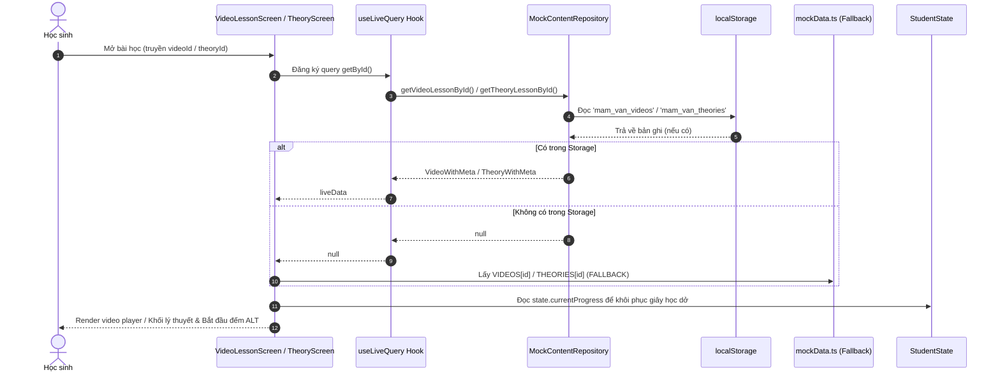
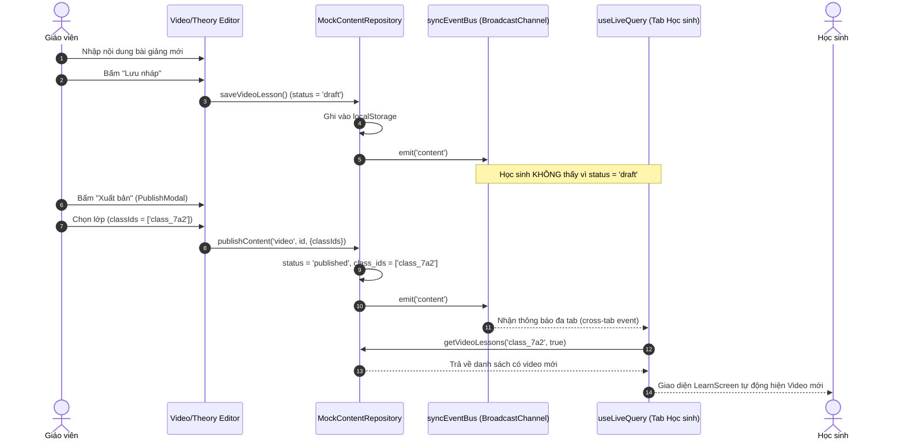

# BÁO CÁO KIỂM TOÁN NGUỒN DỮ LIỆU VÀ LUỒNG DỮ LIỆU HIỆN TẠI (PHASE 1)
**Project Audit: Mầm Văn (Grade 7 Vietnamese Language EdTech Platform)**  
*Mã tài liệu:* `DOC-MV-AUDIT-01`  
*Ngày thực hiện:* 29/09/2026  
*Vai trò kiểm toán:* Senior Software Architect, Data Architect, Business Analyst & QA Engineer  
*Phạm vi:* Toàn bộ Data Inventory, Video & Theory Flow, Question Bank & Quiz Flow, Publishing Workflow, Student Attempts & Progress Tracking.

---

## MỤC LỤC
1. [Phần A – Kiểm kê toàn bộ thực thể dữ liệu (Data Inventory)](#phần-a--kiểm-kê-toàn-bộ-thực-thể-dữ-liệu-data-inventory)
2. [Phần B – Luồng dữ liệu Bài giảng Video & Lý thuyết](#phần-b--luồng-dữ-liệu-bài-giảng-video--lý-thuyết)
3. [Phần C – Luồng dữ liệu Ngân hàng câu hỏi & Đề thi / Bài tập (Quiz)](#phần-c--luồng-dữ-liệu-ngân-hàng-câu-hỏi--đề-thi--bài-tập-quiz)
4. [Phần D – Kiểm toán quy trình xuất bản (Publishing Workflow Audit)](#phần-d--kiểm-toán-quy-trình-xuất-bản-publishing-workflow-audit)
5. [Phần E – Lịch sử làm bài (Attempts) & Tiến trình học sinh](#phần-e--lịch-sử-làm-bài-attempts--tiến-trình-học-sinh)

---

## PHẦN A – KIỂM KÊ TOÀN BỘ THỰC THỂ DỮ LIỆU (DATA INVENTORY)

> **Lưu ý kiểm toán đặc biệt:** Trong cấu trúc thư mục thực tế, **không tồn tại** file `src/data/lessonData.ts`. Dữ liệu học tập mẫu đang nằm tại `src/data/mockData.ts` (1.106 dòng, 53.6 KB) và `src/services/mock/seedData.ts` (486 dòng, 21 KB).

Dưới đây là bảng phân tích chi tiết 21 thực thể/mô hình được yêu cầu rà soát:

### 1. Teacher (Giáo viên)
* **Tên interface:** `TeacherProfile`
* **File định nghĩa:** `src/services/types.ts` (dòng 58–69)
* **Các trường thực tế:** `id`, `name`, `username`, `role` ('teacher'), `email?`, `subject`, `school`, `classIds: string[]`, `avatarUrl?`, `phone?`.
* **ID & Quan hệ:** ID dạng chuỗi (`gv001`). Quan hệ 1–N với `ClassItem` thông qua mảng `classIds`.
* **Nguồn dữ liệu:** Nạp ban đầu từ `SEED_TEACHERS` (`src/services/mock/seedData.ts`).
* **Cập nhật:** Chưa có UI cho phép giáo viên chỉnh sửa thông tin cá nhân.
* **Nơi lưu trữ:** `localStorage['mam_van_teachers']`.
* **Component sử dụng:** `TeacherPortal.tsx`, `TeacherTopbar.tsx`, `TeacherSidebar.tsx`, `TeacherSettingsScreen.tsx`.
* **Trường hardcoded:** `id: 'gv001'`, `name: 'Thầy Nguyễn Văn An'`, `school: 'THCS Giấy & Mực'`.
* **Trường cần bổ sung cho Database:** `auth_uid` (UUID Supabase Auth), `created_at`, `updated_at`, `is_active`.

### 2. Student (Học sinh)
* **Tên interface:** `StudentAccount` (quản trị/danh sách) & `StudentProfile` (trong session học sinh).
* **File định nghĩa:** `src/services/types.ts` (dòng 122–138) và `src/types.ts` (dòng 305–313).
* **Các trường thực tế:** `id`, `name`, `username`, `password_hash?`, `class_id`, `student_code?`, `dob?`, `status` ('active' | 'locked'), `has_logged_in`, `last_active_at?`, `isDemoSeed?`, `created_at`, `updated_at`, `deleted_at?`.
* **ID & Quan hệ:** ID dạng `hs001`, `hs002` hoặc `student_...`. N–1 với `ClassItem` qua `class_id`. 1–1 với `StudentState`.
* **Nguồn dữ liệu:** `SEED_STUDENTS` + `generateDemoSeedData()` (`demoSeedHistory.ts`) tạo 35 học sinh demo.
* **Cập nhật:** Giáo viên tạo/sửa/khóa tại `ClassesAndStudentsScreen.tsx` qua `studentService`.
* **Nơi lưu trữ:** `localStorage['mam_van_students']`.
* **Component sử dụng:** `ClassesAndStudentsScreen.tsx`, `AddStudentModal.tsx`, `StudentProfileDrawer.tsx`, `LoginScreen.tsx`.
* **Trường hardcoded:** Học sinh mặc định khi chạy demo là `hs001` (Nguyễn Minh Anh) và `hs002` (Trần Gia Bảo).
* **Trường cần bổ sung cho Database:** `auth_uid` (Supabase Auth link), `parent_phone`, `gender`, `avatar_url`.

### 3. Class (Lớp học)
* **Tên interface:** `ClassItem`
* **File định nghĩa:** `src/services/types.ts` (dòng 95–108).
* **Các trường thực tế:** `id`, `name`, `grade`, `schoolYear`, `teacherId`, `description?`, `studentCount`, `active7DaysCount`, `status` ('active' | 'archived'), `created_at`, `updated_at`, `deleted_at?`.
* **ID & Quan hệ:** ID dạng `class_7a2`, `class_7a3`. N–1 với `TeacherProfile` qua `teacherId`, 1–N với `StudentAccount` qua `class_id`.
* **Nguồn dữ liệu:** `SEED_CLASSES` (`seedData.ts`) và `demoSeedHistory.ts`.
* **Cập nhật:** Thêm/sửa qua `classService` tại `ClassesAndStudentsScreen.tsx`.
* **Nơi lưu trữ:** `localStorage['mam_van_classes']`.
* **Component sử dụng:** `ClassesAndStudentsScreen.tsx`, `TeacherTopbar.tsx`, `TeacherContentScreen.tsx`, `AnalyticsFilterBar.tsx`.
* **Trường hardcoded:** `studentCount` và `active7DaysCount` đang được tính hoặc lưu tĩnh trên bản ghi, chưa phải generated column.
* **Trường cần bổ sung cho Database:** `academic_year_id`, `room_number`, `max_students`.

### 4. Topic (Chủ đề học tập)
* **Tên interface:** `Topic` & `TopicWithMeta`
* **File định nghĩa:** `src/types.ts` (dòng 153–161) & `src/services/types.ts` (dòng 189).
* **Các trường thực tế:** `id`, `title`, `shortDesc`, `tag`, `videoIds: string[]`, `theoryId: string`, `colorScheme: string`, kèm `ContentMetadata` (`status`, `class_ids`, `version`, `has_unpublished_edits`, `published_at`, `created_at`, `updated_at`, `deleted_at`).
* **ID & Quan hệ:** ID chuỗi (vd `topic_tho_bon_nam`). 1–N với `VideoLesson` qua mảng `videoIds` (mô hình quan hệ mảng JSON), 1–1 với `TheoryLesson` qua `theoryId`.
* **Nguồn dữ liệu:** `TOPICS` trong `mockData.ts` & nạp vào `localStorage['mam_van_topics']`.
* **Cập nhật:** Giáo viên tạo/sửa tại `TeacherContentScreen.tsx` qua `TopicModal.tsx`.
* **Nơi lưu trữ:** `localStorage['mam_van_topics']`.
* **Component sử dụng:** `LearnScreen.tsx`, `HomeScreen.tsx`, `TreeScreen.tsx`, `TeacherContentScreen.tsx`, `TopicTreeSidebar.tsx`.
* **Trường hardcoded:** 4 chủ đề chuẩn lớp 7 ban đầu. `videoIds` lưu dạng mảng chuỗi trong topic chứ không có bảng liên kết trung gian.
* **Trường cần bổ sung cho Database:** `order_index`, `icon_name`, `grade_level` (số nguyên), `parent_topic_id`.

### 5. Lesson (Bài học tổng quát)
* **Tên interface:** **Không tồn tại interface `Lesson` đơn nhất.** Hệ thống tách đôi thành `VideoLesson` và `TheoryLesson`.
* **File định nghĩa:** `src/types.ts` (dòng 96–109 và dòng 138–150).
* **Thực trạng:** Khái niệm "Lesson" chỉ xuất hiện ở tầng UI, nghiệp vụ quản lý nội dung coi Video và Lý thuyết là 2 thực thể độc lập có metadata riêng.

### 6. Video (Bài giảng Video)
* **Tên interface:** `VideoLesson` & `VideoLessonWithMeta`
* **File định nghĩa:** `src/types.ts` (dòng 96–109) & `src/services/types.ts` (dòng 190).
* **Các trường thực tế:** `id`, `topicId`, `title`, `durationSec`, `sampleUrl?`, `thumbnailUrl?`, `subtopics: string[]`, `summaryPoints: VideoFocusPoint[]`, `practiceQuizId`, `quickTestId`, `masteryCheckId`, `description?`, kèm `ContentMetadata`.
* **ID & Quan hệ:** ID `video_tho_1`, N–1 với `Topic` qua `topicId`, 1–1 với 3 Quiz liên kết (`practiceQuizId`, `quickTestId`, `masteryCheckId`).
* **Nguồn dữ liệu:** `VIDEOS` trong `mockData.ts`.
* **Cập nhật:** Giáo viên sửa tại `VideoLessonEditor.tsx` qua `contentService.saveVideoLesson`.
* **Nơi lưu trữ:** `localStorage['mam_van_videos']`.
* **Component sử dụng:** `VideoLessonScreen.tsx`, `VideoCard.tsx`, `LearnScreen.tsx`, `TeacherContentScreen.tsx`.
* **Trường hardcoded:** `sampleUrl` đang rỗng hoặc dẫn tới video mẫu; 3 quiz ID liên kết bị gán tĩnh theo quy ước.
* **Trường cần bổ sung cho Database:** `youtube_video_id`, `provider` ('youtube' | 'storage'), `transcript_json`, `order_index`.

### 7. Theory (Lý thuyết trọng tâm)
* **Tên interface:** `TheoryLesson` & `TheoryLessonWithMeta`
* **File định nghĩa:** `src/types.ts` (dòng 138–150) & `src/services/types.ts` (dòng 191).
* **Các trường thực tế:** `id`, `topicId`, `title`, `minReadSeconds`, `kind?`, `sections: TheorySection[]`, `blocks?: TheoryBlock[]`, `practiceQuizId`, `testQuizId`, `test2QuizId?`, kèm `ContentMetadata`.
* **ID & Quan hệ:** ID `theory_tho_bon_nam`. N–1 với `Topic` qua `topicId`. 1–N với `TheoryBlock` (lưu dạng mảng nhúng). Liên kết `practiceQuizId`, `testQuizId`.
* **Nguồn dữ liệu:** `THEORIES` trong `mockData.ts`.
* **Cập nhật:** Giáo viên biên soạn bằng Block Editor trong `TheoryLessonEditor.tsx`.
* **Nơi lưu trữ:** `localStorage['mam_van_theories']`.
* **Component sử dụng:** `TheoryLessonScreen.tsx`, `TheoryLessonEditor.tsx`, `LearnScreen.tsx`.
* **Trường hardcoded:** Thời gian đọc tối thiểu `minReadSeconds: 25`, cấu trúc section demo SVG diagram ('so_sanh', 'tu_lay').
* **Trường cần bổ sung cho Database:** Chuyển `blocks` thành bảng con `theory_blocks` hoặc cột JSONB có schema validation.

### 8. Question (Câu hỏi)
* **Tên interface:** `Question` & `QuestionWithMeta`
* **File định nghĩa:** `src/types.ts` (dòng 43–67) & `src/services/types.ts` (dòng 224).
* **Các trường thực tế:** `id`, `type` ('single' | 'multi' | 'fill' | 'essay'), `level` (SkillLevel), `difficulty` (Difficulty), `prompt`, `passage?`, `imageUrl?`, `options?`, `answer?`, `fillBlanksCount?`, `explanation`, `rubric?`, `sampleEssay?`, `topicId`, `subtopic?`, `points?`, `allowPartialCredit?`, `enableAiGrading?`, `minWords?`, `maxWords?`, `aiSourceSnippet?`, `isAiGenerated?`, `isTeacherReviewed?`, kèm `ContentMetadata`.
* **ID & Quan hệ:** ID `q_tho_01` hoặc `q_<uuid>`. N–1 với `Topic` qua `topicId`.
* **Nguồn dữ liệu:** `QUESTIONS_BANK` (`mockData.ts`).
* **Cập nhật:** Tạo/sửa trong `QuizBuilder.tsx` hoặc `QuestionBankModal.tsx` qua `quizService.saveQuestion`.
* **Nơi lưu trữ:** `localStorage['mam_van_questions']`.
* **Component sử dụng:** `QuizRunner.tsx`, `QuizResult.tsx`, `QuizBuilder.tsx`, `QuestionAnalyticsTab.tsx`.
* **Trường hardcoded:** Điểm số mặc định 10; cấu hình 4 tiêu chí rubric mặc định cho câu essay.
* **Trường cần bổ sung cho Database:** `tags: text[]`, `usage_count`, `discrimination_index`, `created_by_teacher_id`.

### 9. Quiz (Đề thi / Bài luyện tập)
* **Tên interface:** `Quiz` & `QuizWithMeta`
* **File định nghĩa:** `src/types.ts` (dòng 71–86) & `src/services/types.ts` (dòng 223).
* **Các trường thực tế:** `id`, `title`, `kind` ('practice' | 'quick' | 'mastery' | 'reading' | 'final' | 'homework'), `topicId`, `timeLimitMinutes?`, `questionIds: string[]`, `xp`, `targetSkillLevels?`, `shuffleQuestions?`, `shuffleOptions?`, `dueDate?`, `assignedTo?`, `assignedStudentIds?`, `relatedVideoId?`, kèm `ContentMetadata`.
* **ID & Quan hệ:** ID `quiz_tho_quick`. 1–N với Question qua mảng `questionIds` (không có bảng liên kết trung gian).
* **Nguồn dữ liệu:** `QUIZZES` trong `mockData.ts`.
* **Cập nhật:** Soạn và xuất bản qua `QuizBuilder.tsx`.
* **Nơi lưu trữ:** `localStorage['mam_van_quizzes']`.
* **Component sử dụng:** `QuizRunner.tsx`, `VideoLessonScreen.tsx`, `TheoryLessonScreen.tsx`, `QuizBuilder.tsx`.
* **Trường hardcoded:** Mảng `questionIds` chứa các ID tĩnh; `quiz_homework_special` bị hardcode trực tiếp trong `App.tsx` (dòng 507).
* **Trường cần bổ sung cho Database:** Tách `questionIds` thành bảng trung gian `quiz_questions` có thứ tự `sort_order` và điểm riêng.

### 10. QuizVersion (Phiên bản đề thi)
* **Tên interface:** **Không tồn tại interface `QuizVersion` độc lập.**
* **Thực trạng trong source:** Chỉ là một thuộc tính số `version: number` nằm trong `ContentMetadata` gắn trên `QuizWithMeta`.
* **Cơ chế hiện tại:** Tại `mockRepositories.ts` (dòng 1468), khi xuất bản bài tập đã có học sinh làm (`hasStudentAttempts`), code thực hiện `nextVersion = (target.version || 1) + 1` và **ghi đè trực tiếp** lên bản ghi `Quiz` cũ. Không lưu snapshot câu hỏi/đáp án của các version trước.

### 11. Attempt (Lượt làm bài kiểm tra)
* **Tên interface:** **Không tồn tại interface `Attempt` độc lập.**
* **Thực trạng trong source:** Không có bảng hoặc mảng `attempts: Attempt[]`. Khi học sinh hoàn thành bài kiểm tra, hệ thống chỉ đẩy chuỗi đánh dấu vào `completedSteps` (vd: `'quiz_completed:quiz_tho_quick'`) và tách rời các câu trả lời vào mảng `questionResults: QuestionResult[]`.
* **Hậu quả:** Không thể biết được lượt làm bài diễn ra trong bao nhiêu phút, điểm tổng từng lần làm, hay truy xuất lại toàn bộ bài thi của một lần làm cụ thể.

### 12. AttemptAnswer (Câu trả lời chi tiết trong lượt làm)
* **Tên interface:** **Không tồn tại interface `AttemptAnswer`.**
* **Thực trạng:** Chỉ có `QuestionResult` (`src/types.ts`, dòng 163–170) với các trường: `questionId`, `level`, `isCorrect`, `scoreRatio`, `timestamp`, `topicId`.
* **Điểm thiếu hụt nghiêm trọng:** `QuestionResult` **không lưu đáp án học sinh đã chọn** (`userAnswer`), không lưu đề bài tại thời điểm làm, không lưu ID của Quiz.

### 13. EssaySubmission (Bài nộp tự luận / viết đoạn văn)
* **Tên interface:** `EssaySubmission`
* **File định nghĩa:** `src/types.ts` (dòng 172–213).
* **Các trường thực tế:** `id`, `questionId`, `studentId`, `submittedAt`, `content`, `wordCount`, `status` ('PENDING_TEACHER' | 'AI_SUGGESTED' | 'GRADED'), `quizId?`, `quizTitle?`, `classId?`, `studentName?`, `className?`, `promptTitle?`, `rubric?`, `skillLevel?`, `hoursWaiting?`, `teacherFeedback?`, `rubricScores?`, `totalScore?`, `finalScore?`, `gradedAt?`, `finalRatio?`, `aiSuggestion?`, `ai_vs_teacher_diff?`, `teacherDraft?`.
* **ID & Quan hệ:** ID `sub_<timestamp>_<qid>`. N–1 với Student qua `studentId`.
* **Nơi lưu trữ:** **Lưu nhúng bên trong từng `StudentState.essaySubmissions`** (`localStorage['mam_van_student_states']`).
* **Component sử dụng:** `TeacherGradingScreen.tsx`, `GradingQueueTable.tsx`, `SplitGradingWorkspace.tsx`, `QuizRunner.tsx`.
* **Trường hardcoded:** `studentId: 'hs001'` bị hardcoded khi nộp tại `QuizRunner.tsx` (dòng 141) và `VideoLessonScreen.tsx` (dòng 271).
* **Trường cần bổ sung cho Database:** Chuyển thành bảng độc lập `essay_submissions`, thêm `attempt_id`, `rubric_template_id`.

### 14. EssayReview (Kết quả chấm và phản hồi bài viết)
* **Tên interface:** **Không tồn tại interface `EssayReview` độc lập.**
* **Thực trạng:** Toàn bộ dữ liệu chấm (`teacherFeedback`, `rubricScores`, `totalScore`, `finalScore`, `gradedAt`, `ai_vs_teacher_diff`) được cập nhật trực tiếp vào bản ghi `EssaySubmission`.
* **Cần bổ sung:** Cần bảng `essay_reviews` (hoặc `essay_gradings`) riêng để hỗ trợ lưu lịch sử chấm lại hoặc nhiều giáo viên chấm chéo.

### 15. StudentProgress (Tiến độ học tập)
* **Tên interface:** Không có bảng riêng; lưu dưới dạng thuộc tính `currentProgress` bên trong `StudentState`.
* **File định nghĩa:** `src/types.ts` (dòng 362–368).
* **Các trường thực tế:** `type` ('video' | 'theory' | 'quiz' | 'homework'), `topicId`, `itemId`, `stepIndex`, `videoSeconds?`.
* **Nơi lưu trữ:** Nhúng trong `StudentState`. Chỉ lưu 1 vị trí học dở gần nhất (để phục vụ nút "Học tiếp" trên trang chủ).

### 16. Mastery (Năng lực 4 mức theo Bloom)
* **Tên interface:** `SkillMasteryInfo` & `MasteryStatus` ('NEEDS_REVIEW' | 'PROGRESSING' | 'SOLID' | 'INSUFFICIENT_DATA').
* **File định nghĩa:** `src/logic/mastery.ts` (dòng 4–13) & `src/types.ts` (dòng 151).
* **Các trường thực tế:** `level`, `displayName`, `shortDesc`, `exampleSkill`, `totalQuestionsAttempted`, `percentage`, `status`, `statusLabel`.
* **Bản chất lưu trữ:** **Không được lưu cố định trong storage.** Mastery là dữ liệu phái sinh (computed on the fly), được tính toán động mỗi khi render bằng hàm `calculateAllMastery()` quét qua toàn bộ mảng `questionResults`.

### 17. XP (Kinh nghiệm & Thưởng)
* **Tên interface:** `XPLogEntry`
* **File định nghĩa:** `src/types.ts` (dòng 249–257).
* **Các trường thực tế:** `id`, `timestamp`, `actionName`, `rawXp`, `actualXp`, `reason`, `cappedNotice?`.
* **Lưu trữ:** Tổng điểm (`xpToday`, `xpWeek`, `totalXp`) và mảng 50 log gần nhất (`xpLogs`) lưu trong `StudentState`.

### 18. Attendance (Điểm danh học tập)
* **Tên interface:** Không có interface riêng.
* **Cấu trúc thực tế:** Nằm trong `StudentState`: `lastAttendanceDate` (string YYYY-MM-DD), `attendanceDaysThisWeek` (number), `attendanceHistory` (mảng string YYYY-MM-DD), `consecutiveWeeks` (number), `exemptDaysUsedThisWeek` (number).
* **Lưu trữ:** Nhúng trong `StudentState`.

### 19. Reward (Phần thưởng & Rương quà)
* **Tên interface:** `RewardTier` (`RewardItem`), `RewardRequest`, `EnrichedRewardRequest`.
* **File định nghĩa:** `src/types.ts` (dòng 266–294) & `src/services/types.ts` (dòng 310–320).
* **Các trường thực tế:**
  * `RewardTier`: `id`, `requiredXp`, `requiredAttendanceDays`, `tierKey`, `teaserDescription`, `secret: { name, description }`, `xpCost`, `isPhysical?`, `stock?`, `isActive?`.
  * `RewardRequest`: `id`, `rewardId`, `requestedAt`, `status` ('LOCKED' | 'ELIGIBLE' | 'PENDING_APPROVAL' | 'APPROVED' | 'GIVEN' | 'OPENED' | 'REJECTED'), `rejectReason?`, `approvedAt?`, `givenAt?`, `openedAt?`.
* **Lưu trữ:** Danh mục quà lưu tại `localStorage['mam_van_rewards']` (nạp từ `src/data/rewards.ts`). Yêu cầu đổi quà của học sinh lưu nhúng trong `StudentState.rewardRequests`.

### 20. Settings (Cài đặt hệ thống)
* **Tên interface:** `SystemSettings`
* **File định nghĩa:** `src/services/types.ts` (dòng 345–386).
* **Các trường thực tế:** `schoolInfo` (schoolName, academicYear, semester, classNameDefault), `mastery` (thresholds, minQuestions, weightDecay), `xp` (dailyCaps, weeklyCap, actionXp), `time` (idleLimit, breakReminder, readLimits), `notifications`.
* **Nơi lưu trữ:** `localStorage['mam_van_system_settings']`.
* **Component sử dụng:** `TeacherSettingsScreen.tsx`, `config.ts` (qua `getEffectiveXpConfig()`).

### 21. AuditLog (Nhật ký kiểm toán hoạt động)
* **Tên interface:** `AuditLog`
* **File định nghĩa:** `src/services/types.ts` (dòng 399–410).
* **Các trường thực tế:** `id`, `actor_id`, `actor_name`, `actor_role`, `action`, `target_type`, `target_id`, `target_name`, `details?`, `created_at`.
* **Nơi lưu trữ:** `localStorage['mam_van_audit_logs']`.
* **Component sử dụng:** `TeacherSettingsScreen.tsx` (Tab Nhật ký), ghi log tại mọi thao tác sửa đổi trong `mockRepositories.ts`.

---

## PHẦN B – VIDEO & THEORY DATA FLOW

### B1. Báo cáo 10 câu hỏi cốt lõi về Video & Lý thuyết

1. **Video hiện được lưu ở đâu?**
   * Video được khai báo ban đầu trong file tĩnh `src/data/mockData.ts` (mục `VIDEOS`), sau đó nạp vào `localStorage['mam_van_videos']` dưới dạng mảng `VideoLessonWithMeta[]` qua `MockContentRepository`.
2. **URL video có hardcoded không?**
   * Có. Thuộc tính `sampleUrl` trong `mockData.ts` đang hardcoded rỗng (`''`) hoặc đường dẫn tĩnh. Khi xem video trên giao diện, trình duyệt kích hoạt thẻ HTML5 `<video src={video.sampleUrl} />`.
3. **Video liên kết với Lesson/Topic qua ID hay cấu trúc nào?**
   * Video liên kết 2 chiều:
     * Chiều 1: `VideoLesson.topicId` trỏ trực tiếp đến `Topic.id` (vd: `'topic_tho_bon_nam'`).
     * Chiều 2: `Topic.videoIds` chứa mảng ID video (vd: `['video_tho_1', 'video_tho_2']`).
4. **Giáo viên đã có chức năng tạo hoặc cập nhật video chưa?**
   * **Đã có giao diện và hàm lưu trong Repository.** Giáo viên có thể mở `VideoLessonEditor.tsx` trên `TeacherContentScreen.tsx` để sửa tiêu đề, thời lượng, URL, các điểm tóm tắt, và lưu qua `contentService.saveVideoLesson`.
5. **Khi giáo viên cập nhật video, màn hình học sinh có nhận được nội dung mới không?**
   * **Có nhận được nếu mở video trực tiếp**, nhưng **bị ghi đè fallback nếu video chưa được xuất bản**.
   * Bằng chứng tại `VideoLessonScreen.tsx` (dòng 43–48): màn hình dùng `useLiveQuery` đọc qua `contentService.getVideoLessonById(videoId)` và fallback `liveVideo || VIDEOS[videoId]`.
   * Tuy nhiên, trên `LearnScreen.tsx` (dòng 31), danh sách video gọi `contentService.getVideoLessons(undefined, true)` (chỉ lấy video `published`). Nếu giáo viên chỉ lưu nháp (`draft`), học sinh sẽ không thấy video mới xuất hiện trong danh mục.
6. **Lý thuyết có lưu thông qua ContentRepository không hay lấy trực tiếp từ mockData?**
   * **Có cơ chế kép (Hybrid/Fallback):** `TheoryLessonScreen.tsx` (dòng 44–49) gọi `contentService.getTheoryLessonById(theoryId)` qua `useLiveQuery`, nhưng nếu kết quả trả về `null` hoặc chưa nạp kịp, code fallback ngay lập tức về `THEORIES[theoryId]` từ `mockData.ts`.
7. **Kiến thức trọng tâm, nội dung lý thuyết chi tiết và video có dùng chung một cấu trúc chủ đề không?**
   * Dùng chung `topicId`, nhưng **cấu trúc dữ liệu nội dung bị phân mảnh**:
     * Video lưu tóm tắt trong mảng `summaryPoints: VideoFocusPoint[]` (chỉ có title, content, example).
     * Lý thuyết lưu nội dung qua 2 cấu trúc song song: `sections: TheorySection[]` (cấu trúc cũ) và `blocks: TheoryBlock[]` (cấu trúc khối mới). Hai cấu trúc này không đồng nhất với nhau.
8. **Nếu một video bị thay thế, dữ liệu học tập trước đó của học sinh có được bảo toàn không?**
   * **Bị ảnh hưởng nghiêm trọng.** Vì tiến trình học sinh lưu bước hoàn thành theo chuỗi `completedSteps: ['video_watch:video_tho_1']`. Nếu giáo viên đổi ID video hoặc xóa tạo video mới, chuỗi khóa này không còn khớp, học sinh bị mất trạng thái đã hoàn thành. Nếu giữ nguyên ID video cũ và chỉ thay đổi nội dung bài giảng, học sinh cũ vẫn giữ `video_watch:video_tho_1` dù chưa hề xem video mới.
9. **Video progress, unique watched seconds và trạng thái hoàn thành đang lưu ở đâu?**
   * `watchedSecondsSet` (tập hợp các giây đã xem duy nhất để chống tua): **Chỉ lưu trong bộ nhớ tạm React (in-memory state)** tại `VideoLessonScreen.tsx` (dòng 77: `useState<Set<number>>`). Khi học sinh F5 hoặc thoát màn hình, dữ liệu này **mất hoàn toàn**.
   * Chỉ khi học sinh xem đủ $\ge 80\%$ và nhấn nút chuyển bước sang "Tóm tắt", hệ thống mới lưu:
     * `state.completedSteps.push('video_watch:<videoId>')`.
     * `state.currentProgress = { type: 'video', itemId: videoId, stepIndex: 2, videoSeconds: currentTime }`.
10. **Kiểm tra cơ chế fallback khi không theo dõi được video bằng YouTube iframe:**
    * Hiện tại trong `VideoLessonScreen.tsx` **chưa tích hợp YouTube Iframe API**. Ứng dụng dùng thẻ HTML5 `<video>`.
    * Cơ chế fallback hiện tại: Khi video nạp bị lỗi (`onError={() => setIsVideoError(true)}`), màn hình chuyển sang giao diện "Khung phát mô phỏng thông minh" (`VideoLessonScreen.tsx`, dòng 410–427). Tại đây, một `setInterval` chạy ngầm mỗi 1 giây tự động cộng thời gian học và giả lập tăng `watchedSecondsSet` để học sinh không bị kẹt bài học.

---

### B2. Sơ đồ luồng đọc Video / Lý thuyết hiện tại



---

### B3. Sơ đồ luồng Giáo viên tạo nội dung đến khi Học sinh nhìn thấy



---

## PHẦN C – QUESTION BANK & QUIZ DATA FLOW

### C1. Bảng kiểm thử End-to-End cho 4 dạng câu hỏi

| Loại câu hỏi | Định nghĩa TypeScript | QuestionEditor tạo được | Lưu qua Repository | PracticeScreen/QuizRunner render | Nhận câu trả lời | Chấm điểm tự động | Lưu AttemptAnswer | Cập nhật vào Mastery | Khả năng tái sử dụng từ Bank | Trạng thái End-to-End |
| :--- | :---: | :---: | :---: | :---: | :---: | :---: | :---: | :---: | :---: | :---: |
| **1. Single (Trắc nghiệm 1 đáp án)** | ĐÃ CÓ (`src/types.ts`) | ĐÃ CÓ (`QuizBuilder.tsx`) | ĐÃ CÓ (`quizRepo`) | ĐÃ CÓ (`QuizRunner.tsx`) | ĐÃ CÓ (Radio UI) | ĐÃ CÓ (100% nếu khớp) | **CHƯA CÓ** (chỉ lưu QuestionResult) | ĐÃ CÓ (tính động từ kết quả) | ĐÃ CÓ (`QuestionBankModal`) | **PARTIAL** (Thiếu lưu chi tiết AttemptAnswer) |
| **2. Multi (Chọn nhiều đáp án)** | ĐÃ CÓ (`src/types.ts`) | ĐÃ CÓ (`QuizBuilder.tsx`) | ĐÃ CÓ (`quizRepo`) | ĐÃ CÓ (`QuizRunner.tsx`) | ĐÃ CÓ (Checkbox UI) | ĐÃ CÓ (Chấm điểm từng phần) | **CHƯA CÓ** (chỉ lưu QuestionResult) | ĐÃ CÓ (qua `scoreRatio`) | ĐÃ CÓ (`QuestionBankModal`) | **PARTIAL** (Thiếu lưu chi tiết AttemptAnswer) |
| **3. Fill (Điền từ vào ô trống)** | ĐÃ CÓ (`src/types.ts`) | ĐÃ CÓ (`QuizBuilder.tsx`) | ĐÃ CÓ (`quizRepo`) | ĐÃ CÓ (`QuizRunner.tsx`) | ĐÃ CÓ (Input text UI) | ĐÃ CÓ (So khớp không phân biệt hoa thường) | **CHƯA CÓ** (chỉ lưu QuestionResult) | ĐÃ CÓ (ngưỡng $\ge 75\%$) | ĐÃ CÓ (`QuestionBankModal`) | **PARTIAL** (Thiếu lưu chi tiết AttemptAnswer) |
| **4. Essay (Viết đoạn văn ngắn)** | ĐÃ CÓ (`src/types.ts`) | ĐÃ CÓ (Rubric Editor trong QuizBuilder) | ĐÃ CÓ (`quizRepo` & `essayRepo`) | ĐÃ CÓ (Textarea + đếm từ) | ĐÃ CÓ (Lưu draft chuỗi) | KHÔNG (Tạm gán 0.8 điểm chờ giáo viên chấm) | **LƯU RIÊNG** (Lưu vào EssaySubmission) | **LỖI NGHIỆP VỤ** (Cộng Mastery 2 lần: lúc nộp và lúc GV chấm) | ĐÃ CÓ (`QuestionBankModal`) | **PARTIAL** (Lệch quy tắc Mastery và hardcoded hs001) |

---

### C2. Báo cáo 10 câu hỏi chi tiết về Question & Quiz

1. **Quiz liên kết với Question bằng cách nào?**
   * Liên kết thông qua một mảng chuỗi ID các câu hỏi: `Quiz.questionIds: string[]`. Không có thực thể trung gian lưu thứ tự hay điểm số riêng của câu hỏi trong đề.
2. **Một câu hỏi có thể thuộc nhiều Quiz không?**
   * Về mặt cấu trúc ID thì có thể. Tuy nhiên, khi giáo viên sử dụng tính năng "Ngân hàng câu hỏi" trong `QuizBuilder.tsx` (dòng 309), hệ thống lại thực hiện clone tạo một câu hỏi mới với ID mới (`q_<timestamp>_<random>`) thay vì chia sẻ chung ID câu hỏi.
3. **Có hỗ trợ lựa chọn câu hỏi theo mức năng lực và độ khó không?**
   * Trong `QuestionBankModal.tsx` đã có bộ lọc theo `topicId`, `level` (Nhận biết, Thông hiểu, Phân tích, Vận dụng) và `difficulty` (Dễ, Trung bình, Khó).
4. **Thời gian làm bài có được lưu không?**
   * **KHÔNG LƯU.** `QuizRunner.tsx` chỉ có đồng hồ đếm ngược `timeLeft` để hiển thị và kích hoạt nộp bài tự động khi hết giờ. Khi nộp, hệ thống không lưu lại học sinh đã làm bài trong bao nhiêu giây/phút.
5. **Hệ thống lưu bài chưa nộp, bài đã nộp và bài hết giờ như thế nào?**
   * *Bài chưa nộp:* Khi đang làm bài trong `QuizRunner`, câu trả lời chỉ nằm trong React State (`userAnswers`, `essayDrafts`). Nếu học sinh đóng tab hoặc tải lại trang, **toàn bộ câu trả lời đang làm dở bị mất sạch**.
   * *Bài đã nộp:* Đẩy toàn bộ `QuestionResult[]` vào `studentState.questionResults` và lưu `completedSteps.push('quiz_completed:<quizId>')`.
   * *Bài hết giờ:* Khi `timeLeft <= 1`, hàm `handleSubmitFinal()` tự động được gọi và nộp toàn bộ những câu đã chọn tại thời điểm đó.
6. **Kiểm tra logic chấm điểm và giải thích đáp án:**
   * Logic chấm trắc nghiệm (`QuizRunner.tsx`, dòng 77–124):
     * Single: Khớp đáp án $\rightarrow$ `scoreRatio = 1`, ngược lại `0`.
     * Multi: `ratio = Math.max(0, (matches - extraWrong * 0.5) / correctArray.length)`. Nếu `ratio >= 0.85` thì tính là đúng (`isCorrect = true`).
     * Fill: So khớp từng từ sau khi trim và lowercase. Nếu `ratio >= 0.75` thì tính là đúng.
     * Giải thích đáp án (`explanation`): Ở chế độ `practice`, học sinh bấm "Kiểm tra" sẽ xem được giải thích ngay. Ở chế độ kiểm tra (`quick`, `mastery`), giải thích chỉ hiện ở màn hình tổng kết kết quả.
7. **Có giới hạn số lần làm bài không?**
   * **Không giới hạn số lần làm lại.** Học sinh có thể làm lại bài kiểm tra bao nhiêu lần tùy thích. Tuy nhiên, theo quy tắc của `xpEngine.ts` (dòng 50), từ lần làm thứ 2 trở đi, học sinh sẽ nhận **0 XP** (`reason: "Bạn đã hoàn thành mục này trước đó..."`).
8. **Phiên bản đề thi được lưu như thế nào?**
   * Chỉ có trường `version: number` trên bản ghi `QuizWithMeta`. Hệ thống **không tạo bản ghi lịch sử**, không có bảng `QuizVersion`, và việc tăng version chỉ là số nguyên nhảy bậc khi bấm Xuất bản lại.
9. **Nếu giáo viên sửa câu hỏi đã có học sinh làm, bài làm cũ có giữ được nội dung câu hỏi và đáp án tại thời điểm nộp không?**
   * **KHÔNG GIỮ ĐƯỢC.** Vì `QuestionResult` trong lịch sử của học sinh chỉ lưu `questionId` (`q_tho_01`). Khi màn hình hiển thị lại bài cũ, nó dùng `questionId` để join sang `QUESTIONS_BANK`. Nếu giáo viên đã đổi đề bài của `q_tho_01`, học sinh mở lại sẽ thấy đề bài mới, làm sai lệch hoàn toàn ngữ cảnh chấm điểm trong quá khứ.
10. **Có trường hợp câu hỏi trong bản nháp bị học sinh truy cập được không?**
    * **CÓ THỂ XẢY RA.** Trong `VideoLessonScreen.tsx` (dòng 50–57) và `TheoryLessonScreen.tsx` (dòng 51–58):
      ```typescript
      const { data: liveQuizzes } = useLiveQuery<QuizWithMeta[]>(
        () => quizService.getQuizzes(undefined, false), // onlyPublished = false!
        ['quiz']
      );
      ```
      Màn hình học sinh đang truyền `onlyPublished = false` khi lấy danh sách quiz và question! Do đó, nếu một quiz đang ở trạng thái `draft` nhưng có ID trùng với `practiceQuizId` gắn trên video, học sinh hoàn toàn nạp và làm được câu hỏi bản nháp.

---

## PHẦN D – PUBLISHING WORKFLOW AUDIT

Bảng đánh giá toàn diện chu trình xuất bản nội dung từ Giáo viên đến Học sinh:

| Bước quy trình | Đánh giá | Trạng thái | Bằng chứng code (File & Dòng) | Phân tích chi tiết |
| :--- | :---: | :---: | :--- | :--- |
| **1. GV tạo video mới $\rightarrow$ HS nhìn thấy** | **PARTIAL** | ⚠️ Triển khai 1 phần | `TeacherContentScreen.tsx` (L600), `LearnScreen.tsx` (L31, L40) | Nếu video được GV bấm "Xuất bản" (`status: 'published'`), `LearnScreen` qua `useLiveQuery` sẽ cập nhật vào `videosMap`. Tuy nhiên, nếu video mới không được add vào mảng `Topic.videoIds`, nó sẽ không được hiển thị lên thẻ chủ đề nào cả. |
| **2. GV tạo lý thuyết mới $\rightarrow$ HS đọc được** | **PARTIAL** | ⚠️ Triển khai 1 phần | `TopicTreeSidebar.tsx`, `LearnScreen.tsx` (L34) | Tương tự video, `Topic` chỉ có 1 trường duy nhất `theoryId: string`. Nếu GV tạo bài lý thuyết mới nhưng không cập nhật `Topic.theoryId` trỏ sang bài này, bài lý thuyết đó sẽ mồ côi và không hiển thị trên giao diện học sinh. |
| **3. GV tạo Quiz mới $\rightarrow$ HS làm được** | **FAIL** | ❌ Chưa thông luồng | `App.tsx` (L507), `VideoLessonScreen.tsx` (L105-107) | Giao diện học sinh gắn cố định các Quiz ID vào video (`practiceQuizId`, `quickTestId`, `masteryCheckId`). GV tạo ra một Quiz mới hoàn toàn trên CMS nhưng không có cơ chế gán Quiz đó vào lộ trình bài học của học sinh, ngoại trừ việc thay thế ID của Quiz có sẵn. |
| **4. Chỉ nội dung Published mới được HS thấy** | **FAIL** | ❌ Lỗ hổng rò rỉ | `VideoLessonScreen.tsx` (L51), `TheoryLessonScreen.tsx` (L52) | Code học sinh tại 2 màn hình này gọi `quizService.getQuizzes(undefined, false)` với cờ `onlyPublished = false`, dẫn tới bài nháp (`draft`) vẫn bị nạp xuống máy học sinh. |
| **5. Phân quyền nội dung theo lớp (Class assignment)** | **FAIL** | ❌ Chỉ là giao diện | `App.tsx` (L247), `mockRepositories.ts` (L827) | `App.tsx` gọi `contentService.getTopics(studentState.profile.grade, true)`. Hệ thống truyền `grade` ('Lớp 7') vào tham số `classId` (vốn đòi hỏi 'class_7a2'). Bộ lọc `class_ids.includes(classId)` bị sai lệch hoàn toàn, khiến mọi nội dung gán riêng cho lớp 7A2 không lọc được đúng. |
| **6. Giao nội dung cho lớp có thật không?** | **FAIL** | ❌ Dữ liệu hình thức | `PublishModal.tsx` (L45), `QuizBuilder.tsx` (L880) | Có UI chọn lớp để xuất bản, nhưng ở tầng hiển thị cho học sinh, toàn bộ các màn hình đều đang bypass hoặc filter sai lệch. |
| **7. Nội dung Archived có xuất hiện cho HS không?** | **PASS** | ✅ Đã kiểm soát | `mockRepositories.ts` (L824, L842, L859) | Khi gọi với `onlyPublished = true`, các nội dung có `status === 'archived'` hoặc có `deleted_at` đều bị loại trừ chính xác. |
| **8. GV sửa bài xuất bản có đổi lịch sử cũ không?** | **FAIL** | ❌ Lỗi toàn vẹn | `mockRepositories.ts` (L1374), `QuizRunner.tsx` (L30) | Câu hỏi được sửa trực tiếp trên cùng một ID `q_...`. Lịch sử làm bài cũ của học sinh chỉ trỏ đến ID câu hỏi nên toàn bộ kết quả cũ bị thay đổi ngữ cảnh câu hỏi tương ứng. |
| **9. Đồng bộ giữa Tab GV và HS (Cross-tab Sync)** | **PASS** | ✅ Hoạt động tốt | `eventBus.ts` (L15), `services/index.ts` (L68) | Sử dụng `BroadcastChannel('mam_van_sync_bus')` hoạt động mượt mà giữa các tab trình duyệt khi có sự kiện `content`, `quiz`, `state`, `essay`. |
| **10. Bỏ qua Repository lấy tĩnh trực tiếp** | **FAIL** | ❌ Vi phạm nghiêm trọng | `TreeScreen.tsx` (L3), `HomeScreen.tsx` (L3), `QuizRunner.tsx` (L3) | Các màn hình này vẫn import trực tiếp hằng số `TOPICS`, `VIDEOS`, `QUESTIONS_BANK`, `REWARDS_CATALOG` từ `src/data/mockData.ts`, bỏ qua tầng Repository khi render danh mục. |

---

## PHẦN E – STUDENT ATTEMPTS & LEARNING PROGRESS

### E1. Bản đồ luồng dữ liệu học tập (Data Flow Mapping)

```text
[Học sinh làm bài] 
       │
       ▼
[QuizRunner State] ──(F5 / Reload mất dữ liệu)──► [MẤT TRẮNG DỮ LIỆU DỞ DANG]
       │
       ▼ (Bấm Nộp bài / Hết giờ)
[Tách dữ liệu nộp]
  ├──► QuestionResult[] (Chỉ có questionId, isCorrect, scoreRatio)
  └──► EssaySubmission[] (Lưu text bài viết, status: PENDING_TEACHER)
       │
       ▼
[Ghi vào StudentState] (Lưu đè mảng trong localStorage['mam_van_student_states'])
  ├──► questionResults: [newResults, ...prevResults]
  └──► completedSteps: ['quiz_completed:<quizId>', ...prevSteps]
       │
       ▼
[Đồng bộ sang GV] (syncEventBus.emit('state'))
       │
       ▼
[Teacher Analytics Screen] 
  └──► Quét toàn bộ questionResults của TẤT CẢ học sinh (gồm cả 35 học sinh Demo Seed)
  └──► Chạy calculateAllMastery() để vẽ biểu đồ Recharts
```

### E2. Trả lời chi tiết 12 câu hỏi nghiệp vụ làm bài và tiến trình

1. **Attempt được tạo lúc nào?**
   * **Hệ thống KHÔNG tạo thực thể Attempt.** Chỉ khi học sinh hoàn thành câu cuối và nhấn "Nộp bài", dữ liệu kết quả mới được tạo thành các mẩu `QuestionResult` riêng lẻ.
2. **Mỗi Attempt có ID độc lập không?**
   * **KHÔNG CÓ.** Không có bảng `attempts`, không có `attempt_id`.
3. **Lưu đáp án từng câu hay chỉ lưu điểm tổng?**
   * **Chỉ lưu kết quả Đúng/Sai (`isCorrect`) và tỷ lệ điểm (`scoreRatio`).** Đáp án học sinh đã chọn (A, B, C, D hay từ ngữ điền ô trống) **bị vứt bỏ hoàn toàn**, không được lưu trữ vào bất kỳ đâu!
4. **Có lưu `quiz_version` không?**
   * **KHÔNG LƯU.** `QuestionResult` không có trường lưu phiên bản đề thi.
5. **Có lưu thời gian bắt đầu, thời gian nộp, thời gian làm bài không?**
   * Chỉ có trường `timestamp: number` (thời điểm nộp bài). Thời gian bắt đầu và tổng số giây làm bài **không được lưu**.
6. **Có lưu kết quả từng mức năng lực không?**
   * Có. Mỗi `QuestionResult` có gắn kèm `level: SkillLevel` ('NHAN_BIET' | 'THONG_HIEU' | 'PHAN_TICH' | 'VAN_DUNG') để phục vụ bộ tính toán Mastery.
7. **Có phân biệt luyện tập, kiểm tra nhanh, Mastery Check và BTVN không?**
   * Chỉ phân biệt ở cấp độ `Quiz.kind`. Khi lưu vào lịch sử câu hỏi `questionResults`, toàn bộ bị san phẳng thành danh sách các câu hỏi độc lập, không còn metadata phân loại bài tập.
8. **Khi học sinh làm lại, dữ liệu cũ được giữ hay bị ghi đè?**
   * Kết quả các câu làm mới được đẩy thêm (`unshift`/`push`) vào mảng `questionResults`. Cả câu cũ và câu mới đều cùng tồn tại trong mảng. Khi tính Mastery, thuật toán lấy tối đa 12 câu gần nhất và nhân hệ số suy giảm thời gian `0.88^k`.
9. **Khi refresh hoặc mất kết nối, tiến trình chưa nộp được xử lý như thế nào?**
   * **Bị mất toàn bộ.** Chỉ riêng bước học video/lý thuyết có lưu trường `currentProgress` để giữ lại vị trí bài học dở, nhưng các câu trả lời đang điền trong bài kiểm tra chưa bấm nộp thì biến mất.
10. **Mastery được cập nhật từ dữ liệu nào?**
    * Được tính toán động từ mảng `studentState.questionResults` lọc theo `level` và `topicId`.
11. **XP được ghi thành lịch sử giao dịch hay chỉ thay đổi tổng XP?**
    * Cả hai: Hệ thống vừa cập nhật các biến tổng (`xpToday`, `xpWeek`, `totalXp`), vừa ghi thêm một bản ghi vào mảng `xpLogs: XPLogEntry[]` (tối đa giữ 50 bản ghi gần nhất).
12. **Analytics dùng dữ liệu Attempt thực hay dữ liệu demo seed?**
    * **Dùng lẫn lộn cả hai.** `TeacherPortal.tsx` đọc toàn bộ từ `attemptService.getAllStates()`, bao gồm 35 học sinh ảo từ `demoSeedHistory.ts` cùng với học sinh thực tế. Hệ thống chưa có bộ lọc tách riêng dữ liệu thật và dữ liệu thử nghiệm.

### E3. Danh sách dữ liệu BẮT BUỘC phải lưu trữ lâu dài (Database Requirements)

Để phục vụ theo dõi tiến bộ học tập, báo cáo phụ huynh và đánh giá học sinh chuẩn sư phạm, khi chuyển sang Supabase **bắt buộc phải chuẩn hóa và lưu trữ lâu dài**:

1. **`quiz_attempts` (Bảng lượt làm bài):**
   * `id` (UUID), `student_id`, `quiz_id`, `quiz_version`, `started_at`, `submitted_at`, `duration_seconds`, `total_score`, `max_score`, `status` ('in_progress' | 'submitted' | 'timed_out').
2. **`attempt_answers` (Bảng chi tiết câu trả lời):**
   * `id` (UUID), `attempt_id`, `question_id`, `question_snapshot` (JSONB lưu nguyên vẹn câu hỏi tại thời điểm thi), `student_answer` (JSONB lưu đáp án học sinh đã chọn), `is_correct`, `score`, `teacher_feedback`.
3. **`video_watch_logs` (Nhật ký xem bài giảng):**
   * `student_id`, `video_id`, `unique_seconds_watched` (mảng/khoảng thời gian), `watch_ratio`, `completed_at`.
4. **`xp_ledger` (Sổ cái giao dịch XP):**
   * Lưu toàn bộ lịch sử biến động XP dưới dạng transaction bất biến (append-only), không giới hạn 50 bản ghi như mảng local state hiện tại.
