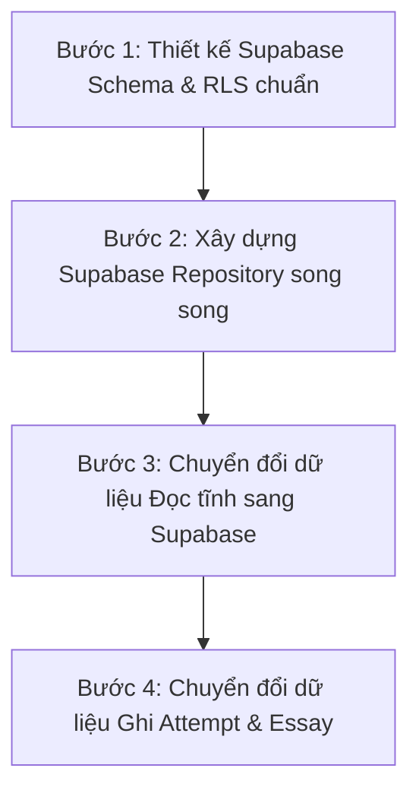

# BÁO CÁO ĐÁNH GIÁ SẴN SÀNG CHUYỂN ĐỔI SUPABASE & TÀI LIỆU BÀN GIAO CHATGPT (PHASE 1)
**Project Audit: Mầm Văn (Grade 7 Vietnamese Language EdTech Platform)**  
*Mã tài liệu:* `DOC-MV-AUDIT-03`  
*Ngày thực hiện:* 29/09/2026  
*Vai trò kiểm toán:* Senior Software Architect & Lead Data Architect  
*Mục đích:* Chuẩn bị mô hình dữ liệu khái niệm (Conceptual Data Model) trước khi thiết kế Database Schema, Đánh giá toàn vẹn dữ liệu, Phân loại thực thể và Bàn giao toàn diện cho AI Architect (ChatGPT).

---

## MỤC LỤC
1. [Phần G – Đánh giá tính toàn vẹn dữ liệu & Độ sẵn sàng Supabase](#phần-g--đánh-giá-tính-toàn-vẹn-dữ-liệu--độ-sẵn-sàng-supabase)
2. [Mô hình dữ liệu khái niệm (Conceptual Data Model)](#mô-hình-dữ-liệu-khái-niệm-conceptual-data-model)
3. [Phân loại thực thể: CORE vs SUPPORTING vs FUTURE](#phân-loại-thực-thể-core-vs-supporting-vs-future)
4. [Phần I – Bàn giao kỹ thuật toàn diện cho ChatGPT (ChatGPT Handoff Summary)](#phần-i--bàn-giao-kỹ-thuật-toàn-diện-cho-chatgpt-chatgpt-handoff-summary)
5. [Lộ trình triển khai nhỏ nhất và ít rủi ro nhất (Incremental Roadmap)](#lộ-trình-triển-khai-nhỏ-nhất-và-ít-rủi-ro-nhất-incremental-roadmap)

---

## PHẦN G – ĐÁNH GIÁ TÍNH TOÀN VẸN DỮ LIỆU & ĐỘ SẴN SÀNG SUPABASE

### 1. Đánh giá hệ thống Định danh (ID & UUID)
* **Thực trạng hiện tại:** Đang tồn tại sự pha trộn lộn xộn giữa các chuẩn định danh:
  * Chuỗi tiền tố tự chế: `gv001`, `hs001`, `class_7a2`, `topic_tho_bon_nam`, `video_tho_1`, `quiz_tho_quick`.
  * Chuỗi ngẫu nhiên sinh bằng Math.random: `q_` + `generateUUID().slice(0, 8)` hoặc `q_` + `Date.now()`.
  * Chuỗi ID ghép: `sub_` + `<timestamp>` + `_` + `<questionId>` (trong bài nộp tự luận).
* **Đánh giá rủi ro:** Không đồng bộ với chuẩn `uuid_generate_v4()` của PostgreSQL. Dễ gây xung đột khóa chính khi scale phân tán hoặc nhiều học sinh nộp bài cùng một millisecond.
* **Yêu cầu khi sang Supabase:** Bắt buộc chuẩn hóa 100% ID bảng thành kiểu `UUID` chuẩn RFC 4122. Giữ lại các mã sư phạm như `student_code` ('HS7A2-01') và `slug` ('tho-bon-nam') dưới dạng các trường thuộc tính phụ có đánh chỉ mục `UNIQUE`.

### 2. Đánh giá các mối quan hệ thực thể (Entity Relationships)
* **Teacher – Class – Student:**
  * Hiện tại: `TeacherProfile.classIds` là một mảng chuỗi `['class_7a2', 'class_7a3']` lưu trực tiếp trên bảng giáo viên. `StudentAccount.class_id` lưu mã lớp.
  * Khi sang Supabase: Cần chuẩn hóa quan hệ Teacher – Class thành bảng trung gian `teacher_classes` (hỗ trợ trường hợp nhiều giáo viên cùng dạy 1 lớp, hoặc giáo viên bộ môn khác nhau). Quan hệ Class – Student là 1–N (`students.class_id` là Foreign Key có `ON DELETE RESTRICT`).
* **Topic – Lesson – Video – Theory:**
  * Hiện tại: `Topic` chứa mảng `videoIds: string[]` và trường đơn `theoryId: string`. Cấu trúc này phá vỡ dạng chuẩn 1NF (First Normal Form).
  * Khi sang Supabase: `videos` và `theories` phải chứa Foreign Key `topic_id REFERENCES topics(id)`. Bổ sung cột `order_index` để quản lý thứ tự hiển thị thay vì phụ thuộc vào thứ tự phần tử trong mảng.
* **Quiz – Question – Attempt – Answer:**
  * Hiện tại: `Quiz.questionIds: string[]` lưu mảng ID câu hỏi. Thiếu hoàn toàn 2 thực thể cực kỳ quan trọng là `Attempt` và `AttemptAnswer`.
  * Khi sang Supabase: Bắt buộc tạo bảng trung gian `quiz_questions` (`quiz_id`, `question_id`, `sort_order`, `points`), bảng `quiz_attempts` và bảng `attempt_answers`.
* **Essay – AI Suggestion – Teacher Review:**
  * Hiện tại: Đang bị gộp chung vào 1 JSON Object khổng lồ `EssaySubmission` nhúng trong state của học sinh.
  * Khi sang Supabase: Tách thành bảng độc lập `essay_submissions`, bảng `essay_ai_evaluations` (lưu kết quả AI chấm gợi ý) và bảng `essay_teacher_reviews` (lưu điểm và nhận xét của giáo viên).
* **Student – XP – Attendance – Mastery:**
  * Hiện tại: Toàn bộ nằm trong 1 JSON Object `StudentState`. Điểm Mastery được tính động và không có bảng snapshot lịch sử.
  * Khi sang Supabase: Tách thành:
    * `student_xp_ledger`: Bảng sổ cái giao dịch điểm thưởng (append-only).
    * `student_attendance`: Bảng điểm danh từng ngày (`student_id`, `attendance_date`, `created_at`).
    * `student_mastery_snapshots`: Bảng lưu điểm năng lực định kỳ (theo tuần/tháng) để vẽ biểu đồ tiến bộ mà không phải quét lại hàng nghìn câu hỏi cũ.
* **Reward – Secret – Claim:**
  * Hiện tại: Danh mục quà và nội dung bí mật bị phơi bày trên frontend qua file tĩnh `rewards.ts`.
  * Khi sang Supabase: Tách trường `secret_name` và `secret_description` thành bảng riêng hoặc cột có chính sách RLS chỉ cho phép đọc khi yêu cầu đổi quà đã ở trạng thái `GIVEN` hoặc `OPENED`.

### 3. Đánh giá Quản lý vòng đời dữ liệu (Metadata & Auditability)
* `created_at`, `updated_at`: Đã có trong `ContentMetadata` và các model chính, nhưng hiện đang sinh thủ công bằng `new Date().toISOString()` ở client. Cần chuyển sang default PostgreSQL `now()`.
* `deleted_at`: Đã có trường nhưng hiện tại là xóa mềm giả lập trong mảng localStorage.
* Trạng thái `draft` / `published` / `archived`: Đã được thiết kế tốt trên `ContentMetadata`, sẵn sàng chuyển đổi thành ENUM trong PostgreSQL.
* Các trường JSON quá tải: `StudentState` đang là một "Anti-pattern Monolith JSON" khi nhồi nhét cả XP logs, lịch sử câu hỏi, bài tự luận, yêu cầu đổi quà và tiến trình học vào cùng một bản ghi. Bắt buộc phải giải nén (normalize) thành các bảng quan hệ độc lập.

---

## MÔ HÌNH DỮ LIỆU KHÁI NIỆM (CONCEPTUAL DATA MODEL)

> **Ghi chú kiến trúc:** Bản đặc tả này sử dụng mô hình quan hệ khái niệm (Entity-Relationship Conceptual Model). Tuyệt đối **không viết câu lệnh SQL CREATE TABLE** và **không tạo file migration** theo đúng quy tắc kiểm toán Phase 1.

### 1. Phân định rõ ràng giữa Hiện trạng và Đề xuất mới
* `[EXISTING]`: Thực thể/thuộc tính đã có sẵn trong source code hiện tại.
* `[PROPOSED NEW]`: Thực thể/thuộc tính đề xuất kiến trúc mới bắt buộc phải có khi chuyển sang Supabase để khắc phục các lỗ hổng đã phát hiện.

---

### 2. Danh mục các Thực thể Khái niệm (Conceptual Entities)

#### Nhóm A: Người dùng, Phân quyền & Lớp học
1. **`User` [PROPOSED NEW]:** Bảng định danh người dùng chung (tích hợp `auth.users` của Supabase Auth).
   * Thuộc tính: `id` (UUID), `role` (ENUM: 'student' | 'teacher' | 'parent'), `email`, `phone`, `created_at`.
2. **`TeacherProfile` [EXISTING]:**
   * Thuộc tính: `id` (UUID - liên kết 1-1 với User), `full_name`, `username`, `subject`, `school`, `avatar_url`, `created_at`, `updated_at`.
3. **`Class` [EXISTING]:**
   * Thuộc tính: `id` (UUID), `name`, `grade` (số nguyên: 7), `academic_year`, `teacher_id` (N-1 với TeacherProfile), `description`, `status` (ENUM: 'active' | 'archived'), `created_at`, `updated_at`, `deleted_at`.
4. **`StudentAccount` [EXISTING]:**
   * Thuộc tính: `id` (UUID - liên kết 1-1 với User), `class_id` (N-1 với Class), `student_code`, `full_name`, `username`, `dob`, `status` (ENUM: 'active' | 'locked'), `last_active_at`, `is_demo_seed`, `created_at`, `updated_at`, `deleted_at`.

#### Nhóm B: Kho Học liệu & Nội dung Giảng dạy
5. **`Topic` [EXISTING]:**
   * Thuộc tính: `id` (UUID), `title`, `short_desc`, `tag`, `color_scheme`, `status` (ENUM: 'draft' | 'published' | 'archived'), `version`, `order_index` [PROPOSED NEW], `created_at`, `updated_at`, `deleted_at`.
6. **`TopicClassAssignment` [PROPOSED NEW thay thế mảng `class_ids`]:**
   * Thuộc tính: `topic_id`, `class_id` (Quan hệ N-N giữa Topic và Class).
7. **`VideoLesson` [EXISTING]:**
   * Thuộc tính: `id` (UUID), `topic_id` (N-1 với Topic), `title`, `duration_seconds`, `video_url`, `thumbnail_url`, `status`, `version`, `order_index` [PROPOSED NEW], `created_at`, `updated_at`.
8. **`VideoFocusPoint` [EXISTING]:**
   * Thuộc tính: `id` (UUID), `video_id` (N-1 với VideoLesson), `title`, `content`, `example`, `sort_order`.
9. **`TheoryLesson` [EXISTING]:**
   * Thuộc tính: `id` (UUID), `topic_id` (N-1 với Topic), `title`, `min_read_seconds`, `status`, `version`, `created_at`, `updated_at`.
10. **`TheoryBlock` [EXISTING]:**
    * Thuộc tính: `id` (UUID), `theory_id` (N-1 với TheoryLesson), `block_type` (heading, paragraph, list, example, takeaway, image), `content_payload` (JSONB), `sort_order`.

#### Nhóm C: Ngân hàng Câu hỏi & Đề thi
11. **`Question` [EXISTING]:**
    * Thuộc tính: `id` (UUID), `topic_id` (N-1 với Topic), `type` (single, multi, fill, essay), `level` (NHAN_BIET, THONG_HIEU, PHAN_TICH, VAN_DUNG), `difficulty` (DE, TB, KHO), `prompt`, `passage`, `image_url`, `options` (JSONB), `correct_answer` (JSONB), `explanation`, `sample_essay`, `min_words`, `max_words`, `is_ai_generated`, `is_teacher_reviewed`, `status`, `version`, `created_at`, `updated_at`.
12. **`Quiz` [EXISTING]:**
    * Thuộc tính: `id` (UUID), `topic_id` (N-1 với Topic), `title`, `kind` (practice, quick, mastery, reading, final, homework), `time_limit_minutes`, `xp_reward`, `shuffle_questions`, `shuffle_options`, `due_date`, `status`, `version`, `created_at`, `updated_at`.
13. **`QuizQuestionItem` [PROPOSED NEW thay thế mảng `questionIds`]:**
    * Thuộc tính: `quiz_id` (N-1 với Quiz), `question_id` (N-1 với Question), `sort_order`, `points` (mặc định 10).
14. **`QuizAssignment` [PROPOSED NEW thay thế `assignedTo`]:**
    * Thuộc tính: `quiz_id`, `class_id` (giao cho lớp) hoặc `student_id` (giao đích danh học sinh), `assigned_at`, `due_date`.

#### Nhóm D: Lượt làm bài & Kết quả học tập (Giải quyết lỗ hổng lớn nhất)
15. **`QuizAttempt` [PROPOSED NEW - CỰC KỲ QUAN TRỌNG]:**
    * Thuộc tính: `id` (UUID), `student_id` (N-1 với StudentAccount), `quiz_id` (N-1 với Quiz), `quiz_version_at_attempt`, `started_at`, `submitted_at`, `duration_seconds`, `total_score`, `max_score`, `status` (ENUM: 'in_progress' | 'submitted' | 'timed_out').
16. **`AttemptAnswer` [PROPOSED NEW - CỰC KỲ QUAN TRỌNG]:**
    * Thuộc tính: `id` (UUID), `attempt_id` (N-1 với QuizAttempt), `question_id`, `question_snapshot` (JSONB lưu đề bài lúc làm), `student_answer` (JSONB lưu đáp án học sinh chọn), `is_correct`, `score_ratio`, `score_earned`.
17. **`EssaySubmission` [EXISTING nhưng TÁCH RA BẢNG ĐỘC LẬP]:**
    * Thuộc tính: `id` (UUID), `attempt_id` (N-1 với QuizAttempt), `student_id`, `question_id`, `content`, `word_count`, `submitted_at`, `status` (ENUM: 'PENDING_TEACHER' | 'AI_SUGGESTED' | 'GRADED'), `ai_suggested_score`, `ai_suggestion_payload` (JSONB), `final_score`, `teacher_feedback`, `rubric_scores` (JSONB), `graded_at`, `graded_by_teacher_id`.

#### Nhóm E: Tương tác, Chuyên cần & Phần thưởng
18. **`StudentAttendance` [PROPOSED NEW thay thế mảng `attendanceHistory`]:**
    * Thuộc tính: `id` (UUID), `student_id`, `attendance_date` (DATE), `xp_awarded` (2 XP), `created_at`.
19. **`ActiveLearningLog` [PROPOSED NEW]:**
    * Thuộc tính: `id` (UUID), `student_id`, `log_date` (DATE), `active_seconds_today`, `last_active_at`.
20. **`XpLedger` [PROPOSED NEW thay thế mảng `xpLogs`]:**
    * Thuộc tính: `id` (UUID), `student_id`, `action_name`, `step_key`, `raw_xp`, `actual_xp`, `reason`, `capped_notice`, `created_at`.
21. **`RewardCatalog` [EXISTING]:**
    * Thuộc tính: `id` (UUID), `tier_key` (HAT, LA, HOA, VANG), `required_xp`, `required_attendance_days`, `teaser_description`, `secret_name` [BẢO MẬT RLS], `secret_description` [BẢO MẬT RLS], `is_physical`, `stock`, `is_active`.
22. **`RewardClaimRequest` [EXISTING]:**
    * Thuộc tính: `id` (UUID), `student_id`, `reward_id`, `requested_at`, `status` (LOCKED, ELIGIBLE, PENDING_APPROVAL, APPROVED, GIVEN, OPENED, REJECTED), `reject_reason`, `approved_at`, `given_at`, `opened_at`.

#### Nhóm F: Cấu hình & Quản trị
23. **`SystemSetting` [EXISTING]:**
    * Thuộc tính: `id` (mã nhóm: 'school_info', 'mastery', 'xp', 'time'), `settings_payload` (JSONB), `updated_at`, `updated_by`.
24. **`AuditLog` [EXISTING]:**
    * Thuộc tính: `id` (UUID), `actor_id`, `actor_name`, `actor_role`, `action`, `target_type`, `target_id`, `target_name`, `details` (JSONB), `created_at`.

---

## PHÂN LOẠI THỰC THỂ: CORE vs SUPPORTING vs FUTURE

| Thực thể | Phân loại | Lý do & Vai trò trong kiến trúc Supabase |
| :--- | :---: | :--- |
| **User (Auth)** | **CORE** | Nền tảng phân quyền học sinh, giáo viên, phụ huynh qua Supabase Auth. |
| **TeacherProfile** | **CORE** | Quản lý thông tin và quyền hạn của giáo viên. |
| **Class** | **CORE** | Đơn vị tổ chức học tập căn bản của trường phổ thông. |
| **StudentAccount** | **CORE** | Quản lý danh sách, tài khoản và trạng thái của học sinh. |
| **Topic** | **CORE** | Khung phân loại 4 chủ đề Ngữ văn 7. |
| **VideoLesson & TheoryLesson** | **CORE** | Trục nội dung học tập cốt lõi của nền tảng Mầm Văn. |
| **Question & Quiz** | **CORE** | Ngân hàng câu hỏi và các bài luyện tập / kiểm tra. |
| **QuizAttempt & AttemptAnswer** | **CORE** | **Bắt buộc có ngay.** Giải quyết triệt để lỗi mất dữ liệu bài làm và phục vụ tính toán Mastery. |
| **EssaySubmission** | **CORE** | Bài tập viết văn là đặc thù sống còn của môn Ngữ văn 7. |
| **XpLedger & Attendance** | **CORE** | Đảm bảo tính toán Gamification và chuỗi chuyên cần chuẩn xác. |
| **RewardCatalog & ClaimRequest** | **SUPPORTING** | Nghiệp vụ đổi quà bí mật và tương tác rương. |
| **VideoFocusPoint & TheoryBlock** | **SUPPORTING** | Chi tiết trình bày nội dung bài học. |
| **QuizAssignment** | **SUPPORTING** | Phân quyền giao bài tập chi tiết cho từng lớp. |
| **AuditLog** | **SUPPORTING** | Ghi nhận nhật ký quản trị và hành động của giáo viên. |
| **SystemSetting** | **SUPPORTING** | Cho phép tùy chỉnh tham số XP, thời gian mà không cần deploy lại code. |
| **MasterySnapshot** | **SUPPORTING** | Tối ưu hóa hiệu năng tính biểu đồ Analytics khi số lượng câu hỏi lên tới hàng vạn. |
| **RubricTemplate & GradedSample**| **SUPPORTING** | Dữ liệu dùng cho huấn luyện và cấu hình AI chấm bài. |
| **ParentAccount & Notification** | **FUTURE** | Vai trò phụ huynh và thông báo Zalo/SMS (Chưa triển khai ở MVP). |
| **AIContentSourceSnippet** | **FUTURE** | Lưu trữ ngữ liệu trích xuất tự động khi kết nối Gemini API quy mô lớn. |

---

## PHẦN I – BÀN GIAO KỸ THUẬT TOÀN DIỆN CHO CHATGPT (CHATGPT HANDOFF SUMMARY)

> **Dành cho AI Architect tiếp quản:** Dưới đây là bức tranh toàn cảnh trung thực và chính xác nhất về hiện trạng kỹ thuật của dự án Mầm Văn sau kiểm toán Phase 1.

### 1. Kiến trúc thực tế của hệ thống
* **Frontend:** React 19, TypeScript, Tailwind CSS v4, Recharts, Lucide Icons, Vite 8.
* **Mô hình dữ liệu:** Repository Pattern độc lập (`src/services/types.ts`), hiện đang chạy trên `MockRepository` với `localStorage` và đồng bộ đa tab bằng `BroadcastChannel('mam_van_sync_bus')`.
* **Trạng thái kết nối Backend:** **Chưa tích hợp Supabase thật.** Thư mục `src/services/supabase/` mới chỉ có kế hoạch và tài liệu sơ bộ. Không có biến môi trường Supabase nào được kết nối.

### 2. Những luồng ĐÃ HOẠT ĐỘNG XUYÊN SUỐT (End-to-End Functional)
1. **Luồng tính toán XP & Giới hạn trần:** `xpEngine.ts` chạy rất chuẩn mực, chặn trần 130 XP (dưới 45 phút), 150 XP (dưới 90 phút) và 900 XP/tuần; chặn cộng lặp lại cho bài học cũ.
2. **Luồng đo thời gian học tích cực (ALT):** `useActiveLearningTimer.ts` theo dõi chính xác sự kiện chuột/phím, tạm dừng khi ẩn tab hoặc bất hoạt quá 4 phút.
3. **Luồng tính Năng lực Mastery theo Bloom:** Thuật toán tính trọng số suy giảm thời gian $0.88^k$ và đánh giá 4 mức kèm điều kiện chủ đề Vững (80/80 và 60/60) chạy hoàn hảo.
4. **Đồng bộ đa tab (Cross-tab Realtime):** Khi giáo viên thêm học sinh, xuất bản bài hoặc duyệt quà ở tab này, tab học sinh tự động cập nhật ngay lập tức mà không cần F5.
5. **Giao diện Teacher CMS & Analytics:** Hệ thống giao diện quản lý lớp, ngân hàng câu hỏi, phòng chấm bài tự luận và 5 tab biểu đồ phân tích được xây dựng rất hoàn chỉnh và chi tiết.

### 3. Những luồng BỊ NGẮT hoặc LỖI NGHIỆP VỤ giữa Teacher và Student
1. **Mất sạch dữ liệu câu trả lời (No Attempt Answers):** Hệ thống chỉ lưu `isCorrect` và `scoreRatio`, hoàn toàn không lưu học sinh đã chọn đáp án gì. Không thể mở lại bài thi đã làm để xem lại.
2. **Lỗi nhân đôi Mastery bài viết tự luận:** Khi HS nộp bài, hệ thống tạm chấm 0.8 và cộng ngay vào Mastery. Khi GV vào chấm thật, hệ thống lại cộng thêm 1 lần nữa vào Mastery.
3. **Hardcoded Học sinh:** Khi nộp bài tự luận trong `QuizRunner.tsx` (dòng 141) và `VideoLessonScreen.tsx` (dòng 271), mã học sinh bị gán cứng là `'hs001'`, khiến các học sinh khác nộp bài thì giáo viên vẫn thấy tên là `hs001`.
4. **Hở thông tin phần thưởng bí mật:** Thuộc tính `secret` của quà tặng nằm lộ thiên trong bundle JavaScript phía client.
5. **Lệch bộ lọc xuất bản theo lớp:** `App.tsx` truyền `'Lớp 7'` vào bộ lọc `classId` (cần `'class_7a2'`), khiến cơ chế xuất bản bài theo từng lớp bị vô hiệu hóa.
6. **Bypass Repository về file tĩnh:** `HomeScreen`, `TreeScreen`, `QuizRunner` vẫn import trực tiếp từ file mẫu `mockData.ts`.

### 4. Những điểm CẦN XỬ LÝ DỨT ĐIỂM trước khi thiết kế Schema Supabase
* Phải có quyết định chính thức từ Product Owner về 11 câu hỏi mở (Phần H của Tài liệu 02).
* Đặc biệt là: **Quy tắc cộng XP bài viết tự luận** và **Phạm vi phân quyền bài học theo lớp**.

---

## LỘ TRÌNH TRIỂN KHAI NHỎ NHẤT VÀ ÍT RỦI RO NHẤT (INCREMENTAL ROADMAP)

Để đảm bảo an toàn tuyệt đối cho source code hiện tại, không gây vỡ giao diện đang chạy mượt mà của khách hàng, lộ trình chuyển dịch sang Supabase được đề xuất thành 4 bước nhỏ (Phase 2):

* **Bước 1: Thiết kế Supabase Schema & Migration (Không chạm vào source code app):**
  * Khởi tạo dự án Supabase, viết migration DDL cho 17 bảng thuộc nhóm CORE.
  * Thiết lập RLS policies bảo vệ bảng `reward_catalog` (giấu secret) và bảng điểm thi.
  * Viết script seed nạp toàn bộ 4 chủ đề và ngân hàng câu hỏi từ `mockData.ts` lên Supabase.
* **Bước 2: Xây dựng `SupabaseRepository` độc lập trong `src/services/supabase/`:**
  * Tạo class triển khai đầy đủ các interface của `src/services/types.ts`.
  * Viết unit test độc lập trong `scripts/` để kiểm tra CRUD Supabase mà chưa thay đổi `src/services/index.ts`.
* **Bước 3: Chuyển đổi dữ liệu Đọc (Read-only Switching):**
  * Đổi `contentService` và `quizService` trong `src/services/index.ts` trỏ sang Supabase.
  * Kiểm tra học sinh và giáo viên đọc danh mục bài học từ Supabase thành công.
* **Bước 4: Chuyển đổi dữ liệu Ghi (Write Operations Switching):**
  * Chuyển `attemptService`, `essayService`, `rewardService` sang Supabase.
  * Bổ sung cơ chế lưu `QuizAttempt` và `AttemptAnswer` để lưu vết 100% câu trả lời của học sinh.
