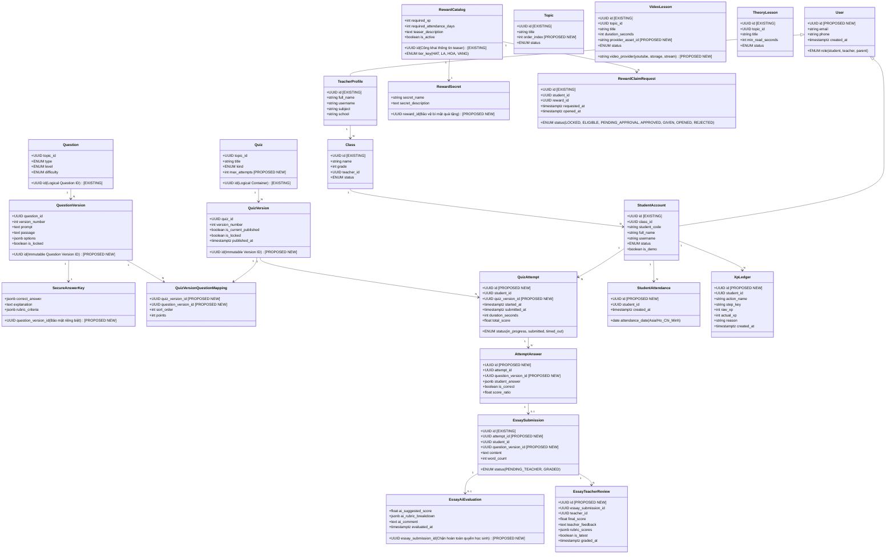
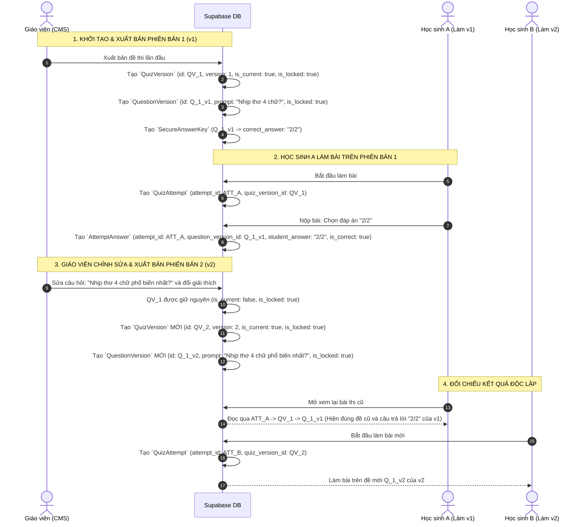

# ĐẶC TẢ NGHIỆP VỤ VÀ MÔ HÌNH DỮ LIỆU CHUẨN MẦM VĂN V1.1
## (MAM VAN BUSINESS & DATA SPECIFICATION V1.1)

> **Tài liệu tham chiếu kỹ thuật và nghiệp vụ chính thức cho Phase 2 (Supabase Database Design & Migration)**  
> **Dự án:** Mầm Văn – Nền tảng EdTech học Ngữ văn lớp 7  
> **Mã tài liệu:** `DOC-MV-SPEC-V1.1`  
> **Ngày ban hành:** 29/09/2026  
> **Vai trò thực hiện:** Senior Software Architect, Data Architect, Security Architect & Technical Documentation Lead  
> **Tình trạng phê duyệt:**  
> - **11 Quy tắc nghiệp vụ (BR-01 đến BR-11):** **APPROVED BY PRODUCT OWNER**  
> - **Đề xuất kiến trúc kỹ thuật & Mô hình dữ liệu v1.1:** **PENDING TECHNICAL REVIEW**

---

## MỤC LỤC

1. [Phần 1: Quản trị tài liệu & Nhật ký thay đổi (Document Control & Change Log)](#phần-1-quản-trị-tài-liệu--nhật-ký-thay-đổi-document-control--change-log)
2. [Phần 2: Phạm vi dự án (Project Scope)](#phần-2-phạm-vi-dự-án-project-scope)
3. [Phần 3: Kiểm định Baseline & Đối chiếu hiện trạng Git (Baseline Verification)](#phần-3-kiểm-định-baseline--đối-chiếu-hiện-trạng-git-baseline-verification)
4. [Phần 4: 11 Quyết định nghiệp vụ chính thức đã phê duyệt (11 Approved Business Decisions)](#phần-4-11-quyết-định-nghiệp-vụ-chính-thức-đã-phê-duyệt)
5. [Phần 5: Đặc tả chi tiết 11 quy tắc nghiệp vụ cốt lõi (Detailed Business Specifications)](#phần-5-đặc-tả-chi-tiết-11-quy-tắc-nghiệp-vụ-cốt-lõi)
6. [Phần 6: Mô hình dữ liệu khái niệm chuẩn v1.1 (Conceptual Data Model v1.1)](#phần-6-mô-hình-dữ-liệu-khái-niệm-chuẩn-v11-conceptual-data-model-v11)
7. [Phần 7: Bản đồ quan hệ thực thể & Chính sách xóa/giữ lại dữ liệu (Entity Mapping & Data Retention)](#phần-7-bản-đồ-quan-hệ-thực-thể--chính-sách-xóagiữ-lại-dữ-liệu-entity-mapping--data-retention)
8. [Phần 8: Luồng dữ liệu xuất bản, làm bài & Kiểm soát phiên bản (Data Flows & Versioning Traces)](#phần-8-luồng-dữ-liệu-xuất-bản-làm-bài--kiểm-soát-phiên-bản-data-flows--versioning-traces)
9. [Phần 9: Ma trận sai lệch triển khai (Implementation Gap Matrix)](#phần-9-ma-trận-sai-lệch-triển-khai-implementation-gap-matrix)
10. [Phần 10: Ma trận kiểm thử nghiệm thu (Acceptance Test Matrix)](#phần-10-ma-trận-kiểm-thử-nghiệm-thu-acceptance-test-matrix)
11. [Phần 11: Yêu cầu an toàn thông tin & Kiến trúc bảo mật đa tầng (Security & Privacy Architecture)](#phần-11-yêu-cầu-an-toàn-thông-tin--kiến-trúc-bảo-mật-đa-tầng-security--privacy-architecture)
12. [Phần 12: Sổ đăng ký quyết định kiến trúc (Architecture Decision Register - ADR) & Quyết định kỹ thuật còn mở](#phần-12-sổ-đăng-ký-quyết-định-kiến-trúc-architecture-decision-register---adr--quyết-định-kỹ-thuật-còn-mở)
13. [Phần 13: Danh mục sẵn sàng chuyển giao Phase 2 (Phase 2 Readiness Checklist)](#phần-13-danh-mục-sẵn-sàng-chuyển-giao-phase-2-readiness-checklist)
14. [Phần 14: Tóm tắt bàn giao kỹ thuật cho ChatGPT (ChatGPT Handoff Summary)](#phần-14-tóm-tắt-bàn-giao-kỹ-thuật-cho-chatgpt-chatgpt-handoff-summary)

---

## PHẦN 1: QUẢN TRỊ TÀI LIỆU & NHẬT KÝ THAY ĐỔI (DOCUMENT CONTROL & CHANGE LOG)

### 1.1 Thông tin phiên bản tài liệu
* **Tên tài liệu:** Mầm Văn Business & Data Specification v1.1
* **Mã hiệu:** `DOC-MV-SPEC-V1.1`
* **Phiên bản:** `1.1.0-REFINED`
* **Ngày phát hành:** 29/09/2026
* **Tài liệu tiền nhiệm:** `DOC-MV-SPEC-V1.0` (vẫn được lưu trữ nguyên vẹn tại `docs/phase-1/MAM_VAN_BUSINESS_DATA_SPEC_V1.md`).
* **Phân định thẩm quyền:**
  * **Quy tắc nghiệp vụ (BR-01 đến BR-11):** Được bảo toàn nguyên vẹn 100% theo quyết định phê chuẩn của Product Owner.
  * **Giải pháp kiến trúc, mô hình dữ liệu và đề xuất kỹ thuật:** Thuộc trạng thái `[PENDING TECHNICAL REVIEW]` nhằm phục vụ thẩm định của Hội đồng Kiến trúc trước khi viết mã SQL ở Phase 2.

### 1.2 Nhật ký thay đổi (V1.0 → V1.1 Change Log)

| Mục thay đổi | Nội dung hiệu chỉnh trong v1.1 | Lý do kỹ thuật / Căn cứ nghiệp vụ |
| :--- | :--- | :--- |
| **Git Baseline** | Cập nhật định danh rõ ràng: `SOURCE SNAPSHOT – GIT COMMIT UNVERIFIED`. Không suy đoán bản ZIP là Git HEAD. | Thư mục cục bộ giải nén không chứa thư mục `.git`. Cần bảo đảm tính trung thực tuyệt đối của báo cáo. |
| **Bảo mật dữ liệu nhạy cảm** | Hiệu chỉnh hiểu biết về PostgreSQL RLS: RLS là phân quyền mức hàng (Row-level), **không tự động che giấu từng cột (Column-level) trong một hàng được phép SELECT**. Tách các bảng độc lập: `reward_secrets`, `essay_ai_evaluations`, `essay_teacher_reviews`, `secure_answer_keys` và dùng RPC / Safe Views. | Tránh lỗi rò rỉ dữ liệu bí mật quà tặng, đáp án đúng và điểm AI gợi ý xuống thiết bị học sinh qua DevTools. |
| **Kiểm soát phiên bản bất biến (BR-05)** | Chuẩn hóa mô hình Versioning 3 cấp độ: `quiz_versions`, `question_versions`, `quiz_version_questions`. Liên kết `quiz_attempts` trực tiếp vào `quiz_version_id` bất biến. Bổ sung 2 kịch bản minh họa chi tiết. | Chấm dứt triệt để việc ghi đè câu hỏi cũ khi sửa đề thi, bảo vệ lịch sử sư phạm không bị sai lệch theo BR-05. |
| **Chính sách xóa dữ liệu & Khóa ngoại** | **Loại bỏ toàn bộ `ON DELETE CASCADE`** trên các thực thể chứa dữ liệu lịch sử sư phạm (`students` $\rightarrow$ `attempts`, `answers`, `xp_ledger`, `attendance`, `essays`). Thay bằng `ON DELETE RESTRICT` / `NO ACTION` kết hợp Soft Delete, Khóa tài khoản và Anonymization. | Ngăn ngừa tai họa xóa nhầm một học sinh làm bốc hơi toàn bộ lịch sử thi cử, điểm danh và sổ cái kinh nghiệm. |
| **Sổ cái XP & Múi giờ** | Phân biệt tường minh giữa `raw_xp` (điểm gốc) và `actual_xp` (điểm thực nhận sau khi qua bộ lọc trần). Chuẩn hóa múi giờ nghiệp vụ `Asia/Ho_Chi_Minh` và lưu trữ `TIMESTAMPTZ` (UTC). Thêm kiểm tra Idempotency server-side. | Chống thao túng ngày giờ từ client và đảm bảo việc tính trần ngày/tuần đồng nhất trên toàn hệ thống. |
| **Tách biệt Rule & Config** | Rà soát toàn bộ tài liệu và dán nhãn phân loại rõ: (A) Approved Requirement, (B) Existing Source Config, (C) Proposed Technical Default, (D) Pending Technical Decision. | Tránh việc Antigravity tự động nâng cấp các giả định kỹ thuật tạm thời thành quy tắc nghiệp vụ bất biến. |
| **Trừu tượng hóa Video Storage** | Không mặc định Supabase Storage là nền tảng duy nhất. Chuẩn hóa interface trừu tượng `Video Provider / Storage Service` hỗ trợ đa nguồn (YouTube Unlisted, Supabase Storage, Dedicated Video HLS/DASH). | Cho phép linh hoạt lựa chọn hạ tầng video ở Phase 2 mà không phá vỡ tầng Repository và tiến trình học. |

---

## PHẦN 2: PHẠM VI DỰ ÁN (PROJECT SCOPE)

### 2.1 Tổng quan dự án
Mầm Văn là hệ thống học tập thông minh môn Ngữ văn lớp 7, kết hợp chặt chẽ giữa:
1. Phương pháp sư phạm đổi mới (Chương trình GDPT 2018): 4 mức năng lực Bloom rút gọn (Nhận biết, Thông hiểu, Phân tích, Vận dụng).
2. Yếu tố game hóa học tập (Gamification): Cây Trưởng Thành (Growth Tree), Ngọn Lửa Chuỗi (Streak Flame), Rương Quà Bí Mật theo tuần và Linh vật Mầm Mực đồng hành.
3. Trợ lý sư phạm cho Giáo viên: Soạn đề kiểm tra hỗ trợ bởi AI, chấm bài tự luận đa tiêu chí Rubric với AI gợi ý điểm, và 5 tab Dashboard phân tích dữ liệu trực quan bằng Recharts.

### 2.2 Ranh giới đặc tả
* **Nhiệm vụ tài liệu:** Thiết lập bản đặc tả logic dữ liệu chính thức cuối cùng của Phase 1.
* **Quy tắc tuyệt đối:** Không chỉnh sửa source code ứng dụng, không tạo SQL migration, không cài đặt package, không tự động commit/push Git.

---

## PHẦN 3: KIỂM ĐỊNH BASELINE & ĐỐI CHIẾU HIỆN TRẠNG GIT (BASELINE VERIFICATION)

### 3.1 Tình trạng kiểm định Git Baseline
* **Trạng thái xác minh:** `SOURCE SNAPSHOT – GIT COMMIT UNVERIFIED`
* **Đường dẫn thư mục làm việc:** `e:\APP_Education\MamVan_Education-main\MamVan_Education-main`
* **Kết quả kiểm tra `.git`:** Thư mục hiện tại không chứa thư mục con `.git` (`Test-Path .git = False`). Lệnh `git status` trả về `fatal: not a git repository`.
* **Căn cứ nguồn gốc:** Thư mục được giải nén từ file nén `MamVan_Education-main.zip`. Do đó, tài liệu này **không định danh thư mục làm việc là Git HEAD**, mà định danh chính xác là **Bản chụp snapshot mã nguồn phục vụ kiểm toán Phase 1**.
* **Repository chính thức được Product Owner công bố:** `https://github.com/DuongDADEV/MamVan_Education.git`. Khi triển khai Phase 2, đội ngũ kỹ sư sẽ clone trực tiếp repository này về môi trường có Git chính thức để tiến hành công việc.

### 3.2 Hiện trạng thành phần công nghệ thực tế (Active Code at Local Snapshot)
* `node`: `v24.19.0`, `npm`: `11.17.0`.
* `react`: `^19.0.1` (resolved `19.3.0`), `react-dom`: `^19.0.1` (resolved `19.3.0`).
* `react-is`: `^19.3.0` (resolved `19.3.0` - cài đặt thêm ngày 29/09 với `--legacy-peer-deps` để giải quyết lỗi Vite Recharts import analysis).
* `recharts`: `^3.10.1`, `vite`: `^8.3.0` (resolved `8.3.1`), `@tailwindcss/vite`: `^4.3.3` (Tailwind v4), `typescript`: `^7.0.2`.
* **Xác thực file dữ liệu:** Nguồn dữ liệu tĩnh duy nhất là [`src/data/mockData.ts`](file:///e:/APP_Education/MamVan_Education-main/MamVan_Education-main/src/data/mockData.ts) (53.6 KB, 1.106 dòng); hoàn toàn không có file `src/data/lessonData.ts`.

---

## PHẦN 4: 11 QUYẾT ĐỊNH NGHIỆP VỤ CHÍNH THỨC ĐÃ PHÊ DUYỆT

Toàn bộ 11 quyết định sau đã được Product Owner phê duyệt chính thức và giữ nguyên vẹn giá trị hiệu lực:

* **BR-01 – SINGLE SOURCE OF TRUTH:** Giáo viên quản lý toàn bộ nội dung học tập. Giao diện học sinh đọc dữ liệu duy nhất thông qua tầng Repository. Các bài học mẫu tĩnh chỉ dùng làm seed khởi tạo; không được trở thành nguồn dữ liệu cố định hoặc fallback có thể ghi đè nội dung mới.
* **BR-02 – ATTENDANCE:** Học sinh chủ động bấm thẻ điểm danh trên trang chủ để nhận thưởng +2 XP và kích hoạt hoạt ảnh tưới cây. Đăng nhập hệ thống không tự động điểm danh. Mỗi học sinh chỉ nhận thưởng điểm danh 1 lần hợp lệ trong ngày.
* **BR-03 – ESSAY XP & MASTERY:** Bài viết nằm trong cấu trúc Quiz. Khi nộp Quiz hợp lệ, học sinh nhận XP của bước Quiz theo quy định. Không cộng XP riêng cho bài essay khi nộp. Không chờ giáo viên chấm mới cộng XP Quiz. AI chỉ gợi ý điểm. Năng lực Mastery của câu essay chỉ cập nhật sau khi giáo viên chốt điểm cuối cùng. Không được đưa điểm giả định 0.8 vào Mastery. Không ghi nhận trùng lặp kết quả khi giáo viên chấm lại.
* **BR-04 – COMPLETE ATTEMPT HISTORY:** Bắt buộc lưu trữ đầy đủ: Mỗi lượt làm bài độc lập, nội dung câu trả lời của học sinh (`student_answer`), điểm từng câu, điểm tổng, phiên bản Quiz/Question tương ứng, thời gian bắt đầu, nộp và thời lượng, trạng thái bài làm để xem lại lịch sử và phân tích sư phạm.
* **BR-05 – IMMUTABLE CONTENT VERSIONING:** Khi chỉnh sửa nội dung đã xuất bản và đã có học sinh làm, hệ thống bắt buộc tạo phiên bản mới ($N+1$). Phiên bản cũ phải được đóng băng bất biến. Kết quả bài làm cũ không thay đổi khi giáo viên sửa nội dung hoặc đáp án ở phiên bản mới.
* **BR-06 – ANALYTICS DATA SEGREGATION:** Dữ liệu mẫu demo (35 học sinh ảo) và dữ liệu học sinh thật phải tách biệt hoàn toàn. Dashboard phân tích của giáo viên trong môi trường thực tế chỉ tổng hợp từ các học sinh thật thuộc các lớp phụ trách.
* **BR-07 – CONTENT SCOPE & ASSIGNMENT:** Kho học liệu Ngữ văn 7 (video, lý thuyết) dùng chung cho khối 7. Bài kiểm tra chính thức và BTVN được giáo viên giao theo lớp hoặc từng học sinh. Tách biệt giữa nội dung gốc và thực thể giao bài; không nhân bản toàn bộ Quiz mỗi khi giao cho một lớp mới.
* **BR-08 – RETAKE POLICY:** Bài luyện tập không giới hạn số lần thực hiện. Bài kiểm tra chính thức có số lượt làm tối đa do giáo viên cấu hình. Các lượt làm phải được lưu riêng, không ghi đè lịch sử. XP vẫn tuân thủ quy định chỉ thưởng lần đầu hoàn thành mục tương ứng.
* **BR-09 – ARCHIVED CONTENT:** Nội dung Archived không còn xuất hiện trong danh mục bài học mới. Tuy nhiên, học sinh đã từng học nội dung đó vẫn có quyền xem lại để ôn tập. Lịch sử nội dung và kết quả bài làm cũ phải được bảo toàn theo đúng phiên bản.
* **BR-10 – AUTO-SAVE & RESUME:** Hệ thống tự động lưu câu trả lời đang làm và vị trí học. Nếu học sinh F5, mất mạng hoặc đóng trình duyệt, phải có khả năng khôi phục tiến trình hợp lệ. Thời gian làm bài kiểm tra phải được xác định nhất quán dựa trên máy chủ, tránh việc refresh để đặt lại đồng hồ.
* **BR-11 – VIDEO COMPLETION VERIFICATION:** Quy tắc chuẩn: xem ít nhất 80% thời lượng duy nhất của bài giảng video; tua nhanh không được tính là đã xem. Nếu nền tảng phát không hỗ trợ theo dõi chính xác từng giây, cho phép xác minh thay thế bằng câu hỏi xác minh nội dung hoặc giáo viên xác nhận thủ công. Tuyệt đối không dùng timer ảo để tự ghi nhận hoàn thành. Phải lưu phương thức xác minh cụ thể.

---

## PHẦN 5: ĐẶC TẢ CHI TIẾT 11 QUY TẮC NGHIỆP VỤ CỐT LÕI

*(Đã được hiệu chỉnh hoàn toàn để loại bỏ các giả định kỹ thuật sai lầm về RLS cột đơn, đồng thời tích hợp các cơ chế bảo mật và versioning chuyên sâu).*

### BR-01: SINGLE SOURCE OF TRUTH (NGUỒN DỮ LIỆU DUY NHẤT)
1. **Business Objective:** Đảm bảo toàn bộ học liệu học sinh tiếp cận được quản lý tập trung và đồng bộ từ Giáo viên, loại bỏ hoàn toàn hiện tượng học sinh nhìn thấy nội dung cũ hoặc bị sai lệch do nạp file tĩnh cục bộ.
2. **Approved Requirement:** Học sinh đọc dữ liệu duy nhất qua `ContentRepository` và `QuizRepository`. File mẫu `mockData.ts` chỉ được dùng làm seed khởi tạo hệ thống lúc chưa có dữ liệu. Không được dùng `mockData.ts` làm fallback đè lên dữ liệu do giáo viên biên soạn.
3. **Actors:** Giáo viên (Tạo/Sửa/Xuất bản), Học sinh (Đọc/Học).
4. **Trigger / User Action:** Học sinh truy cập các màn hình `HomeScreen`, `LearnScreen`, `VideoLessonScreen`, `TheoryLessonScreen`.
5. **Preconditions:** Học sinh đã đăng nhập với tài khoản hợp lệ thuộc một lớp học cụ thể.
6. **Main Flow:** Màn hình gọi hook truy vấn `useLiveQuery` trỏ vào Repository Service tương ứng $\rightarrow$ Repository truy vấn từ Database (Supabase) dựa trên phạm vi lớp và trạng thái `published` $\rightarrow$ Giao diện render chính xác danh mục nội dung nhận được từ Database.
7. **Exception / Edge Cases:** Mất kết nối mạng $\rightarrow$ Hiển thị thông báo trạng thái ngoại tuyến (Offline Banner) và nút Thử lại, không âm thầm nạp dữ liệu tĩnh mẫu gây hiểu nhầm.
8. **Data to Persist:** Không có dữ liệu ghi mới; yêu cầu dữ liệu trả về từ bảng `topics`, `video_lessons`, `theory_lessons`, `quizzes`.
9. **Validation Rules:** Dữ liệu trả về cho học sinh bắt buộc phải có `status = 'published'` và `deleted_at IS NULL`.
10. **Acceptance Criteria (Testable):**
    * *AC-01.1:* Khi giáo viên đổi tên chủ đề "Thơ bốn chữ, năm chữ" thành "Thơ 4-5 chữ Việt Nam", tài khoản học sinh tải lại trang thấy ngay tên mới mà không còn chữ cũ từ `mockData.ts`.
    * *AC-01.2:* Tìm kiếm trong toàn bộ mã nguồn phía client của các màn hình học sinh không còn dòng lệnh `import { TOPICS, VIDEOS... } from '../data/mockData'`.
11. **Current Source Status:** **FAIL.** `LearnScreen.tsx` (L27), `VideoLessonScreen.tsx` (L48), `TheoryLessonScreen.tsx` (L49) vẫn dùng toán tử `||` fallback về hằng số tĩnh của `mockData.ts`.
12. **Implementation Gap:** Cần gỡ bỏ toàn bộ fallback `|| VIDEOS[id]`, `|| THEORIES[id]`. Khi Repository trả về null, màn hình phải hiển thị Empty State chuẩn.
13. **Related Entities:** `Topic`, `VideoLesson`, `TheoryLesson`, `Quiz`.
14. **Security Considerations:** Áp dụng RLS mức bảng: Học sinh chỉ được quyền `SELECT` các bản ghi có `status = 'published'`.

---

### BR-02: ATTENDANCE (QUY TẮC ĐIỂM DANH CHỦ ĐỘNG & MÚI GIỜ)
1. **Business Objective:** Rèn luyện tính tự giác và ý thức chuyên cần học tập mỗi ngày cho học sinh lớp 7 thông qua nghi thức điểm danh và nhận thưởng kinh nghiệm.
2. **Approved Requirement:** Học sinh chủ động click thẻ "Điểm danh nhận +2 XP" trên trang chủ. Đăng nhập hệ thống không tự động điểm danh. Mỗi ngày chỉ nhận thưởng điểm danh 1 lần hợp lệ.
3. **Actors:** Học sinh.
4. **Trigger / User Action:** Học sinh click nút "Điểm danh ngay" trên widget Điểm danh tại `HomeScreen.tsx`.
5. **Preconditions:** Học sinh đã đăng nhập; chưa có bản ghi điểm danh hợp lệ trong ngày hôm nay theo múi giờ nghiệp vụ `Asia/Ho_Chi_Minh`.
6. **Main Flow:**
   * Học sinh click nút Điểm danh.
   * Gửi request lên RPC Server / Stored Procedure `claim_daily_attendance()`.
   * Server lấy ngày hiện tại `CURRENT_DATE AT TIME ZONE 'Asia/Ho_Chi_Minh'`.
   * Kiểm tra điều kiện duy nhất trong bảng `student_attendance`.
   * Ghi nhận giao dịch vào sổ cái `student_xp_ledger` (`raw_xp = 2`, `actual_xp` được tính toán căn cứ trần ngày hiện tại).
   * Cập nhật số ngày chuyên cần tuần `attendanceDaysThisWeek += 1`.
   * Kích hoạt hiệu ứng tưới nước cho Mầm Cây và mở khóa huy hiệu (nếu đạt mốc 3 ngày hoặc 5 ngày).
7. **Exception / Edge Cases:**
   * Học sinh gửi 2 request cùng lúc (Double-click/Race condition) $\rightarrow$ Ràng buộc `UNIQUE(student_id, attendance_date)` và Database Transaction chặn đứng request thứ 2 một cách an toàn (Idempotency).
   * Học sinh đổi múi giờ trên máy tính cá nhân sang hôm sau $\rightarrow$ Server bác bỏ vì mốc thời gian căn cứ theo đồng hồ máy chủ cơ sở dữ liệu.
8. **Data to Persist:** Bảng `student_attendance` (`id`, `student_id`, `attendance_date`, `created_at`), bảng `student_xp_ledger` (`raw_xp: 2`, `actual_xp: number`).
9. **Validation Rules:** Ràng buộc duy nhất `UNIQUE(student_id, attendance_date)`.
10. **Acceptance Criteria (Testable):**
    * *AC-02.1:* Đăng nhập tài khoản học sinh, tải lại trang 10 lần $\rightarrow$ `totalXp` không tăng, `attendanceDaysThisWeek` không đổi.
    * *AC-02.2:* Bấm nút Điểm danh $\rightarrow$ Giao dịch ghi nhận thành công, nút chuyển sang trạng thái "Đã điểm danh" có dấu tích xanh và bị vô hiệu hóa.
11. **Current Source Status:** **MATCH (Logic UI), GAP (Dữ liệu).** Source hiện tại tại `App.tsx` (L356–390) đã xử lý đúng việc bấm tay nhận +2 XP; tuy nhiên dữ liệu chỉ lưu trong `studentState` của localStorage, hàm `attemptRepo.recordAttendance()` chưa từng được gọi.
12. **Implementation Gap:** Cần lưu vào bảng `student_attendance` chuyên biệt tại Supabase có khóa UNIQUE theo ngày của máy chủ.
13. **Related Entities:** `StudentAccount`, `StudentAttendance`, `XpLedger`, `Badge`.
14. **Security Considerations:** Mọi thao tác điểm danh và cộng XP phải chạy trong Database Transaction có mức cô lập Read Committed / Serializable.

---

### BR-03: ESSAY XP & MASTERY (TÁCH BIỆT BẢNG BẢO MẬT & MASTERY IDEMPOTENT)
1. **Business Objective:** Khuyến khích học sinh rèn luyện kỹ năng viết đoạn văn mà không tạo áp lực điểm số ảo, đồng thời bảo toàn tính chuẩn xác tuyệt đối của đánh giá sư phạm từ Giáo viên.
2. **Approved Requirement:** Câu tự luận nằm trong Quiz. Khi nộp Quiz, nhận ngay XP của Quiz. Không cộng XP riêng cho câu tự luận khi nộp. Không chờ giáo viên chấm mới cộng XP Quiz. AI chỉ hỗ trợ gợi ý điểm cho giáo viên. Năng lực Mastery của câu tự luận **chỉ được cập nhật sau khi giáo viên hoàn thành chấm điểm chính thức**. Cấm đưa điểm giả định 0.8 vào Mastery. Cấm ghi đè hoặc cộng trùng lặp Mastery khi giáo viên chấm lại.
3. **Actors:** Học sinh (Nộp bài), AI Service (Gợi ý chấm ngầm), Giáo viên (Chấm và chốt điểm).
4. **Trigger / User Action:** Học sinh bấm "Nộp bài" trong `QuizRunner.tsx` $\rightarrow$ Giáo viên mở `SplitGradingWorkspace.tsx` và bấm "Chốt điểm".
5. **Preconditions:** Học sinh đã điền nội dung tự luận đạt độ dài tối thiểu (`PROPOSED_CONFIG: minWords >= 5`).
6. **Main Flow:**
   * *Bước 1 (Học sinh nộp):* Hệ thống ghi nhận bài thi vào `quiz_attempts`, tạo bản ghi bài viết trong bảng `essay_submissions` (`status = 'PENDING_TEACHER'`). Cộng XP của Quiz vào sổ cái XP. **Tuyệt đối không cập nhật Mastery cho câu tự luận tại bước này**.
   * *Bước 2 (AI chấm gợi ý):* Background Function gọi Gemini AI chấm theo Rubric và lưu vào bảng riêng biệt `essay_ai_evaluations`. Bảng này áp dụng Table Privilege / RLS chặn hoàn toàn tài khoản học sinh.
   * *Bước 3 (Giáo viên chốt điểm):* Giáo viên xem bài viết, tham khảo gợi ý AI, chốt điểm từng tiêu chí Rubric, viết nhận xét và lưu vào bảng `essay_teacher_reviews`.
   * *Bước 4 (Cập nhật Mastery Idempotent):* Trạng thái bài viết chuyển thành `GRADED`. Hệ thống gọi Stored Procedure cập nhật chỉ số Mastery mức Vận dụng của học sinh dựa trên ID bài nộp. Nếu bài viết này đã từng được tính Mastery trước đó (do giáo viên chấm lại), hệ thống chỉ cập nhật điểm tỷ lệ, không được cộng thêm số câu.
7. **Exception / Edge Cases:** Giáo viên chấm lại nhiều lần $\rightarrow$ Bảng `essay_teacher_reviews` có thể lưu lịch sử các lần chấm, nhưng bản ghi tổng hợp Mastery của học sinh chỉ lấy điểm của lần chấm mới nhất (`is_latest = true`).
8. **Data to Persist:** Bảng `essay_submissions`, bảng `essay_ai_evaluations` (bảo mật riêng), bảng `essay_teacher_reviews`, bảng `attempt_answers`.
9. **Validation Rules:** $0 \le \text{finalScore} \le 10$.
10. **Acceptance Criteria (Testable):**
    * *AC-03.1:* Học sinh nộp bài thi có câu tự luận $\rightarrow$ Mở tab Mastery thấy số câu Vận dụng chưa tăng, Mastery không đổi.
    * *AC-03.2:* Giáo viên cho 9/10 điểm và chốt $\rightarrow$ Lúc này Mastery mức Vận dụng của học sinh mới được tính thêm 1 câu với tỷ lệ 0.9.
    * *AC-03.3:* Khi hs002 nộp bài, giáo viên mở hàng đợi chấm thấy đúng tên học sinh hs002 (khắc phục triệt để lỗi hardcode hs001).
11. **Current Source Status:** **FAIL NGHIÊM TRỌNG.** `QuizRunner.tsx` (L129–147) tự gán `scoreRatio = 0.8` và đẩy ngay vào `questionResults` khi học sinh vừa nộp bài. Khi giáo viên chấm lại đẩy thêm 1 bản ghi nữa vào `mockRepositories.ts` (L1874) $\rightarrow$ Câu tự luận bị tính điểm 2 lần vào Mastery! Đồng thời hardcode cứng `studentId: 'hs001'`.
12. **Implementation Gap:** Tách luồng ghi nhận Mastery ra khỏi client; loại bỏ hoàn toàn đoạn code tự gán 0.8 điểm trong `QuizRunner.tsx`; chuyển việc ghi nhận Mastery vào Stored Procedure chấm bài của giáo viên.
13. **Related Entities:** `QuizAttempt`, `AttemptAnswer`, `EssaySubmission`, `EssayAiEvaluation`, `EssayTeacherReview`, `Mastery`.
14. **Security Considerations:** Bảng `essay_ai_evaluations` thu hồi hoàn toàn quyền `SELECT` đối với role học sinh (`authenticated` với role `student`).

---

### BR-04: COMPLETE ATTEMPT HISTORY (LỊCH SỬ LÀM BÀI TRỌN VẸN)
1. **Business Objective:** Cung cấp bằng chứng sư phạm đầy đủ để học sinh xem lại lỗi sai, phụ huynh theo dõi bài làm của con, và giáo viên phân tích phổ điểm chi tiết.
2. **Approved Requirement:** Lưu trữ độc lập và vĩnh viễn: ID lượt làm bài, câu trả lời thực tế của học sinh (`student_answer`), điểm chi tiết từng câu, phiên bản Quiz/Question tương ứng, thời gian bắt đầu, thời gian nộp và trạng thái bài thi.
3. **Actors:** Học sinh (Thực hiện), Hệ thống (Ghi nhận).
4. **Trigger / User Action:** Học sinh bắt đầu làm bài (`Start Quiz`) $\rightarrow$ Chọn đáp án $\rightarrow$ Nộp bài (`Submit Quiz`).
5. **Preconditions:** Học sinh được phép làm bài kiểm tra này (được giao hoặc bài chung).
6. **Main Flow:** Tạo bản ghi `QuizAttempt` với trạng thái `in_progress`, lưu `started_at = now()`. Khi học sinh thao tác chọn từng câu, đáp án được lưu tạm vào bảng `AttemptAnswer` (`student_answer: JSONB`). Khi bấm Nộp bài hoặc hết giờ, tính điểm tổng, lưu `submitted_at = now()`, `duration_seconds = submitted_at - started_at`, trạng thái chuyển thành `submitted` hoặc `timed_out`.
7. **Exception / Edge Cases:** Học sinh mất mạng khi đang làm dở $\rightarrow$ Các câu đã trả lời trước đó được lưu an toàn trên máy chủ.
8. **Data to Persist:** Bảng `quiz_attempts` và bảng `attempt_answers`.
9. **Validation Rules:** Mỗi lượt làm có 1 UUID riêng biệt. Không cho phép sửa đổi `student_answer` sau khi trạng thái đã chuyển thành `submitted`.
10. **Acceptance Criteria (Testable):**
    * *AC-04.1:* Học sinh chọn đáp án B cho câu trắc nghiệm và gõ từ "hoa sen" cho câu điền từ $\rightarrow$ Sau khi nộp, giáo viên hoặc học sinh mở xem lại bài thi thấy chính xác đáp án B và từ "hoa sen" cùng đánh dấu Đúng/Sai của hệ thống.
11. **Current Source Status:** **FAIL HOÀN TOÀN.** Hiện tại không có bảng `Attempt` hay `AttemptAnswer`. Toàn bộ đáp án của học sinh bị vứt bỏ, chỉ giữ lại `isCorrect` và `scoreRatio`.
12. **Implementation Gap:** Xây dựng mới 2 bảng `quiz_attempts` và `attempt_answers` trên Supabase và kết nối vào API nộp bài.
13. **Related Entities:** `QuizAttempt`, `AttemptAnswer`, `QuizVersion`, `QuestionVersion`.
14. **Security Considerations:** Học sinh chỉ được xem `attempt_answers` của chính mình sau khi bài kiểm tra đã nộp. Không được xem đáp án của học sinh khác.

---

### BR-05: IMMUTABLE CONTENT VERSIONING (BẢO TOÀN PHIÊN BẢN BẤT BIẾN 3 CẤP ĐỘ)
1. **Business Objective:** Bảo vệ tính toàn vẹn của lịch sử sư phạm. Đảm bảo kết quả học tập trong quá khứ phản ánh chính xác đề thi tại thời điểm học sinh thực hiện, không bị biến dạng khi đề thi được cải tiến ở tương lai.
2. **Approved Requirement:** Khi sửa đổi nội dung đã xuất bản và đã có học sinh làm bài, hệ thống phải tạo một phiên bản mới ($N+1$). Phiên bản cũ được bảo toàn bất biến. Cấm việc chỉ tăng số version rồi sửa đè nội dung trên cùng một bản ghi.
3. **Actors:** Giáo viên (Chỉnh sửa đề).
4. **Trigger / User Action:** Giáo viên nhấn "Cập nhật lên web học sinh" (Xuất bản) cho một Quiz hoặc Question đã có lượt làm trong hệ thống.
5. **Preconditions:** Bài kiểm tra đã có ít nhất 1 bản ghi trong `quiz_attempts`.
6. **Main Flow:**
   * Hệ thống kiểm tra: Nếu đề thi đã có học sinh làm bài, bản ghi trong bảng `quiz_versions` hiện tại được giữ nguyên với `is_current_published = false`.
   * Tạo bản ghi mới trong `quiz_versions` với `version_number = old_version + 1` và `is_current_published = true`.
   * Các câu hỏi bị sửa đổi sẽ tạo bản ghi mới trong `question_versions`. Các câu hỏi không sửa đổi được tái liên kết trong bảng `quiz_version_questions`.
   * Lượt làm bài cũ (`quiz_attempts`) trỏ cứng vào khóa ngoại `quiz_version_id` cũ.
7. **Exception / Edge Cases:**
   * Đề thi chưa có học sinh làm $\rightarrow$ Cho phép sửa trực tiếp trên bản ghi version 1 nháp hiện tại.
   * Học sinh đang làm dở version 1 đúng lúc giáo viên bấm xuất bản version 2 $\rightarrow$ Học sinh tiếp tục hoàn thành và nộp theo đúng version 1 mà không bị đứt gãy giữa chừng.
8. **Data to Persist:** Bảng `quizzes` (logical container), `quiz_versions` (immutable snapshot), `question_versions` (immutable snapshot), `quiz_version_questions`.
9. **Validation Rules:** Khóa ngoại `attempt.quiz_version_id` trỏ đến bản ghi bất biến có `is_locked = true`.
10. **Acceptance Criteria (Testable):**
    * *AC-05.1 (Ví dụ 1 - Sửa đáp án sau khi có học sinh làm):* Học sinh A làm đề v1 có câu hỏi "Nhịp thơ 4 chữ?" (đáp án 2/2). Giáo viên phát hiện câu hỏi cần sửa thành "Thể thơ 4 chữ có nhịp nào phổ biến nhất?" và đổi đáp án. Giáo viên xuất bản v2. Học sinh A mở lại lịch sử bài làm cũ vẫn thấy nguyên văn câu hỏi và đáp án của v1. Học sinh B làm bài mới sẽ thấy đề bài của v2.
    * *AC-05.2 (Ví dụ 2 - Xuất bản v2 khi đang làm dở v1):* Học sinh A bấm bắt đầu làm bài lúc 08:00 (gắn với quiz_version_id = V1). Lúc 08:05 giáo viên xuất bản V2. Lúc 08:10 học sinh A bấm nộp bài $\rightarrow$ Hệ thống ghi nhận nộp thành công cho V1, không báo lỗi không khớp phiên bản.
11. **Current Source Status:** **FAIL.** `mockRepositories.ts` (L1374, L1468) chỉ tăng biến đếm `version` và ghi đè trực tiếp lên ID cũ.
12. **Implementation Gap:** Xây dựng cấu trúc bảng Snapshot 3 cấp độ trên Supabase: `quiz_versions`, `question_versions`, `quiz_version_questions`.
13. **Related Entities:** `Quiz`, `QuizVersion`, `Question`, `QuestionVersion`, `QuizAttempt`.
14. **Security Considerations:** Thu hồi toàn bộ quyền `UPDATE` và `DELETE` trên bảng `quiz_versions` và `question_versions` đối với mọi role sau khi cờ `is_locked = true`.

---

### BR-06: ANALYTICS DATA SEGREGATION (PHÂN TÁCH DỮ LIỆU PHÂN TÍCH)
1. **Business Objective:** Đảm bảo dữ liệu thống kê, báo cáo sư phạm của Giáo viên và Ban Giám hiệu phản ánh 100% kết quả học tập của học sinh thật, không bị sai lệch bởi các tài khoản thử nghiệm.
2. **Approved Requirement:** Tách bạch tuyệt đối dữ liệu mẫu demo và dữ liệu học sinh thật. Dashboard của giáo viên ở môi trường vận hành chỉ tổng hợp từ các học sinh thực tế thuộc các lớp được phân công.
3. **Actors:** Giáo viên.
4. **Trigger / User Action:** Giáo viên truy cập màn hình `TeacherOverviewScreen.tsx` và `TeacherAnalyticsScreen.tsx`.
5. **Preconditions:** Giáo viên đã đăng nhập và chọn lớp phụ trách.
6. **Main Flow:** Tầng dữ liệu truy vấn học sinh với điều kiện `is_demo = false` $\rightarrow$ Toàn bộ thuật toán thống kê điểm số, phân bố Mastery, tỷ lệ chuyên cần chỉ duyệt qua các bản ghi của học sinh thật.
7. **Exception / Edge Cases:** Ở chế độ đào tạo/hướng dẫn sử dụng (Pilot / Training Mode) $\rightarrow$ Cung cấp nút chuyển đổi: "Xem lớp học thực tế" / "Xem dữ liệu mẫu minh họa".
8. **Data to Persist:** Cột `is_demo: boolean DEFAULT false` trên bảng `classes`, `students`, `quiz_attempts`.
9. **Validation Rules:** Mọi view tổng hợp (Materialized View hoặc Stored Procedure) đều có mệnh đề lọc `WHERE is_demo = false`.
10. **Acceptance Criteria (Testable):**
    * *AC-06.1:* Lớp 7A2 có 2 học sinh thật làm bài $\rightarrow$ Biểu đồ sĩ số và phổ điểm hiển thị chính xác mẫu số là 2 học sinh, không bị nhảy lên 35 học sinh từ seed ảo.
11. **Current Source Status:** **FAIL.** `TeacherPortal.tsx` (L78) đọc toàn bộ `attemptRepo.getAllStates()`, bao gồm 35 học sinh ảo của `demoSeedHistory.ts` hòa lẫn vào học sinh thật.
12. **Implementation Gap:** Thêm cờ `is_demo` trên bảng cơ sở dữ liệu và bổ sung bộ lọc phân tách tại các hàm thống kê `src/analytics/`.
13. **Related Entities:** `Class`, `StudentAccount`, `QuizAttempt`, `Analytics`.
14. **Security Considerations:** Dữ liệu học sinh thật phải tuân thủ quyền riêng tư, không hiển thị cho tài khoản demo.

---

### BR-07: CONTENT SCOPE & ASSIGNMENT (PHẠM VI HỌC LIỆU & GIAO BÀI)
1. **Business Objective:** Tối ưu hóa việc chia sẻ tài nguyên giáo dục chung cho toàn khối 7, đồng thời đảm bảo tính linh hoạt khi giao bài tập cá nhân hóa hoặc theo từng lớp.
2. **Approved Requirement:** Bài giảng video và lý thuyết dùng chung cho toàn khối 7. Bài kiểm tra chính thức và bài tập về nhà được giao theo lớp hoặc chỉ định học sinh cụ thể. Không clone nhân bản toàn bộ đề thi mỗi khi giao cho một lớp mới.
3. **Actors:** Giáo viên (Giao bài), Học sinh (Nhận bài).
4. **Trigger / User Action:** Giáo viên cấu hình bài tập về nhà trong `QuizBuilder.tsx` và chọn lớp tại `PublishModal.tsx`.
5. **Preconditions:** Đề thi đã được soạn và lưu nháp thành công.
6. **Main Flow:** Giáo viên giữ nguyên bản ghi Quiz gốc $\rightarrow$ Khi giao bài, hệ thống tạo bản ghi trong bảng trung gian `quiz_assignments` (`quiz_id`, `class_id` hoặc `student_id`, `due_date`, `assigned_at`) $\rightarrow$ Học sinh thuộc lớp được giao khi mở ứng dụng sẽ thấy bài tập xuất hiện trong danh mục BTVN kèm hạn nộp.
7. **Exception / Edge Cases:** Học sinh chuyển từ lớp 7A2 sang lớp 7A3 $\rightarrow$ Hệ thống tự động cập nhật danh sách bài tập theo lớp mới, bảo lưu kết quả bài tập đã làm ở lớp cũ.
8. **Data to Persist:** Bảng `quiz_assignments` (`id`, `quiz_id`, `class_id`, `student_id`, `due_date`, `created_at`).
9. **Validation Rules:** Một Quiz có thể giao cho nhiều lớp mà không làm thay đổi ID của Quiz.
10. **Acceptance Criteria (Testable):**
    * *AC-07.1:* Giáo viên giao BTVN cho lớp 7A2 với hạn nộp ngày 15/10 $\rightarrow$ Học sinh lớp 7A2 thấy bài tập có hạn nộp 15/10; học sinh lớp 7A3 không thấy bài tập này.
    * *AC-07.2:* Kiểm tra bảng Quiz chỉ có đúng 1 bản ghi đề thi duy nhất, không bị nhân bản thành nhiều bản sao thừa thãi.
11. **Current Source Status:** **FAIL.** `App.tsx` (L247) truyền sai tham số `grade` ('Lớp 7') vào `classId`, làm tê liệt bộ lọc phân lớp. Đồng thời `App.tsx` (L507) đang hardcode bài BTVN là `QUIZZES.quiz_homework_special`.
12. **Implementation Gap:** Xây dựng bảng `quiz_assignments` và sửa logic nạp bài tập trong `App.tsx` để đọc danh sách BTVN thực tế được giao cho học sinh.
13. **Related Entities:** `Quiz`, `Class`, `StudentAccount`, `QuizAssignment`.
14. **Security Considerations:** Học sinh không có quyền truy vấn các bài kiểm tra được giao riêng cho lớp khác.

---

### BR-08: RETAKE POLICY (CHÍNH SÁCH LÀM LẠI BÀI TẬP)
1. **Business Objective:** Khuyến khích học sinh luyện tập nhiều lần để tiến bộ, đồng thời giữ tính nghiêm túc cho các bài kiểm tra đánh giá định kỳ.
2. **Approved Requirement:** Bài luyện tập (`practice`) cho phép làm lại không giới hạn số lần. Bài kiểm tra chính thức và Mastery Check có số lượt làm tối đa do giáo viên thiết lập (mặc định 1 hoặc 2 lần). Mỗi lượt làm đều được lưu bản ghi riêng. XP chỉ thưởng ở lần đầu tiên đạt yêu cầu.
3. **Actors:** Học sinh.
4. **Trigger / User Action:** Học sinh bấm "Làm lại bài kiểm tra" sau khi đã có kết quả trước đó.
5. **Preconditions:** Số lượt làm bài hiện tại nhỏ hơn `max_attempts` được cấu hình trên Quiz.
6. **Main Flow:** Hệ thống kiểm tra số bản ghi `quiz_attempts` của học sinh đối với Quiz này $\rightarrow$ Nếu còn lượt: Cho phép mở bài thi mới và tạo bản ghi `QuizAttempt` mới $\rightarrow$ Khi hoàn thành: Lưu điểm mới. Nếu lần trước đã nhận XP thì lần này nhận `actual_xp = 0` kèm thông báo khuyến khích rèn luyện.
7. **Exception / Edge Cases:** Học sinh đã hết số lượt cho phép $\rightarrow$ Nút "Làm lại" bị khóa mờ (`disabled`) và hiển thị thông báo "Em đã hoàn thành số lượt làm bài tối đa cho phép".
8. **Data to Persist:** Cột `max_attempts` trên bảng `quizzes`; số lượng bản ghi trong `quiz_attempts`.
9. **Validation Rules:** `COUNT(quiz_attempts WHERE status IN ('submitted', 'timed_out')) < quiz.max_attempts`.
10. **Acceptance Criteria (Testable):**
    * *AC-08.1:* Đề thi cấu hình tối đa 2 lần làm $\rightarrow$ Học sinh làm xong lần 1 vẫn bấm làm lại được; làm xong lần 2 nút làm lại biến mất.
    * *AC-08.2:* Cả 2 lần làm bài đều xuất hiện trong danh sách lịch sử thi để giáo viên so sánh sự tiến bộ.
11. **Current Source Status:** **PARTIAL.** Hiện tại hệ thống cho làm lại tự do không giới hạn số lần; logic chặn XP lặp lại tại `xpEngine.ts` (L50) hoạt động tốt, nhưng thiếu cơ chế giới hạn số lượt và không lưu riêng từng lượt.
12. **Implementation Gap:** Bổ sung trường `max_attempts: number` vào Quiz và kiểm tra số lượt làm ở tầng Backend/Repository trước khi cho phép bắt đầu bài thi.
13. **Related Entities:** `Quiz`, `QuizAttempt`, `XpLedger`.
14. **Security Considerations:** Chặn việc gọi API tạo attempt mới từ client khi số lượt đã vượt quá giới hạn.

---

### BR-09: ARCHIVED CONTENT (XỬ LÝ HỌC LIỆU LƯU TRỮ)
1. **Business Objective:** Giúp giáo viên dọn dẹp các nội dung cũ trên giao diện chính mà không làm mất quyền ôn tập của các học sinh đã học nội dung đó.
2. **Approved Requirement:** Khi bài học hoặc bài kiểm tra chuyển sang trạng thái Lưu trữ (`archived`), nó sẽ bị ẩn khỏi danh mục khám phá bài học mới. Tuy nhiên, học sinh đã từng học hoặc từng làm bài nội dung này vẫn được phép xem lại nội dung và bài làm cũ trong mục "Học bạ / Bài đã học".
3. **Actors:** Giáo viên (Lưu trữ nội dung), Học sinh (Xem lại bài đã học).
4. **Trigger / User Action:** Giáo viên chọn "Lưu trữ" trong menu quản lý nội dung $\rightarrow$ Học sinh truy cập mục ôn tập bài cũ.
5. **Preconditions:** Nội dung có `status = 'archived'` và học sinh có bản ghi đã hoàn thành nội dung này.
6. **Main Flow:**
   * Danh mục học chính (`LearnScreen`): Truy vấn `status = 'published'` $\rightarrow$ Không hiện bài lưu trữ.
   * Danh mục bài đã học (`ProfileScreen` / `History`): Truy vấn các bài có `status = 'published' OR (status = 'archived' AND id IN (các bài học sinh đã hoàn thành))`.
   * Học sinh xem lại lý thuyết hoặc bài làm cũ bình thường nhưng không được nộp bài mới.
7. **Exception / Edge Cases:** Học sinh chưa từng học bài đó $\rightarrow$ Không thể tìm thấy hoặc truy cập bài đã lưu trữ.
8. **Data to Persist:** Cột `status = 'archived'` trên các bảng nội dung.
9. **Validation Rules:** Cấm tạo mới `QuizAttempt` cho bài thi đang ở trạng thái `archived`.
10. **Acceptance Criteria (Testable):**
    * *AC-09.1:* Giáo viên lưu trữ video V1 $\rightarrow$ Học sinh A (đã học xong V1 tuần trước) mở hồ sơ vẫn bấm xem lại được video V1; Học sinh B (mới vào lớp) hoàn toàn không thấy video V1 trong danh sách bài giảng.
11. **Current Source Status:** **FAIL.** Hiện tại khi `status === 'archived'`, bài học bị xóa biến mất hoàn toàn khỏi tất cả học sinh (`mockRepositories.ts`, L824).
12. **Implementation Gap:** Cập nhật hàm truy vấn bài học: phân tách giữa "Danh mục bài mới" và "Kho lưu trữ bài đã hoàn thành của cá nhân".
13. **Related Entities:** `Topic`, `VideoLesson`, `TheoryLesson`, `Quiz`, `QuizAttempt`.
14. **Security Considerations:** Phân quyền RLS: Học sinh chỉ được xem nội dung archived nếu có bản ghi hoàn thành trong bảng tiến trình học của chính mình.

---

### BR-10: AUTO-SAVE & RESUME (TỰ ĐỘNG LƯU VÀ KHÔI PHỤC TIẾN TRÌNH)
1. **Business Objective:** Bảo vệ trải nghiệm học tập của học sinh trước các sự cố rớt mạng, tắt nhầm tab hoặc sự cố phần cứng, loại bỏ ức chế khi phải làm lại từ đầu.
2. **Approved Requirement:** Hệ thống tự động lưu câu trả lời đang làm theo thời gian thực (realtime debounce) và vị trí đang học. Khi tải lại trang, tự động khôi phục đúng câu hỏi và các đáp án đã chọn. Thời gian kết thúc bài thi căn cứ theo thời gian máy chủ để chống gian lận F5 làm mới đồng hồ.
3. **Actors:** Học sinh.
4. **Trigger / User Action:** Học sinh chọn đáp án, gõ từ vào ô trống hoặc tải lại trang trình duyệt khi đang làm bài.
5. **Preconditions:** Học sinh đang trong một lượt làm bài kiểm tra (`status = 'in_progress'`).
6. **Main Flow:**
   * Mỗi khi học sinh chọn 1 đáp án $\rightarrow$ Tự động lưu cục bộ (Local State) và gửi cập nhật lên bảng `attempt_answers` trên máy chủ (Debounce cấu hình kỹ thuật `PROPOSED_CONFIG: 500ms`).
   * Cập nhật trường `currentProgress` với thông tin câu hỏi hiện tại.
   * Nếu xảy ra sự cố F5/đóng tab $\rightarrow$ Khi học sinh vào lại bài thi, hệ thống đọc bản ghi `in_progress` gần nhất, khôi phục toàn bộ câu trả lời và đặt lại đồng hồ đếm ngược với thời gian còn lại: `remainingTime = max(0, timeLimitSeconds - (now() - started_at))`.
7. **Exception / Edge Cases:** Học sinh cố tình tắt tab quá thời gian giới hạn $\rightarrow$ Khi mở lại, hệ thống tính toán `now() - started_at > timeLimit` $\rightarrow$ Tự động chuyển bài thi sang trạng thái `timed_out`, thu bài và chấm điểm các câu đã làm.
8. **Data to Persist:** Bảng `quiz_attempts` (`status = 'in_progress'`), bảng `attempt_answers`.
9. **Validation Rules:** Thời gian nộp bài không được vượt quá `started_at + timeLimit + PROPOSED_GRACE_PERIOD`.
10. **Acceptance Criteria (Testable):**
    * *AC-10.1:* Đang làm bài kiểm tra 10 câu, đã chọn đáp án cho 6 câu, nhấn F5 tải lại trang $\rightarrow$ 6 câu đã chọn vẫn còn nguyên vẹn, đồng hồ đếm ngược chạy tiếp từ thời gian thực tế, không bị quay về phút ban đầu.
11. **Current Source Status:** **FAIL.** Hiện tại trong `QuizRunner.tsx` (L34–36), câu trả lời chỉ nằm trong React State. Tải lại trang là mất sạch toàn bộ câu trả lời.
12. **Implementation Gap:** Xây dựng cơ chế Auto-save lưu câu trả lời vào Supabase kết hợp `localStorage` đồng bộ hai chiều.
13. **Related Entities:** `QuizAttempt`, `AttemptAnswer`, `StudentState`.
14. **Security Considerations:** Chống gửi đáp án lên server sau khi đã hết thời gian làm bài (Server-side validation).

---

### BR-11: VIDEO COMPLETION VERIFICATION (XÁC MINH HOÀN THÀNH VIDEO)
1. **Business Objective:** Đảm bảo học sinh thực sự tiếp thu kiến thức bài giảng video trước khi chuyển sang làm bài tập, loại bỏ hành vi tua video để lấy điểm kinh nghiệm.
2. **Approved Requirement:** Quy tắc chuẩn: Xem tích lũy ít nhất 80% thời lượng duy nhất của video (tua nhanh không được tính). Nếu nền tảng phát không hỗ trợ theo dõi chính xác từng giây, cho phép xác minh thay thế bằng câu hỏi trắc nghiệm xác minh nội dung hoặc giáo viên xác nhận thủ công. Cấm dùng timer ảo tự động chạy giờ. Phải lưu rõ phương thức xác minh hoàn thành.
3. **Actors:** Học sinh (Xem video / Xác minh), Giáo viên (Xác nhận thủ công nếu có).
4. **Trigger / User Action:** Học sinh xem video đạt 80% hoặc trả lời câu hỏi xác minh nội dung bài giảng.
5. **Preconditions:** Bài giảng video có thời lượng hợp lệ (`durationSec > 0`).
6. **Main Flow:**
   * *Luồng chuẩn (Video Player hỗ trợ theo dõi):* Theo dõi tập hợp giây đã xem `watchedSecondsSet`. Khi `size(watchedSecondsSet) / durationSec >= 0.8` $\rightarrow$ Mở khóa nút "Tiếp tục sang tóm tắt". Ghi nhận hoàn thành với `verification_method = 'watch_tracking'`.
   * *Luồng thay thế (Khi video không track được giây):* Hiển thị câu hỏi nhanh kiểm tra nội dung cốt lõi của video. Trả lời đúng $\rightarrow$ Mở khóa chuyển bước. Ghi nhận hoàn thành với `verification_method = 'content_quiz_verification'`.
   * Ghi nhận `+5 XP` vào sổ cái XP.
7. **Exception / Edge Cases:** Học sinh tua nhảy cóc từ phút 0 sang phút 9 $\rightarrow$ Hệ thống chỉ ghi nhận vài giây thực xem, tỷ lệ xem không đạt 80%, nút chuyển bước tiếp tục bị khóa.
8. **Data to Persist:** Bảng `video_watch_logs` (`student_id`, `video_id`, `watched_seconds_count`, `watch_ratio`, `is_completed`, `verification_method`, `completed_at`).
9. **Validation Rules:** `verification_method` thuộc ENUM: `'watch_tracking'`, `'content_quiz_verification'`, `'teacher_manual_override'`.
10. **Acceptance Criteria (Testable):**
    * *AC-11.1:* Xem video 10 phút, tua nhanh đến phút thứ 9 và xem 30 giây rồi dừng $\rightarrow$ Hệ thống không mở khóa bước tiếp theo.
    * *AC-11.2:* Xem liên tục tích lũy đủ 8 phút không trùng lặp $\rightarrow$ Nút chuyển bước sáng lên và ghi nhận hoàn thành.
    * *AC-11.3:* Xóa bỏ hoàn toàn đoạn code tự động chạy timer ảo khi có lỗi video tại `VideoLessonScreen.tsx`.
11. **Current Source Status:** **PARTIAL & GAP LỚN.** `VideoLessonScreen.tsx` (L84) đã có logic `watchedRatio >= 0.8` và `watchedSecondsSet`. Tuy nhiên, `watchedSecondsSet` chỉ lưu trong React state, F5 là mất. Khi video lỗi (L410–427), hệ thống kích hoạt timer ảo tự động tăng giây để học sinh vượt qua mà không học thật.
12. **Implementation Gap:** Xóa bỏ cơ chế timer ảo; thay thế bằng Popup câu hỏi kiểm tra nội dung khi phát video bị lỗi; lưu tiến trình xem video định kỳ vào cơ sở dữ liệu.
13. **Related Entities:** `VideoLesson`, `VideoWatchLog`, `XpLedger`.
14. **Security Considerations:** Không cho phép client gửi tham số `watch_ratio = 1.0` giả mạo nếu không có mảng khoảng thời gian đã xem chứng thực.

---

## PHẦN 6: MÔ HÌNH DỮ LIỆU KHÁI NIỆM CHUẨN V1.1 (CONCEPTUAL DATA MODEL V1.1)

Mô hình dữ liệu khái niệm v1.1 được tái cấu trúc thành 7 phân hệ nghiệp vụ, triệt tiêu hoàn toàn các lỗ hổng bảo mật và versioning đã ghi nhận ở v1.0:



---

## PHẦN 7: BẢN ĐỒ QUAN HỆ THỰC THỂ & CHÍNH SÁCH XÓA/GIỮ LẠI DỮ LIỆU (ENTITY MAPPING & DATA RETENTION)

> **Cảnh báo kiến trúc nghiêm ngặt:** Bãi bỏ toàn bộ đề xuất `ON DELETE CASCADE` trên các quan hệ có dữ liệu lịch sử sư phạm. Dưới đây là chính sách toàn vẹn dữ liệu chuẩn mực:

| Bảng nguồn (Parent Entity) | Bảng đích (Child Entity) | Loại quan hệ | Khóa ngoại (Foreign Key) | Ràng buộc xóa (Delete Constraint) | Chính sách giữ lại dữ liệu đề xuất `[PROPOSED TECHNICAL POLICY]` |
| :--- | :--- | :---: | :--- | :--- | :--- |
| `auth.users` | `students` | 1–1 | `id` $\rightarrow$ `users.id` | **RESTRICT** | Khi xóa Auth User, cấm xóa bản ghi Student nếu còn lịch sử học tập. |
| `classes` | `students` | 1–N | `class_id` | **RESTRICT** | Cấm xóa lớp học nếu lớp đang có học sinh. Phải chuyển lớp sang `status = 'archived'`. |
| `students` | `quiz_attempts` | 1–N | `student_id` | **RESTRICT** | **Tuyệt đối cấm CASCADE.** Khi học sinh nghỉ học, tài khoản chuyển sang `status = 'locked'`. Lịch sử thi cử phải được lưu trữ vĩnh viễn theo quy định học bạ. |
| `students` | `student_xp_ledger`| 1–N | `student_id` | **RESTRICT** | **Tuyệt đối cấm CASCADE.** Sổ cái giao dịch XP là bất biến (Immutable Audit Trail). |
| `students` | `student_attendance`| 1–N | `student_id` | **RESTRICT** | **Tuyệt đối cấm CASCADE.** Dữ liệu chuyên cần phục vụ đánh giá xếp loại học kỳ. |
| `students` | `essay_submissions`| 1–N | `student_id` | **RESTRICT** | **Tuyệt đối cấm CASCADE.** Bài viết của học sinh là tài sản sư phạm cần lưu trữ phục vụ phúc khảo. |
| `quiz_versions` | `quiz_attempts` | 1–N | `quiz_version_id` | **RESTRICT** | **Tuyệt đối cấm CASCADE.** Đề thi phiên bản cũ đã có học sinh làm bài không bao giờ được phép xóa khỏi cơ sở dữ liệu. |
| `question_versions` | `attempt_answers` | 1–N | `question_version_id` | **RESTRICT** | **Tuyệt đối cấm CASCADE.** Câu hỏi phiên bản cũ phải được giữ lại để đối chiếu câu trả lời. |
| `quizzes` | `quiz_versions` | 1–N | `quiz_id` | **RESTRICT** | Cấm xóa Logical Quiz nếu còn các bản ghi QuizVersion bên dưới. |
| `questions` | `question_versions` | 1–N | `question_id` | **RESTRICT** | Cấm xóa Logical Question nếu còn các bản ghi QuestionVersion bên dưới. |
| `quiz_versions` & `question_versions` | `quiz_version_questions` | N–N | `quiz_version_id`, `question_version_id` | **CASCADE** | Chỉ bảng mapping kỹ thuật này được phép cascade nếu hủy một bản nháp chưa xuất bản. |
| `essay_submissions` | `essay_ai_evaluations` | 1–1 | `essay_submission_id` | **RESTRICT** | Lưu vết kết quả AI gợi ý phục vụ đo lường độ chính xác AI. |
| `essay_submissions` | `essay_teacher_reviews` | 1–N | `essay_submission_id` | **RESTRICT** | Lưu toàn bộ lịch sử chấm và nhận xét của giáo viên. |
| `rewards` | `reward_secrets` | 1–1 | `reward_id` | **RESTRICT** | Bảo toàn thông tin quà tặng. |
| `rewards` | `reward_claim_requests` | 1–N | `reward_id` | **RESTRICT** | Cấm xóa phần thưởng đã có học sinh gửi yêu cầu đổi. |

### Chính sách Soft Delete và Bảo mật thông tin cá nhân (Anonymization Policy)
* **Khóa tài khoản:** Khi học sinh chuyển trường hoặc thôi học, cập nhật `students.status = 'locked'`. Chặn đăng nhập từ Supabase Auth, nhưng toàn bộ lịch sử bài làm và sổ cái XP được giữ nguyên.
* **Quyền được lãng quên (GDPR / Data Privacy Compliance):** Nếu nhà trường yêu cầu xóa thông tin cá nhân của học sinh sau khi ra trường, hệ thống thực hiện quy trình **Anonymization (Ẩn danh hóa)**: Cập nhật `full_name = 'Học sinh đã tốt nghiệp'`, `student_code = 'ANON'`, xóa `dob` và email, giữ nguyên các bản ghi điểm số và thống kê để phục vụ nghiên cứu sư phạm mà không lộ danh tính cá nhân.

---

## PHẦN 8: LUỒNG DỮ LIỆU XUẤT BẢN, LÀM BÀI & KIỂM SOÁT PHIÊN BẢN (DATA FLOWS & VERSIONING TRACES)

### 8.1 Luồng kiểm soát phiên bản bất biến (Immutable Versioning Trace)



---

### 8.2 Hai kịch bản biên thực tế về kiểm soát phiên bản

#### Kịch bản 1: Giáo viên sửa đáp án câu hỏi sau khi đã có học sinh làm bài
* **Tình huống:** Đề thi trắc nghiệm v1 có câu hỏi 3 bị lỗi nhập liệu đáp án đúng là C trong khi đáp án chuẩn là A. Học sinh A đã làm bài và chọn A (hệ thống v1 chấm Sai). Sau đó giáo viên phát hiện, vào CMS sửa đáp án đúng thành A và xuất bản v2.
* **Xử lý kiến trúc:**
  * Hệ thống đóng băng v1 (giữ nguyên kết quả chấm cũ của v1 để làm bằng chứng).
  * Tạo bản ghi phiên bản mới v2 với `SecureAnswerKey` có `correct_answer = A`.
  * Học sinh làm từ thời điểm này sẽ được chấm đúng theo v2.
  * Đối với học sinh A đã làm ở v1: Giáo viên sử dụng tính năng sư phạm *"Chấm lại theo phiên bản mới"* $\rightarrow$ Hệ thống tạo một bản ghi điều chỉnh điểm có ghi log kiểm toán (`audit_logs`), không tự tiện ghi đè âm thầm lên dữ liệu cũ.

#### Kịch bản 2: Giáo viên xuất bản v2 đúng lúc học sinh đang làm dở v1
* **Tình huống:** Học sinh A bắt đầu làm bài lúc 08:00 (lượt thi `ATT_01` liên kết với `quiz_version_id = QV_1`). Đến 08:05, giáo viên ở trường nhấn xuất bản v2 (`QV_2`). Đến 08:15, học sinh A bấm "Nộp bài".
* **Xử lý kiến trúc:**
  * Lượt thi `ATT_01` đã khóa cứng `quiz_version_id = QV_1` từ thời điểm `started_at`.
  * Khi học sinh bấm nộp, hàm chấm điểm server-side đọc câu hỏi và đáp án từ `QV_1` và chấm điểm hoàn toàn hợp lệ.
  * Học sinh không bị văng khỏi bài thi, không bị lỗi không khớp câu hỏi, và tiến trình nộp bài diễn ra trọn vẹn 100%.

---

## PHẦN 9: MA TRẬN SAI LỆCH TRIỂN KHAI (IMPLEMENTATION GAP MATRIX)

Bảng tổng hợp chi tiết các sai lệch giữa **Quy tắc nghiệp vụ được duyệt** và **Mã nguồn thực tế hiện tại**:

| Mã Gap | Quy tắc liên quan | Hành vi mong đợi (Approved Spec) | Hành vi thực tế trong Source | Đường dẫn file & Hàm liên quan | Mức độ nghiêm trọng | Giai đoạn xử lý |
| :--- | :---: | :--- | :--- | :--- | :---: | :---: |
| **GAP-01** | BR-04 | Lưu nguyên văn câu trả lời `student_answer` của học sinh | Vứt bỏ toàn bộ đáp án của học sinh, chỉ lưu Đúng/Sai và tỷ lệ điểm | `src/components/QuizRunner.tsx` (hàm `handleSubmitFinal`) | **CRITICAL** | Phase 2 (Supabase) |
| **GAP-02** | BR-03 | Câu tự luận chỉ được tính Mastery sau khi giáo viên chấm xong | Tự gán điểm giả định 0.8 và cộng ngay vào Mastery khi học sinh vừa nộp bài | `src/components/QuizRunner.tsx` (dòng 126–137) | **CRITICAL** | Phase 2 (Logic) |
| **GAP-03** | BR-03 | Không nhân đôi Mastery bài viết tự luận | Khi giáo viên chấm, hệ thống đẩy thêm 1 kết quả nữa vào Mastery $\rightarrow$ Bị tính 2 lần | `src/services/mock/mockRepositories.ts` (dòng 1874) | **CRITICAL** | Phase 2 (Logic) |
| **GAP-04** | BR-03 | Bài nộp tự luận ghi nhận đúng ID học sinh đang đăng nhập | Bị gán cứng mã học sinh là `'hs001'` khi nộp | `src/components/QuizRunner.tsx` (L141), `VideoLessonScreen.tsx` (L271) | **HIGH** | Phase 2 (Logic) |
| **GAP-05** | BR-05 | Đóng băng đề thi cũ khi sửa đề đã có học sinh làm | Tự tăng biến đếm `version` và ghi đè nội dung lên câu hỏi cũ, làm méo mó bài thi cũ | `src/services/mock/mockRepositories.ts` (L1374, L1468) | **HIGH** | Phase 2 (Supabase) |
| **GAP-06** | BR-01 | Không dùng file tĩnh làm fallback đè lên nội dung xuất bản | Dùng toán tử `||` fallback về `mockData.ts` nếu chưa nạp được repository | `src/screens/LearnScreen.tsx` (L27), `VideoLessonScreen.tsx` (L48) | **HIGH** | Phase 2 (Frontend) |
| **GAP-07** | BR-07 | Giao bài chính xác theo mã lớp học sinh (`classId`) | Truyền nhầm `grade` ('Lớp 7') vào `classId`, làm tê liệt bộ lọc bài tập theo lớp | `src/App.tsx` (dòng 247) | **HIGH** | Phase 2 (Frontend) |
| **GAP-07b**| BR-07 | Bài tập về nhà được giao linh hoạt từ cơ sở dữ liệu | Bị gán cứng là `QUIZZES.quiz_homework_special` trong mã nguồn | `src/App.tsx` (dòng 507) | **MEDIUM** | Phase 2 (Frontend) |
| **GAP-08** | BR-06 | Dashboard giáo viên tách biệt hoàn toàn dữ liệu thật và demo | Đọc gộp chung 35 học sinh ảo từ `demoSeedHistory.ts` vào cùng học sinh thật | `src/screens/TeacherPortal.tsx` (L78), `src/analytics/filterUtils.ts` | **HIGH** | Phase 2 (Analytics) |
| **GAP-09** | BR-10 | Tự động lưu câu trả lời bài kiểm tra để chống mất dữ liệu khi F5 | Câu trả lời chỉ nằm trong React state, F5 là mất trắng | `src/components/QuizRunner.tsx` (dòng 34–36) | **HIGH** | Phase 2 (Frontend) |
| **GAP-10** | BR-11 | Xem đủ 80% video thật, không dùng timer ảo | Lưu giây xem trong React state (F5 mất); khi lỗi tự chạy timer ảo tự động hoàn thành | `src/screens/VideoLessonScreen.tsx` (L77, L410–427) | **HIGH** | Phase 2 (Frontend) |
| **GAP-11** | Security | Món quà bí mật không được lộ ra trước khi mở | Toàn bộ `secret` bị phơi bày trong bundle JavaScript tải về máy client | `src/data/rewards.ts` (dòng 18–21) | **MEDIUM** | Phase 2 (Security) |
| **GAP-12** | Security | Đề thi nháp (`draft`) cấm lộ ra cho học sinh | Màn hình học sinh gọi query với `onlyPublished = false`, có thể xem được đề nháp | `src/screens/VideoLessonScreen.tsx` (L51), `TheoryLessonScreen.tsx` (L52) | **HIGH** | Phase 2 (Security) |

---

## PHẦN 10: MA TRẬN KIỂM THỬ NGHIỆM THU (ACCEPTANCE TEST MATRIX)

Bộ kịch bản kiểm thử dành cho Antigravity và đội ngũ QA sử dụng để nghiệm thu toàn bộ Phase 2:

| Test ID | Quy tắc | Tên kịch bản kiểm thử | Điều kiện tiên quyết | Các bước thực hiện | Kết quả kỳ vọng | Mức ưu tiên |
| :--- | :---: | :--- | :--- | :--- | :--- | :---: |
| **TC-01** | BR-01 | Xuất bản chủ đề mới và hiển thị cho học sinh | GV đã đăng nhập CMS; có quyền tạo chủ đề | 1. GV tạo chủ đề mới "Văn học thiếu nhi".<br>2. Chọn xuất bản cho Khối 7.<br>3. Mở tài khoản học sinh ở thiết bị khác. | Học sinh thấy chủ đề mới hiển thị ngay lập tức; không bị phụ thuộc vào danh sách 4 chủ đề cũ của `mockData.ts`. | **P1 (Cao nhất)** |
| **TC-02** | BR-01 | Thay thế bài giảng Video và kiểm tra nhận diện | Video cũ V1 đang chạy; GV chuẩn bị video V2 | 1. GV sửa bài học, đổi link video và nội dung trọng tâm.<br>2. Bấm xuất bản cập nhật.<br>3. Học sinh mở bài giảng. | Học sinh xem đúng video V2 mới xuất bản, không bị nạp đè lại video V1 từ mock. | **P1** |
| **TC-03** | BR-07 | Tạo Quiz mới và gán vào lộ trình bài học | GV tạo đề kiểm tra 5 câu mới trên CMS | 1. Soạn đề thi mới Q_NEW.<br>2. Gán Q_NEW làm bài kiểm tra nhanh của Video V1.<br>3. Học sinh học Video V1 sang bước KT nhanh. | Học sinh làm đúng các câu hỏi của Q_NEW thay vì bài quiz cũ. | **P1** |
| **TC-04** | Security | Cách ly dữ liệu giữa 2 học sinh (Data Isolation) | Có 2 học sinh HS_A và HS_B | 1. HS_A làm bài thi và nộp.<br>2. HS_B đăng nhập kiểm tra lịch sử bài làm. | HS_B hoàn toàn không xem được bài làm, điểm số hay bài tự luận của HS_A (chặn bằng RLS). | **P1** |
| **TC-05** | Security | Bảo vệ bài kiểm tra bản nháp (Draft Quiz Protection)| Đề thi Q_DRAFT có `status = 'draft'` | 1. Dùng tài khoản học sinh gửi request trực tiếp lấy ID của Q_DRAFT. | Supabase trả về lỗi 403 Forbidden hoặc null; giao diện học sinh không hiển thị đề nháp. | **P1** |
| **TC-06** | Security | Chống xem trước đáp án đúng (Che giấu correct_answer) | Đề thi có các câu trắc nghiệm | 1. Học sinh bắt đầu làm bài.<br>2. Mở Network Tab và React DevTools kiểm tra JSON câu hỏi. | JSON tải về chỉ có `prompt`, `options`; bảng `secure_answer_keys` bị chặn quyền truy cập. | **P1** |
| **TC-07** | BR-08 | Chặn cộng lặp lại điểm kinh nghiệm (XP Retake Check) | Học sinh đã hoàn thành Quiz lần 1 nhận 15 XP | 1. Học sinh bấm làm lại Quiz lần 2.<br>2. Làm đúng 100% và bấm nộp bài. | Điểm số được lưu, nhưng `actual_xp = 0`, sổ cái ghi nhận lý do "Đã nhận thưởng lần đầu". | **P1** |
| **TC-08** | BR-03 | Trì hoãn tính Mastery cho câu tự luận lúc nộp bài | Đề kiểm tra có 4 câu trắc nghiệm và 1 câu essay | 1. Học sinh làm xong và nộp bài.<br>2. Kiểm tra chỉ số Mastery mức Vận dụng của học sinh. | Mastery mức Vận dụng giữ nguyên số câu và phần trăm, chưa được tính điểm câu tự luận. | **P1** |
| **TC-09** | BR-03 | Cập nhật Mastery chính xác một lần khi giáo viên chốt điểm | Bài tự luận đang ở trạng thái `PENDING_TEACHER` | 1. GV mở phòng chấm, cho 8/10 điểm và bấm Chốt.<br>2. GV mở lại bài đó sửa thành 9/10 và lưu lại. | Lần 1: Mastery tăng đúng 1 câu với tỷ lệ 0.8.<br>Lần 2: Mastery cập nhật tỷ lệ thành 0.9, số câu tính toán vẫn là 1 (không bị nhân đôi). | **P1** |
| **TC-10** | BR-05 | Bảo toàn bất biến đề thi cũ khi xuất bản phiên bản mới | Đề thi V1 đã có 10 học sinh hoàn thành | 1. GV vào sửa đáp án câu số 1 và xuất bản V2.<br>2. Mở lại lịch sử làm bài của 10 học sinh cũ. | Bài làm của 10 học sinh cũ vẫn giữ nguyên vẹn đề bài và đáp án của phiên bản V1. | **P1** |
| **TC-11** | BR-10 | Tự động khôi phục câu trả lời khi F5 trình duyệt | Học sinh đang làm bài thi 10 câu có giới hạn 15 phút | 1. Chọn xong 5 câu đầu.<br>2. Đóng trình duyệt hoặc nhấn F5.<br>3. Mở lại bài kiểm tra. | 5 câu đã chọn được tích sẵn; đồng hồ đếm ngược trừ chính xác số giây đã trôi qua trong lúc đóng tab. | **P1** |
| **TC-12** | BR-09 | Phân quyền truy cập nội dung đã lưu trữ (Archived) | Bài học L_OLD được GV chuyển sang `archived` | 1. HS_1 (đã học L_OLD) vào xem hồ sơ.<br>2. HS_2 (chưa học L_OLD) vào danh mục bài mới. | HS_1 xem lại được bài học cũ; HS_2 không tìm thấy bài học này. | **P2** |
| **TC-13** | BR-11 | Xử lý bài giảng video khi gặp sự cố không track được | Video bị lỗi player hoặc chặn cookie | 1. Mở bài giảng gặp sự cố.<br>2. Không có timer ảo tự động chạy.<br>3. Hiện câu hỏi xác minh nội dung bài học. | Trả lời đúng câu hỏi xác minh thì được mở khóa bước tóm tắt và ghi nhận phương thức xác minh thay thế. | **P2** |
| **TC-14** | BR-06 | Cách ly dữ liệu demo khỏi Dashboard phân tích thật | Hệ thống có 35 học sinh demo và 5 học sinh thật | 1. GV vào tab Điểm số và tab Tương tác. | Số liệu tổng hợp sĩ số là 5, các biểu đồ phân bố và điểm trung bình chỉ tính trên 5 học sinh thật. | **P1** |
| **TC-15** | Security | Bảo vệ thông tin quà bí mật trước khi mở rương | Rương Vàng chưa được GV trao (`APPROVED`) | 1. Dùng tài khoản học sinh kiểm tra dữ liệu API rương. | Trường `secret_name` và `secret_description` trả về `null` hoặc chuỗi rỗng cho tới khi trạng thái là `GIVEN`. | **P2** |

---

## PHẦN 11: YÊU CẦU AN TOÀN THÔNG TIN & KIẾN TRÚC BẢO MẬT ĐA TẦNG (SECURITY & PRIVACY ARCHITECTURE)

> **Hiệu chỉnh chuyên sâu về an toàn thông tin:** PostgreSQL Row Level Security (RLS) hoạt động theo nguyên tắc cho phép hoặc từ chối cả một dòng dữ liệu (`ROW`), **không tự động che giấu từng cột (COLUMN) riêng lẻ**. Do đó, kiến trúc bảo mật Mầm Văn v1.1 áp dụng mô hình **Tách bảng chuyên biệt kết hợp Safe Views & RPC**:

```text
[CLIENT HỌC SINH]
       │
       ├──► SELECT từ `reward_catalog` ─────────► [CHỈ THẤY TEASER]
       │    (Không có quyền SELECT `reward_secrets`)
       │
       ├──► SELECT từ `public_questions_view` ──► [CHỈ THẤY ĐỀ & OPTIONS]
       │    (Không có quyền SELECT `secure_answer_keys`)
       │
       ├──► Gửi đáp án / Nhận thưởng ──────────► [GỌI EDGE FUNCTION / RPC]
       │                                         (Chạy dưới quyền Server-side)
       │
[CLIENT GIÁO VIÊN]
       │
       └──► SELECT từ `essay_ai_evaluations` ──► [XEM ĐẦY ĐỦ GỢI Ý CHẤM AI]
            (Học sinh bị thu hồi quyền SELECT)
```

### 11.1 Phân tách bảng để bảo vệ dữ liệu nhạy cảm
1. **Bảo vệ Phần thưởng Bí mật (Reward Secret Protection):**
   * Bảng `reward_catalog`: Chứa thông tin công khai (`tier_key`, `required_xp`, `required_attendance_days`, `teaser_description`). Học sinh được quyền `SELECT`.
   * Bảng `reward_secrets`: Chứa `secret_name`, `secret_description`. **Chặn hoàn toàn quyền `SELECT` của học sinh**.
   * *Cơ chế giải mã:* Khi học sinh bấm mở rương và trạng thái yêu cầu đạt `GIVEN`, học sinh gọi Stored Procedure `open_reward_chest(request_id)`. Procedure này kiểm tra điều kiện bảo mật trên server và chỉ trả về nội dung secret khi hợp lệ.
2. **Bảo vệ Đáp án Đúng (Answer Key Protection):**
   * Bảng `question_versions`: Chỉ chứa đề bài, ngữ liệu trích dẫn và các lựa chọn đáp án A, B, C, D.
   * Bảng `secure_answer_keys`: Chứa đáp án chuẩn (`correct_answer`), lời giải thích (`explanation`) và tiêu chí chấm. Học sinh không được cấp quyền đọc bảng này trong suốt thời gian làm bài.
3. **Bảo vệ Gợi ý Chấm của AI (AI Evaluation Privacy):**
   * Bảng `essay_ai_evaluations`: Chứa `ai_suggested_score`, nhận xét và phân tích Rubric do Gemini sinh ra. Bảng này chỉ cấp quyền `SELECT` cho giáo viên phụ trách (`teacher_profiles`). Học sinh không được cấp quyền đọc nhằm bảo toàn tính uy nghiêm và quyền quyết định cuối cùng của giáo viên.

### 11.2 Bảo vệ tính bất biến của Sổ cái kinh nghiệm (XP Ledger)
* Bảng `student_xp_ledger` chỉ cho phép quyền thêm mới (`INSERT` append-only) thông qua Stored Procedure được ký quyền bảo mật (`SECURITY DEFINER`). Cấm tuyệt đối quyền sửa (`UPDATE`) hoặc xóa (`DELETE`) từ phía client.

---

## PHẦN 12: SỔ ĐĂNG KÝ QUYẾT ĐỊNH KIẾN TRÚC (ARCHITECTURE DECISION REGISTER - ADR) & QUYẾT ĐỊNH KỸ THUẬT CÒN MỞ

Dưới đây là bảng phân loại tường minh giữa **Quy tắc nghiệp vụ**, **Cấu hình hiện có trong source** và **Đề xuất kỹ thuật**:

| Phân loại | Tên quyết định / Tham số | Trạng thái hiện tại | Mô tả chi tiết & Ảnh hưởng tới Phase 2 |
| :--- | :--- | :---: | :--- |
| **A. APPROVED BUSINESS REQUIREMENT** | **11 Quy tắc BR-01 đến BR-11** | **APPROVED** | Đã được Product Owner phê duyệt chính thức. Bắt buộc Phase 2 tuân thủ 100%. |
| **B. EXISTING SOURCE CONFIG** | Trần XP Ngày (130 / 150 XP) | **EXISTING** | Cấu hình trong `src/config.ts`: 0–45 phút tối đa 130 XP; 45–90 phút tối đa thêm 20 XP. |
| **B. EXISTING SOURCE CONFIG** | Trần XP Tuần (900 XP) | **EXISTING** | Cấu hình trong `src/config.ts`: Mức trần tuần để tích lũy mở rương quà. |
| **B. EXISTING SOURCE CONFIG** | Ngưỡng Mastery Bloom (50% / 80%) | **EXISTING** | Cấu hình trong `src/config.ts`: <50% Cần ôn lại; 50–79% Đang tiến bộ; $\ge 80\%$ Vững. |
| **B. EXISTING SOURCE CONFIG** | Điều kiện chủ đề Vững (80/80 & 60/60)| **EXISTING** | Cấu hình trong `src/config.ts`: Nhận biết & Thông hiểu $\ge 80\%$, Phân tích & Vận dụng $\ge 60\%$. |
| **B. EXISTING SOURCE CONFIG** | Ngưỡng dừng ALT (4 phút bất hoạt) | **EXISTING** | Cấu hình trong `src/config.ts`: `IDLE_LIMIT_SECONDS = 240`. |
| **C. PROPOSED TECHNICAL DEFAULT** | Tần số Debounce Auto-save: 500ms | **PROPOSED** | Đề xuất kỹ thuật cho client lưu câu trả lời. Có thể tinh chỉnh ở Phase 2 tùy độ trễ mạng. |
| **C. PROPOSED TECHNICAL DEFAULT** | Thời gian trễ mạng nộp bài: 30s | **PROPOSED** | Đề xuất biên độ dung sai (Grace Period) cho phép nộp bài khi mạng yếu. |
| **C. PROPOSED TECHNICAL DEFAULT** | Độ dài tối thiểu câu tự luận: 5 từ | **PROPOSED** | Đề xuất chặn học sinh nộp chuỗi rỗng hoặc bấm nhầm nút nộp. |
| **D. PENDING TECHNICAL DECISION** | **Lựa chọn Video Provider** | **PENDING** | Lựa chọn giữa YouTube Unlisted API (chi phí thấp) vs Supabase Storage MP4 (kiểm soát tuyệt đối) vs HLS Dedicated Streaming. |
| **D. PENDING TECHNICAL DECISION** | **Mô hình Auth Học sinh Lớp 7** | **PENDING** | Lựa chọn giữa Mã học sinh + Mật khẩu đơn giản (voucher cấp ban đầu) vs Tài khoản trường học Google Workspace. |
| **D. PENDING TECHNICAL DECISION** | **Chiến lược Snapshot Mastery** | **PENDING** | Lựa chọn giữa Tính toán động 100% qua SQL Query vs Cron Job lưu snapshot định kỳ hàng tuần (`mastery_weekly_snapshots`). |
| **D. PENDING TECHNICAL DECISION** | **Quy tắc trần XP cho Điểm danh** | **PENDING** | Xác nhận từ PO: Điểm danh +2 XP có bị chặn khi học sinh đã đạt trần ngày 130 XP hay là khoản thưởng ngoại lệ luôn nhận đủ? |

---

## PHẦN 13: DANH MỤC SẴN SÀNG CHUYỂN GIAO PHASE 2 (READINESS CHECKLIST)

* [x] **Checklist 1:** Toàn bộ 11 Quy tắc nghiệp vụ BR-01 đến BR-11 được bảo toàn nguyên vẹn 100%.
* [x] **Checklist 2:** Tài liệu v1.0 được giữ nguyên tại `docs/phase-1/MAM_VAN_BUSINESS_DATA_SPEC_V1.md`.
* [x] **Checklist 3:** Không có bất kỳ dòng code ứng dụng nào bị chỉnh sửa; `tsc --noEmit` đạt 0 lỗi.
* [x] **Checklist 4:** Đã loại bỏ hoàn toàn các giả định sai lầm về RLS che giấu từng cột; thiết lập kiến trúc tách bảng bảo mật chuyên sâu.
* [x] **Checklist 5:** Đã hoàn thiện mô hình Versioning bất biến 3 cấp độ (`quiz_versions`, `question_versions`, `quiz_version_questions`).
* [x] **Checklist 6:** Đã xóa bỏ toàn bộ `ON DELETE CASCADE` nguy hiểm trên dữ liệu lịch sử thi cử và điểm danh.
* [x] **Checklist 7:** Đã phân định tường minh giữa `raw_xp` và `actual_xp`, chuẩn hóa múi giờ `Asia/Ho_Chi_Minh`.
* [x] **Checklist 8:** Đã trừu tượng hóa hạ tầng Video Storage, không cố định cứng Supabase Storage.
* [x] **Checklist 9:** Báo cáo Git Baseline trung thực với nhãn `SOURCE SNAPSHOT – GIT COMMIT UNVERIFIED`.

---

## PHẦN 14: TÓM TẮT BÀN GIAO KỸ THUẬT CHO CHATGPT (CHATGPT HANDOFF SUMMARY)

> **Thông điệp chuyển giao kỹ thuật dành cho AI Architect (ChatGPT) phụ trách Phase 2:**

1. **Vị thế mã nguồn:**
   * Dự án đang vận hành ổn định trên frontend React 19 + TypeScript + Vite 8.3.1 + Tailwind v4.
   * Toàn bộ nghiệp vụ đã được chuẩn hóa trong bản đặc tả `DOC-MV-SPEC-V1.1` này.
2. **Nhiệm vụ trọng tâm của Phase 2:**
   * **Bước 1 (Schema & Table Separation):** Viết mã DDL SQL trên PostgreSQL (Supabase) dựa trên **Phần 6 (Mô hình khái niệm v1.1)**. Bắt buộc tách các bảng nhạy cảm: `reward_secrets`, `essay_ai_evaluations`, `essay_teacher_reviews`, `secure_answer_keys`.
   * **Bước 2 (Immutable Versioning):** Tạo các bảng snapshot: `quiz_versions`, `question_versions`, `quiz_version_questions`. Khóa ngoại của `quiz_attempts` trỏ thẳng vào `quiz_version_id`.
   * **Bước 3 (Khắc phục triệt để các Gaps):**
     * Tạo bảng `quiz_attempts` và `attempt_answers` để lưu trữ 100% câu trả lời của học sinh (GAP-01).
     * Chặn việc tự ý cộng Mastery cho câu tự luận khi nộp; chuyển việc cập nhật Mastery sang Stored Procedure chấm điểm của giáo viên với cơ chế idempotent (GAP-02, GAP-03).
     * Loại bỏ các vị trí hardcode `hs001` (GAP-04).
     * Áp dụng chính sách xóa an toàn (Soft delete / Khóa tài khoản, cấm CASCADE lịch sử).
3. **Quy tắc làm việc của Phase 2:**
   * Không được tự ý thay đổi 11 Business Rules đã chốt.
   * Xây dựng tầng `src/services/supabase/` độc lập, kiểm thử thông suốt các kịch bản trong **Phần 10 (Acceptance Test Matrix)** trước khi chuyển đổi chính thức.
