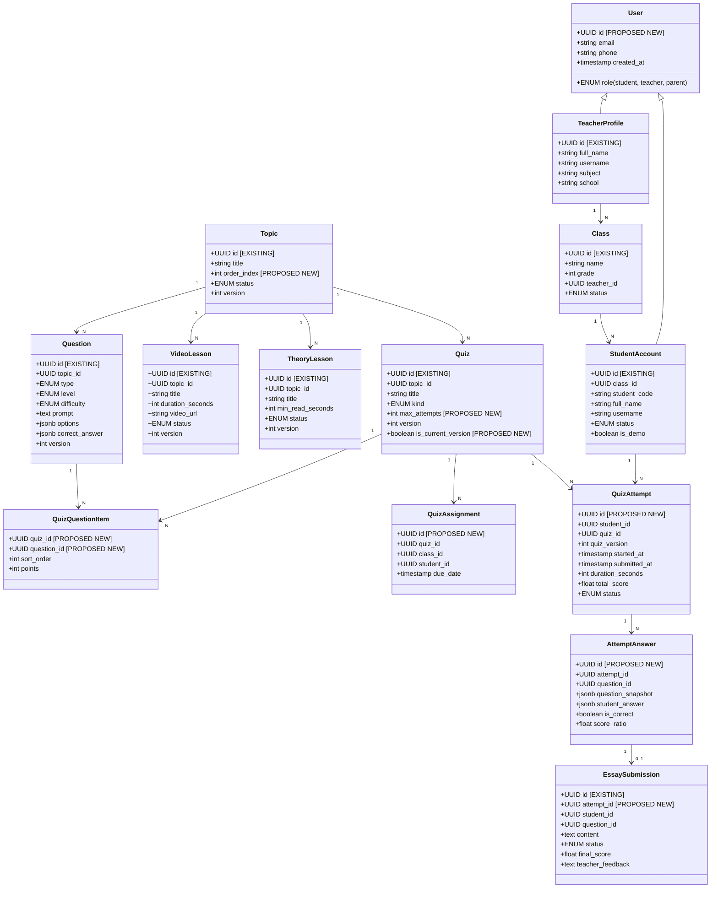
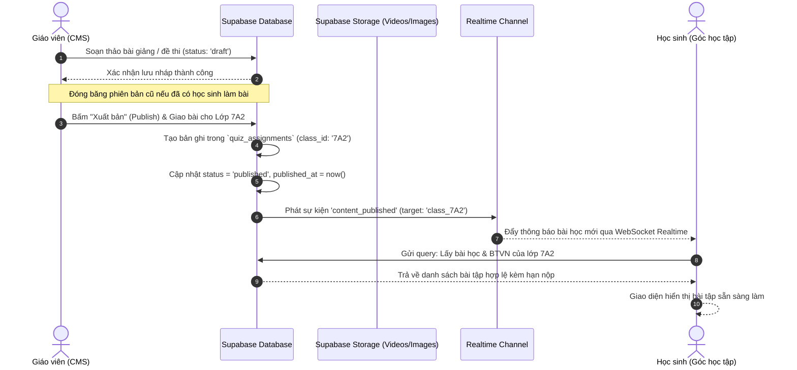
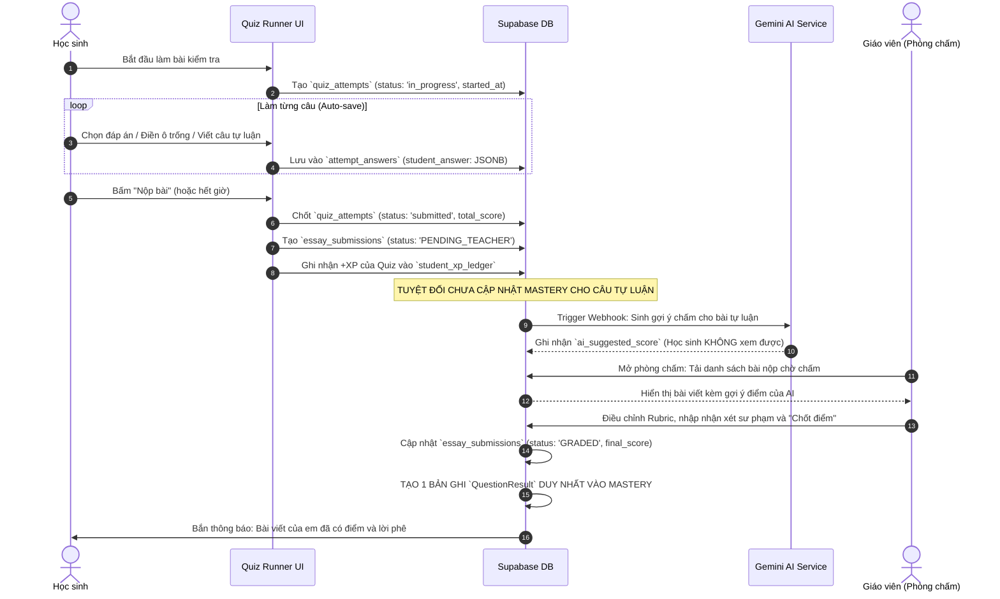

# ĐẶC TẢ NGHIỆP VỤ VÀ MÔ HÌNH DỮ LIỆU CHUẨN MẦM VĂN V1.0
## (MAM VAN BUSINESS & DATA SPECIFICATION V1.0)

> **Tài liệu tham chiếu chính thức cho Phase 2 (Supabase Database Design & Migration)**  
> **Dự án:** Mầm Văn – Nền tảng EdTech học Ngữ văn lớp 7  
> **Mã tài liệu:** `DOC-MV-SPEC-V1.0`  
> **Ngày phê duyệt & ban hành:** 29/09/2026  
> **Vai trò thực hiện:** Senior Software Architect, Lead Business Analyst, Data Architect & Technical Documentation Lead  
> **Trạng thái:** **APPROVED BY PRODUCT OWNER (CHÍNH THỨC BAN HÀNH)**

---

## MỤC LỤC

1. [Phần 1: Quản trị tài liệu (Document Control)](#phần-1-quản-trị-tài-liệu-document-control)
2. [Phần 2: Phạm vi dự án (Project Scope)](#phần-2-phạm-vi-dự-án-project-scope)
3. [Phần 3: Baseline kiến trúc & Đối chiếu hiện trạng Git](#phần-3-baseline-kiến-trúc--đối-chiếu-hiện-trạng-git)
4. [Phần 4: 11 Quyết định nghiệp vụ chính thức đã phê duyệt (11 Approved Business Decisions)](#phần-4-11-quyết-định-nghiệp-vụ-chính-thức-đã-phê-duyệt)
5. [Phần 5: Đặc tả chi tiết 11 quy tắc nghiệp vụ cốt lõi (Detailed Business Specifications)](#phần-5-đặc-tả-chi-tiết-11-quy-tắc-nghiệp-vụ-cốt-lõi)
6. [Phần 6: Mô hình dữ liệu khái niệm chuẩn (Conceptual Data Model v1.0)](#phần-6-mô-hình-dữ-liệu-khái-niệm-chuẩn-conceptual-data-model-v10)
7. [Phần 7: Bản đồ quan hệ thực thể (Entity Relationship Mapping)](#phần-7-bản-đồ-quan-hệ-thực-thể-entity-relationship-mapping)
8. [Phần 8: Luồng dữ liệu xuất bản và học tập xuyên suốt (Data Flows)](#phần-8-luồng-dữ-liệu-xuất-bản-và-học-tập-xuyên-suốt-data-flows)
9. [Phần 9: Ma trận sai lệch triển khai (Implementation Gap Matrix)](#phần-9-ma-trận-sai-lệch-triển-khai-implementation-gap-matrix)
10. [Phần 10: Ma trận kiểm thử nghiệm thu (Acceptance Test Matrix)](#phần-10-ma-trận-kiểm-thử-nghiệm-thu-acceptance-test-matrix)
11. [Phần 11: Yêu cầu an toàn thông tin & Quyền riêng tư (Security & Privacy)](#phần-11-yêu-cầu-an-toàn-thông-tin--quyền-riêng-tư-security--privacy)
12. [Phần 12: Các quyết định kỹ thuật còn mở (Pending Technical Decisions)](#phần-12-các-quyết-định-kỹ-thuật-còn-mở-pending-technical-decisions)
13. [Phần 13: Danh mục sẵn sàng chuyển giao Phase 2 (Phase 2 Readiness Checklist)](#phần-13-danh-mục-sẵn-sàng-chuyển-giao-phase-2-readiness-checklist)
14. [Phần 14: Tóm tắt bàn giao cho ChatGPT (ChatGPT Handoff Summary)](#phần-14-tóm-tắt-bàn-giao-cho-chatgpt-chatgpt-handoff-summary)

---

## PHẦN 1: QUẢN TRỊ TÀI LIỆU (DOCUMENT CONTROL)

### 1.1 Thông tin phiên bản
* **Tên tài liệu:** Mầm Văn Business & Data Specification v1.0
* **Mã hiệu:** `DOC-MV-SPEC-V1.0`
* **Phiên bản:** `1.0.0-FINAL`
* **Ngày phát hành:** 29/09/2026
* **Đơn vị phê duyệt:** Product Owner (Chủ sản phẩm Mầm Văn)
* **Mục tiêu:** Định nghĩa chuẩn mực nghiệp vụ và cấu trúc dữ liệu không thể thay đổi, dùng làm kim chỉ nam duy nhất để thiết kế cơ sở dữ liệu Supabase (PostgreSQL), xây dựng Row Level Security (RLS) và chuyển đổi từ Mock Repository sang Supabase Repository ở Phase 2.

### 1.2 Phân định thuật ngữ kiểm toán
Tài liệu sử dụng các nhãn phân loại chuẩn mực để tránh mọi sự suy diễn chủ quan:
* `[APPROVED BUSINESS REQUIREMENT]`: Yêu cầu nghiệp vụ chính thức đã được Product Owner phê chuẩn, bắt buộc hệ thống đích phải tuân thủ 100%.
* `[CURRENT IMPLEMENTATION]`: Trạng thái thực tế của mã nguồn đang chạy tại commit hiện tại.
* `[IMPLEMENTATION GAP]`: Sự sai lệch, lỗ hổng hoặc thiếu hụt giữa mã nguồn hiện tại và yêu cầu đã phê duyệt.
* `[PROPOSED ARCHITECTURE]`: Thiết kế kiến trúc dữ liệu và giải pháp kỹ thuật đề xuất bởi Lead Architect cho Phase 2.
* `[PENDING TECHNICAL DECISION]`: Lựa chọn hạ tầng hoặc tham số kỹ thuật cần thảo luận chi tiết khi triển khai Phase 2 (không làm thay đổi 11 quyết định nghiệp vụ đã chốt).

---

## PHẦN 2: PHẠM VI DỰ ÁN (PROJECT SCOPE)

### 2.1 Đối tượng phục vụ
Mầm Văn là nền tảng công nghệ giáo dục (EdTech) chuyên sâu môn Ngữ văn Lớp 7 theo Chương trình Giáo dục phổ thông (GDPT) 2018 của Việt Nam. Hệ thống bao gồm 3 phân hệ người dùng chính:
1. **Học sinh (Student):** Học tập qua bài giảng video tương tác, bài đọc lý thuyết sinh động, luyện tập trắc nghiệm và viết đoạn văn biểu cảm / phân tích, nuôi dưỡng "Cây Trưởng Thành" (Growth Tree) và đổi "Rương Quà Bí Mật".
2. **Giáo viên (Teacher):** Quản lý lớp học, phân phối học liệu, biên soạn bài kiểm tra đa định dạng (có hỗ trợ AI), chấm bài tự luận kết hợp AI Rubric và theo dõi 5 tab biểu đồ phân tích năng lực (Mastery Bloom).
3. **Phụ huynh (Parent - Future):** Nắm bắt thời gian học tích cực (ALT), mức độ chuyên cần và năng lực môn Văn của con em.

### 2.2 Ranh giới tài liệu
* **Trong phạm vi:** Chuẩn hóa toàn bộ nghiệp vụ từ học tập, làm bài, chấm điểm, tính kinh nghiệm (XP), điểm danh, năng lực Mastery, xuất bản bài học, kiểm toán phân quyền và mô hình dữ liệu quan hệ cho Supabase.
* **Ngoài phạm vi:** Không viết code thay đổi giao diện, không chạy migration SQL thực tế trong Phase 1, không tạo kết nối mạng Supabase.

---

## PHẦN 3: BASELINE KIẾN TRÚC & ĐỐI CHIẾU HIỆN TRẠNG GIT

### 3.1 Thông tin Baseline môi trường làm việc
* **Thư mục làm việc (CWD):** `e:\APP_Education\MamVan_Education-main\MamVan_Education-main`
* **Hạ tầng máy chủ Node:** Node.js `v24.19.0`, npm `11.17.0`, Hệ điều hành Windows 10/11 x64.
* **Repository tham chiếu gốc:** `https://github.com/DuongDADEV/MamVan_Education.git` (theo công bố của PO).
* **Trạng thái Git trên máy trạm hiện tại:** Thư mục làm việc hiện tại được trích xuất từ bản đóng gói source (`MamVan_Education-main.zip`), thư mục `.git` nội bộ không nằm trong thư mục con này (`fatal: not a git repository`). Mọi phân tích trong tài liệu này dựa trên mã nguồn thực tế tại chỗ (Static Code Analysis & Runtime Testing).
* **Phiên bản Framework & Package thực tế (tại `package.json`):**
  * `react`: `^19.0.1` (resolved `19.3.0`)
  * `react-dom`: `^19.0.1` (resolved `19.3.0`)
  * `react-is`: `^19.3.0` (resolved `19.3.0` - đã cài đặt thành công để sửa lỗi Vite Recharts)
  * `recharts`: `^3.10.1`
  * `vite`: `^8.3.0` (resolved `8.3.1`)
  * `@tailwindcss/vite`: `^4.3.3` (Tailwind CSS v4)
  * `typescript`: `^7.0.2`

### 3.2 Đối chiếu và làm rõ mâu thuẫn giữa các tài liệu trước đây
Báo cáo kiểm toán tổng quan ban đầu ngày 28/09 (`MAM_VAN_PROJECT_AUDIT.md`) và ba báo cáo kiểm toán Phase 1 ngày 29/09 có một số điểm khác biệt. Bảng sau xác lập **sự thật duy nhất tại mã nguồn hiện tại**:

| Nội dung đối chiếu | Ghi nhận tại Báo cáo ngày 28/09 | Ghi nhận tại Báo cáo Phase 1 (29/09) | Hiện trạng thực tế tại mã nguồn HEAD | Kết luận chuẩn hóa |
| :--- | :--- | :--- | :--- | :--- |
| **File dữ liệu học tập** | Đề cập `src/data/lessonData.ts` | Khẳng định không có `lessonData.ts` | Tồn tại `src/data/mockData.ts` (53.6 KB) và `src/services/mock/seedData.ts` (21 KB). Hoàn toàn **không có** file nào tên `lessonData.ts`. | **Chuẩn hóa:** Nguồn dữ liệu mẫu thực tế là `src/data/mockData.ts`. Mọi tài liệu kỹ thuật xóa bỏ tham chiếu `lessonData.ts`. |
| **Phiên bản Vite** | Ghi nhận Vite `^6.2.0` | Ghi nhận Vite `^8.3.0` | `package.json` khai báo `"vite": "^8.3.0"` (chạy thực tế `8.3.1`). | **Chuẩn hóa:** Hệ thống dùng Vite 8.3.1. |
| **Phiên bản Recharts**| Ghi nhận Recharts `^3.7.0` | Ghi nhận Recharts `^3.10.1` | `package.json` khai báo `"recharts": "^3.10.1"`. | **Chuẩn hóa:** Phiên bản là Recharts 3.10.1. |
| **Cơ chế lưu Attempt** | Suy đoán đã có lịch sử làm bài | Chỉ ra thiếu `Attempt` và `AttemptAnswer` | Không có bảng/interface `Attempt`. Chỉ lưu kết quả đúng/sai vào `QuestionResult` trong `StudentState`. Vứt bỏ đáp án chọn của học sinh. | **Chuẩn hóa:** Xác nhận lỗ hổng thiếu `Attempt` và `AttemptAnswer`. Cần tạo mới ở Phase 2. |
| **Đường dẫn Source** | `d:\TIENANH\vợ văn vân\APP 7\mamvan` | `e:\APP_Education\MamVan_Education-main\...` | `e:\APP_Education\MamVan_Education-main\MamVan_Education-main` | Báo cáo 28/09 thực hiện trên máy trạm của Developer cũ; Báo cáo Phase 1 thực hiện trên môi trường máy trạm hiện tại. |

---

## PHẦN 4: 11 QUYẾT ĐỊNH NGHIỆP VỤ CHÍNH THỨC ĐÃ PHÊ DUYỆT

Dưới đây là 11 quyết định nghiệp vụ đã được Product Owner phê duyệt chính thức (từ BR-01 đến BR-11):

* **BR-01 – SINGLE SOURCE OF TRUTH:** Mọi nội dung học tập do giáo viên quản lý qua CMS. Giao diện học sinh đọc dữ liệu duy nhất thông qua tầng Repository. Các bài học mẫu tĩnh chỉ dùng cho mục đích seed dữ liệu khởi tạo lần đầu; tuyệt đối không được trở thành nguồn fallback cứng có khả năng ghi đè hoặc hiển thị song song với nội dung xuất bản mới.
* **BR-02 – ATTENDANCE (ĐIỂM DANH HỌC TẬP):** Học sinh chủ động bấm thẻ điểm danh trên trang chủ để nhận thưởng +2 XP và kích hoạt hoạt ảnh tưới cây. Đăng nhập hệ thống không tự động điểm danh. Mỗi học sinh chỉ được ghi nhận phần thưởng điểm danh một lần duy nhất trong ngày theo giờ địa phương.
* **BR-03 – ESSAY XP & MASTERY (ĐẶC TẢ TỰ LUẬN):** Bài viết đoạn văn nằm trong cấu trúc bài kiểm tra (Quiz). Khi học sinh nộp Quiz hợp lệ, học sinh nhận ngay XP của bước Quiz theo định mức. Không cộng dồn XP riêng cho câu tự luận khi nộp. Không chờ giáo viên chấm mới cộng XP Quiz. AI chỉ đóng vai trò gợi ý điểm cho giáo viên. Năng lực Mastery của câu tự luận **chỉ được cập nhật sau khi giáo viên chốt điểm cuối cùng**. Tuyệt đối không đưa điểm giả định 0.8 vào Mastery. Không được ghi nhận trùng lặp Mastery khi giáo viên chấm lại.
* **BR-04 – COMPLETE ATTEMPT HISTORY (LỊCH SỬ LÀM BÀI TRỌN VẸN):** Hệ thống bắt buộc phải lưu trữ bền vững: Mỗi lượt làm bài độc lập, nguyên văn câu trả lời của học sinh (`student_answer`), điểm từng câu, điểm tổng, phiên bản Quiz/Question tương ứng tại thời điểm thi, thời điểm bắt đầu, thời điểm nộp, tổng thời lượng làm bài và trạng thái hoàn thành.
* **BR-05 – IMMUTABLE CONTENT VERSIONING (BẢO TOÀN PHIÊN BẢN BẤT BIẾN):** Khi chỉnh sửa một bài học hoặc bài kiểm tra đã xuất bản và đã có học sinh làm bài, hệ thống bắt buộc tạo ra một phiên bản mới ($N+1$). Phiên bản cũ phải được đóng băng bất biến (immutable). Kết quả bài làm cũ của học sinh không bao giờ bị thay đổi khi giáo viên sửa nội dung hoặc đáp án ở phiên bản mới.
* **BR-06 – ANALYTICS DATA SEGREGATION (PHÂN TÁCH DỮ LIỆU PHÂN TÍCH):** Dữ liệu mẫu (35 học sinh ảo) và dữ liệu học sinh thực tế phải được phân tách triệt để. Dashboard phân tích của giáo viên trong môi trường vận hành thực tế chỉ được tổng hợp dữ liệu từ các học sinh thật thuộc các lớp mà giáo viên đó phụ trách.
* **BR-07 – CONTENT SCOPE & ASSIGNMENT (PHẠM VI HỌC LIỆU & GIAO BÀI):** Kho bài giảng Ngữ văn 7 (Video, Lý thuyết) được dùng chung cho toàn khối 7. Bài kiểm tra đánh giá chính thức và Bài tập về nhà được giáo viên giao theo từng lớp hoặc chỉ định học sinh. Tách biệt giữa thực thể nội dung gốc và thực thể giao bài; không nhân bản (clone) toàn bộ đề thi mỗi khi giao cho một lớp mới.
* **BR-08 – RETAKE POLICY (CHÍNH SÁCH LÀM LẠI BÀI):** Bài luyện tập không giới hạn số lần thực hiện. Bài kiểm tra chính thức và Mastery Check có số lượt làm tối đa do giáo viên cấu hình. Mọi lượt làm đều phải được lưu trữ độc lập, không ghi đè lịch sử. XP chỉ được thưởng ở lần đầu tiên hoàn thành đạt yêu cầu.
* **BR-09 – ARCHIVED CONTENT (XỬ LÝ HỌC LIỆU LƯU TRỮ):** Nội dung ở trạng thái Lưu trữ (`archived`) không còn xuất hiện trong danh mục bài học mới. Tuy nhiên, học sinh đã từng học hoặc từng làm bài nội dung đó vẫn có quyền xem lại trong hồ sơ cá nhân để ôn tập.
* **BR-10 – AUTO-SAVE & RESUME (TỰ ĐỘNG LƯU VÀ KHÔI PHỤC TIẾN TRÌNH):** Hệ thống tự động lưu câu trả lời đang làm và vị trí bài học. Nếu học sinh gặp sự cố F5, mất mạng hoặc đóng trình duyệt, hệ thống phải khôi phục chính xác tiến trình làm bài dở dang. Đồng hồ đếm ngược bài thi phải được xác định dựa trên mốc thời gian máy chủ (server timestamp) để chống gian lận reset thời gian bằng cách tải lại trang.
* **BR-11 – VIDEO COMPLETION VERIFICATION (XÁC MINH HOÀN THÀNH VIDEO):** Quy tắc thông thường: học sinh phải xem tích lũy ít nhất 80% thời lượng duy nhất của video; tua nhanh không được tính. Nếu nền tảng phát không hỗ trợ theo dõi chính xác từng giây, cho phép xác minh thay thế bằng câu hỏi kiểm tra nhanh nội dung bài giảng hoặc xác nhận thủ công của giáo viên. Tuyệt đối không dùng bộ đếm ảo tự động chạy giờ. Phải ghi nhận rõ phương thức xác minh hoàn thành.

---

## PHẦN 5: ĐẶC TẢ CHI TIẾT 11 QUY TẮC NGHIỆP VỤ CỐT LÕI

### BR-01: SINGLE SOURCE OF TRUTH (NGUỒN DỮ LIỆU DUY NHẤT)
1. **Business Objective:** Đảm bảo toàn bộ học liệu học sinh tiếp cận được quản lý tập trung và đồng bộ từ Giáo viên, loại bỏ hoàn toàn hiện tượng học sinh nhìn thấy nội dung cũ hoặc bị sai lệch do nạp file tĩnh cục bộ.
2. **Approved Requirement:** Học sinh đọc dữ liệu duy nhất qua `ContentRepository` và `QuizRepository`. File mẫu `mockData.ts` chỉ được dùng làm seed khởi tạo hệ thống lúc chưa có dữ liệu. Không được dùng `mockData.ts` làm fallback đè lên dữ liệu do giáo viên biên soạn.
3. **Actors:** Giáo viên (Tạo/Sửa/Xuất bản), Học sinh (Đọc/Học).
4. **Trigger / User Action:** Học sinh truy cập các màn hình `HomeScreen`, `LearnScreen`, `VideoLessonScreen`, `TheoryLessonScreen`.
5. **Preconditions:** Học sinh đã đăng nhập với tài khoản hợp lệ thuộc một lớp học cụ thể.
6. **Main Flow:**
   * Màn hình gọi hook truy vấn `useLiveQuery` trỏ vào Repository Service tương ứng.
   * Repository truy vấn từ Database (Supabase) dựa trên phạm vi lớp và trạng thái `published`.
   * Giao diện render chính xác danh mục nội dung nhận được từ Database.
7. **Exception / Edge Cases:** Mất kết nối mạng $\rightarrow$ Hiển thị thông báo trạng thái ngoại tuyến (Offline Banner) và nút Thử lại, không âm thầm nạp dữ liệu tĩnh mẫu gây hiểu nhầm.
8. **Data to Persist:** Không có dữ liệu ghi mới; yêu cầu dữ liệu trả về từ bảng `topics`, `video_lessons`, `theory_lessons`, `quizzes`.
9. **Validation Rules:** Dữ liệu trả về cho học sinh bắt buộc phải có `status = 'published'` và `deleted_at IS NULL`.
10. **Acceptance Criteria (Testable):**
    * *AC-01.1:* Khi giáo viên đổi tên chủ đề "Thơ bốn chữ, năm chữ" thành "Thơ 4-5 chữ Việt Nam", tài khoản học sinh tải lại trang thấy ngay tên mới mà không còn chữ cũ từ `mockData.ts`.
    * *AC-01.2:* Tìm kiếm trong toàn bộ mã nguồn phía client của các màn hình học sinh không còn dòng lệnh `import { TOPICS, VIDEOS... } from '../data/mockData'`.
11. **Current Source Status:** **FAIL.** `LearnScreen.tsx` (L27), `VideoLessonScreen.tsx` (L48), `TheoryLessonScreen.tsx` (L49) vẫn dùng toán tử `||` fallback về hằng số tĩnh của `mockData.ts`.
12. **Implementation Gap:** Cần gỡ bỏ toàn bộ fallback `|| VIDEOS[id]`, `|| THEORIES[id]`. Khi Repository trả về null, màn hình phải hiển thị Empty State chuẩn.
13. **Related Entities:** `Topic`, `VideoLesson`, `TheoryLesson`, `Quiz`.
14. **Security Considerations:** Áp dụng RLS: Học sinh chỉ được quyền `SELECT` các bản ghi có `status = 'published'`.

---

### BR-02: ATTENDANCE (QUY TẮC ĐIỂM DANH CHỦ ĐỘNG)
1. **Business Objective:** Rèn luyện tính tự giác và ý thức chuyên cần học tập mỗi ngày cho học sinh lớp 7 thông qua nghi thức điểm danh và nhận thưởng kinh nghiệm.
2. **Approved Requirement:** Học sinh chủ động click thẻ "Điểm danh nhận +2 XP" trên trang chủ. Đăng nhập hệ thống không tự động điểm danh. Mỗi ngày (00:00:00 - 23:59:59) chỉ nhận thưởng 1 lần.
3. **Actors:** Học sinh.
4. **Trigger / User Action:** Học sinh click nút "Điểm danh ngay" trên widget Điểm danh tại `HomeScreen.tsx`.
5. **Preconditions:** Học sinh đã đăng nhập; chưa điểm danh thành công trong ngày hôm nay (`lastAttendanceDate !== todayStr`).
6. **Main Flow:**
   * Học sinh click nút Điểm danh.
   * Hệ thống kiểm tra điều kiện chưa điểm danh trong ngày.
   * Ghi nhận giao dịch `+2 XP` vào sổ cái XP (`actionName = 'attendance:<YYYY-MM-DD>'`).
   * Tăng số ngày chuyên cần tuần `attendanceDaysThisWeek += 1`.
   * Ghi ngày hôm nay vào lịch sử chuyên cần `attendanceHistory`.
   * Kích hoạt hiệu ứng tưới nước cho Mầm Cây và hiển thị toast chúc mừng.
   * Nếu đạt mốc 3 ngày hoặc 5 ngày liên tiếp trong tuần, tự động mở khóa huy hiệu (`Badge`) tương ứng.
7. **Exception / Edge Cases:**
   * Học sinh click nhiều lần liên tục $\rightarrow$ Hệ thống chặn xử lý từ lần click thứ 2 và thông báo "Hôm nay bạn đã điểm danh rồi!".
   * Học sinh đổi múi giờ thiết bị để gian lận $\rightarrow$ Hệ thống dùng ngày giờ thực tế của máy chủ cơ sở dữ liệu (`CURRENT_DATE`), không tin tưởng ngày giờ từ máy client.
8. **Data to Persist:** Bảng `student_attendance` (`id`, `student_id`, `attendance_date`, `created_at`), bảng `student_xp_ledger` (`raw_xp: 2`, `actual_xp: 2`).
9. **Validation Rules:** Ràng buộc duy nhất `UNIQUE(student_id, attendance_date)`.
10. **Acceptance Criteria (Testable):**
    * *AC-02.1:* Đăng nhập tài khoản học sinh, tải lại trang 10 lần $\rightarrow$ `totalXp` không tăng, `attendanceDaysThisWeek` không đổi.
    * *AC-02.2:* Bấm nút Điểm danh $\rightarrow$ `totalXp` tăng đúng 2 XP, nút chuyển sang trạng thái "Đã điểm danh" có dấu tích xanh và bị vô hiệu hóa.
11. **Current Source Status:** **MATCH (Logic UI), GAP (Dữ liệu).** Source hiện tại tại `App.tsx` (L356–390) đã xử lý đúng việc bấm tay nhận +2 XP; tuy nhiên dữ liệu chỉ lưu trong `studentState` của localStorage, hàm `attemptRepo.recordAttendance()` chưa từng được gọi.
12. **Implementation Gap:** Cần lưu vào bảng `student_attendance` chuyên biệt tại Supabase có khóa UNIQUE theo ngày của máy chủ.
13. **Related Entities:** `StudentAccount`, `StudentAttendance`, `XpLedger`, `Badge`.
14. **Security Considerations:** Chống gửi request điểm danh giả mạo bằng Database Constraint và kiểm tra IP / rate-limit.

---

### BR-03: ESSAY XP & MASTERY (QUY TẮC ĐÁNH GIÁ TỰ LUẬN)
1. **Business Objective:** Khuyến khích học sinh rèn luyện kỹ năng viết đoạn văn mà không tạo áp lực điểm số ảo, đồng thời bảo toàn tính chuẩn xác tuyệt đối của đánh giá sư phạm từ Giáo viên.
2. **Approved Requirement:** Câu tự luận nằm trong Quiz. Khi nộp Quiz, nhận ngay XP của Quiz. Không cộng XP riêng cho câu tự luận khi nộp. Không chờ giáo viên chấm mới cộng XP Quiz. AI chỉ hỗ trợ gợi ý điểm cho giáo viên. Năng lực Mastery của câu tự luận **chỉ cập nhật sau khi giáo viên hoàn thành chấm điểm chính thức**. Cấm đưa điểm giả định 0.8 vào Mastery. Cấm ghi đè hoặc cộng trùng lặp Mastery khi giáo viên chấm lại.
3. **Actors:** Học sinh (Nộp bài), AI Service (Gợi ý chấm ngầm), Giáo viên (Chấm và chốt điểm).
4. **Trigger / User Action:** Học sinh bấm "Nộp bài" trong `QuizRunner.tsx` $\rightarrow$ Giáo viên mở `SplitGradingWorkspace.tsx` và bấm "Hoàn tất chấm điểm".
5. **Preconditions:** Học sinh đã điền nội dung tự luận đạt độ dài tối thiểu (tối thiểu 5 từ).
6. **Main Flow:**
   * *Bước 1 (Học sinh nộp):* Hệ thống ghi nhận bài thi và tạo bản ghi `EssaySubmission` với trạng thái `PENDING_TEACHER`. Cộng XP của Quiz cho học sinh. **Tuyệt đối không tạo `QuestionResult` cho câu tự luận tại thời điểm này**.
   * *Bước 2 (AI chấm gợi ý):* Background Function gọi Gemini AI chấm theo Rubric mẫu và lưu vào `aiSuggestion`. Học sinh hoàn toàn không xem được kết quả này.
   * *Bước 3 (Giáo viên chốt điểm):* Giáo viên xem bài viết, tham khảo gợi ý AI, điều chỉnh điểm theo từng tiêu chí Rubric, viết nhận xét và bấm "Chốt điểm".
   * *Bước 4 (Cập nhật Mastery):* Trạng thái bài viết chuyển thành `GRADED`. Hệ thống tạo 1 bản ghi `QuestionResult` duy nhất với `scoreRatio = finalScore / 10` và cập nhật vào tiến trình Mastery mức Vận dụng của học sinh.
7. **Exception / Edge Cases:**
   * Giáo viên chấm lại lần 2 (điều chỉnh điểm) $\rightarrow$ Hệ thống cập nhật bản ghi `QuestionResult` hiện có, **không được `push` thêm bản ghi mới**.
   * Học sinh nộp bài viết nhưng giáo viên chưa kịp chấm $\rightarrow$ Mức năng lực Vận dụng hiển thị trạng thái `INSUFFICIENT_DATA` hoặc giữ nguyên kết quả của các bài cũ, không bị méo mó số liệu.
8. **Data to Persist:** Bảng `essay_submissions`, bảng `attempt_answers` (cột `score`, `teacher_feedback`, `rubric_scores`).
9. **Validation Rules:** Điểm tự luận $0 \le \text{finalScore} \le 10$. Trường `ai_suggestion` được bảo vệ không lộ ra API học sinh.
10. **Acceptance Criteria (Testable):**
    * *AC-03.1:* Học sinh nộp bài thi có câu tự luận $\rightarrow$ Mở tab Mastery thấy số câu Vận dụng chưa tăng, Mastery không đổi.
    * *AC-03.2:* Giáo viên cho 9/10 điểm và chốt $\rightarrow$ Lúc này Mastery mức Vận dụng của học sinh mới được tính thêm 1 câu với tỷ lệ 0.9.
    * *AC-03.3:* Khi hs002 nộp bài, giáo viên mở hàng đợi chấm thấy đúng tên học sinh hs002 (khắc phục lỗi hardcode hs001).
11. **Current Source Status:** **FAIL NGHIÊM TRỌNG.**
    * `QuizRunner.tsx` (L129–147) tự gán `scoreRatio = 0.8` và đẩy ngay vào `questionResults` khi học sinh vừa nộp bài.
    * `mockRepositories.ts` (L1874) khi giáo viên chấm lại đẩy thêm 1 `QuestionResult` nữa $\rightarrow$ Câu tự luận bị tính điểm 2 lần vào Mastery!
    * `QuizRunner.tsx` (L141) và `VideoLessonScreen.tsx` (L271) hardcoded cứng `studentId: 'hs001'`.
12. **Implementation Gap:** Xóa bỏ đoạn code tự tạo `QuestionResult` trong `QuizRunner.tsx`. Tách luồng ghi nhận Mastery chỉ nằm ở hàm `gradeSubmission()` của giáo viên với cơ chế idempotent (cập nhật nếu đã có).
13. **Related Entities:** `QuizAttempt`, `AttemptAnswer`, `EssaySubmission`, `QuestionResult`, `Mastery`.
14. **Security Considerations:** AI Suggestion và điểm dự kiến của giáo viên trong bản nháp (`teacherDraft`) bắt buộc phải được bảo vệ bằng RLS, cấm tài khoản học sinh truy vấn.

---

### BR-04: COMPLETE ATTEMPT HISTORY (LỊCH SỬ LÀM BÀI TRỌN VẸN)
1. **Business Objective:** Cung cấp bằng chứng sư phạm đầy đủ để học sinh xem lại lỗi sai, phụ huynh theo dõi bài làm của con, và giáo viên phân tích phổ điểm chi tiết.
2. **Approved Requirement:** Lưu trữ độc lập và vĩnh viễn: ID lượt làm bài, câu trả lời thực tế của học sinh (`student_answer`), điểm chi tiết từng câu, phiên bản Quiz/Question tương ứng, thời gian bắt đầu, thời gian nộp và trạng thái bài thi.
3. **Actors:** Học sinh (Thực hiện), Hệ thống (Ghi nhận).
4. **Trigger / User Action:** Học sinh bắt đầu làm bài (`Start Quiz`) $\rightarrow$ Chọn đáp án $\rightarrow$ Nộp bài (`Submit Quiz`).
5. **Preconditions:** Học sinh được phép làm bài kiểm tra này (được giao hoặc bài chung).
6. **Main Flow:**
   * Tạo bản ghi `QuizAttempt` với trạng thái `in_progress`, lưu `started_at = now()`.
   * Khi học sinh thao tác chọn từng câu, đáp án được lưu tạm vào bảng `AttemptAnswer` (`student_answer: JSONB`).
   * Khi bấm Nộp bài hoặc hết giờ, tính điểm tổng, lưu `submitted_at = now()`, `duration_seconds = submitted_at - started_at`, trạng thái chuyển thành `submitted` hoặc `timed_out`.
7. **Exception / Edge Cases:** Học sinh mất mạng khi đang làm câu 4/5 $\rightarrow$ Các câu 1, 2, 3 đã được lưu trữ an toàn trên máy chủ.
8. **Data to Persist:** Bảng `quiz_attempts` và bảng `attempt_answers`.
9. **Validation Rules:** Mỗi lượt làm có 1 UUID riêng biệt. Không cho phép sửa đổi `student_answer` sau khi trạng thái đã chuyển thành `submitted`.
10. **Acceptance Criteria (Testable):**
    * *AC-04.1:* Học sinh chọn đáp án B cho câu trắc nghiệm và gõ từ "hoa sen" cho câu điền từ $\rightarrow$ Sau khi nộp, giáo viên hoặc học sinh mở xem lại bài thi thấy chính xác đáp án B và từ "hoa sen" cùng đánh dấu Đúng/Sai của hệ thống.
11. **Current Source Status:** **FAIL HOÀN TOÀN.** Hiện tại không có bảng `Attempt` hay `AttemptAnswer`. Toàn bộ đáp án của học sinh bị vứt bỏ, chỉ giữ lại `isCorrect` và `scoreRatio`.
12. **Implementation Gap:** Xây dựng mới 2 bảng `quiz_attempts` và `attempt_answers` trên Supabase và kết nối vào API nộp bài.
13. **Related Entities:** `QuizAttempt`, `AttemptAnswer`, `Quiz`, `Question`.
14. **Security Considerations:** Học sinh chỉ được xem `attempt_answers` của chính mình sau khi bài kiểm tra đã nộp. Không được xem đáp án của học sinh khác.

---

### BR-05: IMMUTABLE CONTENT VERSIONING (BẢO TOÀN PHIÊN BẢN BẤT BIẾN)
1. **Business Objective:** Bảo vệ tính toàn vẹn của lịch sử sư phạm. Đảm bảo kết quả học tập trong quá khứ phản ánh chính xác đề thi tại thời điểm học sinh thực hiện, không bị biến dạng khi đề thi được cải tiến ở tương lai.
2. **Approved Requirement:** Khi sửa đổi nội dung đã xuất bản và đã có học sinh làm bài, hệ thống phải tạo một phiên bản mới ($N+1$). Phiên bản cũ được bảo toàn bất biến. Cấm việc chỉ tăng số version rồi sửa đè nội dung trên cùng một bản ghi.
3. **Actors:** Giáo viên (Chỉnh sửa đề).
4. **Trigger / User Action:** Giáo viên nhấn "Cập nhật lên web học sinh" (Xuất bản) cho một Quiz hoặc Question đã có lượt làm trong hệ thống.
5. **Preconditions:** Bài kiểm tra đã có ít nhất 1 bản ghi trong `quiz_attempts`.
6. **Main Flow:**
   * Hệ thống kiểm tra hàm `hasStudentAttempts(quizId)`.
   * Nếu đã có học sinh làm: Hệ thống đóng băng bản ghi cũ (`is_current_version = false`), tạo bản ghi Quiz mới kế thừa dữ liệu kèm các chỉnh sửa với `version = old_version + 1` và `is_current_version = true`.
   * Các học sinh làm bài từ thời điểm này sẽ nhận phiên bản mới.
   * Lịch sử bài làm cũ vẫn liên kết chặt chẽ với bản ghi phiên bản cũ.
7. **Exception / Edge Cases:** Đề thi chưa có bất kỳ học sinh nào làm $\rightarrow$ Cho phép giáo viên sửa trực tiếp trên phiên bản hiện tại mà không cần tạo bản ghi mới để tránh rác cơ sở dữ liệu.
8. **Data to Persist:** Cột `version`, `is_current_version`, `parent_content_id` trên các bảng nội dung.
9. **Validation Rules:** Bản ghi nội dung có `is_current_version = false` trở thành Read-Only (chặn UPDATE/DELETE qua trigger hoặc RLS).
10. **Acceptance Criteria (Testable):**
    * *AC-05.1:* Học sinh A làm đề v1 có câu hỏi "Nhịp thơ 4 chữ là gì?" (đáp án 2/2). Giáo viên sửa câu hỏi thành "Đặc điểm thơ 4 chữ?" (đáp án khác) và xuất bản v2. Học sinh A mở lại bài cũ vẫn thấy nguyên vẹn câu hỏi "Nhịp thơ 4 chữ là gì?". Học sinh B làm bài mới sẽ thấy đề bài v2.
11. **Current Source Status:** **FAIL.** `mockRepositories.ts` (L1374, L1468) chỉ tăng biến đếm `version` và ghi đè trực tiếp lên ID cũ.
12. **Implementation Gap:** Xây dựng cơ chế Versioning theo mô hình Clone-on-Edit hoặc Snapshot Immutable JSON trên Supabase.
13. **Related Entities:** `Quiz`, `Question`, `QuizAttempt`.
14. **Security Considerations:** Giáo viên không được xóa vĩnh viễn (`Hard Delete`) các phiên bản nội dung đã có học sinh làm bài.

---

### BR-06: ANALYTICS DATA SEGREGATION (PHÂN TÁCH DỮ LIỆU PHÂN TÍCH)
1. **Business Objective:** Đảm bảo dữ liệu thống kê, báo cáo sư phạm của Giáo viên và Ban Giám hiệu phản ánh 100% kết quả học tập của học sinh thật, không bị sai lệch bởi các tài khoản thử nghiệm.
2. **Approved Requirement:** Tách bạch tuyệt đối dữ liệu mẫu demo và dữ liệu học sinh thật. Dashboard của giáo viên ở môi trường vận hành chỉ tổng hợp từ các học sinh thực tế thuộc các lớp được phân công.
3. **Actors:** Giáo viên.
4. **Trigger / User Action:** Giáo viên truy cập màn hình `TeacherOverviewScreen.tsx` và `TeacherAnalyticsScreen.tsx`.
5. **Preconditions:** Giáo viên đã đăng nhập và chọn lớp hoặc chọn toàn bộ lớp phụ trách.
6. **Main Flow:**
   * Tầng dữ liệu truy vấn học sinh với điều kiện `is_demo = false` (ở môi trường sản xuất).
   * Toàn bộ thuật toán thống kê điểm số, phân bố Mastery, tỷ lệ chuyên cần chỉ duyệt qua các bản ghi của học sinh thật.
7. **Exception / Edge Cases:** Ở chế độ đào tạo/hướng dẫn sử dụng (Pilot / Training Mode) $\rightarrow$ Cung cấp nút chuyển đổi: "Xem lớp học thực tế" / "Xem dữ liệu mẫu minh họa".
8. **Data to Persist:** Cột `is_demo: boolean DEFAULT false` trên bảng `classes`, `students`, `quiz_attempts`.
9. **Validation Rules:** Mọi view tổng hợp (Materialized View hoặc Stored Procedure) đều có mệnh đề lọc `WHERE is_demo = false`.
10. **Acceptance Criteria (Testable):**
    * *AC-06.1:* Lớp 7A2 có 2 học sinh thật làm bài $\rightarrow$ Biểu đồ sĩ số và phổ điểm hiển thị chính xác mẫu số là 2 học sinh, không bị nhảy lên 35 học sinh từ seed ảo.
11. **Current Source Status:** **FAIL.** `TeacherPortal.tsx` (L78) đọc toàn bộ `attemptRepo.getAllStates()`, bao gồm 35 học sinh ảo của `demoSeedHistory.ts` hòa lẫn vào học sinh thật.
12. **Implementation Gap:** Thêm cờ `is_demo` trên bảng cơ sở dữ liệu và bổ sung bộ lọc phân tách tại các hàm thống kê `src/analytics/`.
13. **Related Entities:** `Class`, `StudentAccount`, `QuizAttempt`, `Analytics`.
14. **Security Considerations:** Dữ liệu học sinh thật phải tuân thủ quyền riêng tư, không hiển thị cho tài khoản demo.

---

### BR-07: CONTENT SCOPE & ASSIGNMENT (PHẠM VI HỌC LIỆU & GIAO BÀI)
1. **Business Objective:** Tối ưu hóa việc chia sẻ tài nguyên giáo dục chung cho toàn khối 7, đồng thời đảm bảo tính linh hoạt khi giao bài tập cá nhân hóa hoặc theo từng lớp.
2. **Approved Requirement:** Bài giảng video và lý thuyết dùng chung cho toàn khối 7. Bài kiểm tra chính thức và bài tập về nhà được giao theo lớp hoặc chỉ định học sinh cụ thể. Không clone nhân bản toàn bộ đề thi mỗi khi giao cho một lớp mới.
3. **Actors:** Giáo viên (Giao bài), Học sinh (Nhận bài).
4. **Trigger / User Action:** Giáo viên cấu hình bài tập về nhà trong `QuizBuilder.tsx` (chọn "Giao cho cả lớp" hoặc "Chỉ định học sinh") và chọn lớp tại `PublishModal.tsx`.
5. **Preconditions:** Đề thi đã được soạn và lưu nháp thành công.
6. **Main Flow:**
   * Giáo viên giữ nguyên bản ghi Quiz gốc.
   * Khi giao bài, hệ thống tạo bản ghi trong bảng trung gian `quiz_assignments` (`quiz_id`, `class_id` hoặc `student_id`, `due_date`, `assigned_at`).
   * Học sinh thuộc lớp được giao khi mở ứng dụng sẽ thấy bài tập xuất hiện trong danh mục BTVN kèm hạn nộp.
7. **Exception / Edge Cases:** Học sinh chuyển từ lớp 7A2 sang lớp 7A3 $\rightarrow$ Hệ thống tự động cập nhật danh sách bài tập theo lớp mới, bảo lưu kết quả bài tập đã làm ở lớp cũ.
8. **Data to Persist:** Bảng `quiz_assignments` (`id`, `quiz_id`, `class_id`, `student_id`, `due_date`, `created_at`).
9. **Validation Rules:** Một Quiz có thể giao cho nhiều lớp mà không làm thay đổi ID của Quiz.
10. **Acceptance Criteria (Testable):**
    * *AC-07.1:* Giáo viên giao BTVN cho lớp 7A2 với hạn nộp ngày 15/10 $\rightarrow$ Học sinh lớp 7A2 thấy bài tập có hạn nộp 15/10; học sinh lớp 7A3 không thấy bài tập này.
    * *AC-07.2:* Kiểm tra bảng Quiz chỉ có đúng 1 bản ghi đề thi duy nhất, không bị nhân bản thành nhiều bản sao thừa thãi.
11. **Current Source Status:** **FAIL.** `App.tsx` (L247) truyền sai tham số `grade` ('Lớp 7') vào `classId`, làm tê liệt bộ lọc phân lớp. Đồng thời `App.tsx` (L507) đang hardcode bài BTVN là `QUIZZES.quiz_homework_special`.
12. **Implementation Gap:** Xây dựng bảng `quiz_assignments` và sửa logic nạp bài tập trong `App.tsx` để đọc danh sách BTVN thực tế được giao cho học sinh.
13. **Related Entities:** `Quiz`, `Class`, `StudentAccount`, `QuizAssignment`.
14. **Security Considerations:** Học sinh không có quyền truy vấn các bài kiểm tra được giao riêng cho lớp khác.

---

### BR-08: RETAKE POLICY (CHÍNH SÁCH LÀM LẠI BÀI TẬP)
1. **Business Objective:** Khuyến khích học sinh luyện tập nhiều lần để tiến bộ, đồng thời giữ tính nghiêm túc cho các bài kiểm tra đánh giá định kỳ.
2. **Approved Requirement:** Bài luyện tập (`practice`) cho phép làm lại không giới hạn số lần. Bài kiểm tra nhanh (`quick`) và Mastery Check có số lượt làm tối đa do giáo viên thiết lập (mặc định 1 hoặc 2 lần). Mỗi lượt làm đều được lưu bản ghi riêng. XP chỉ thưởng ở lần đầu tiên đạt yêu cầu.
3. **Actors:** Học sinh.
4. **Trigger / User Action:** Học sinh bấm "Làm lại bài kiểm tra" sau khi đã có kết quả trước đó.
5. **Preconditions:** Số lượt làm bài hiện tại nhỏ hơn `max_attempts` được cấu hình trên Quiz.
6. **Main Flow:**
   * Hệ thống kiểm tra số bản ghi `quiz_attempts` của học sinh đối với Quiz này.
   * Nếu còn lượt: Cho phép mở bài thi mới và tạo bản ghi `QuizAttempt` mới.
   * Khi hoàn thành: Lưu điểm mới. Nếu lần trước đã nhận XP thì lần này nhận `actual_xp = 0` kèm thông báo khuyến khích rèn luyện.
7. **Exception / Edge Cases:** Học sinh đã hết số lượt cho phép $\rightarrow$ Nút "Làm lại" bị khóa mờ (`disabled`) và hiển thị thông báo "Em đã hoàn thành số lượt làm bài tối đa cho phép".
8. **Data to Persist:** Cột `max_attempts` trên bảng `quizzes`; số lượng bản ghi trong `quiz_attempts`.
9. **Validation Rules:** `COUNT(quiz_attempts) <= quiz.max_attempts`.
10. **Acceptance Criteria (Testable):**
    * *AC-08.1:* Đề thi cấu hình tối đa 2 lần làm $\rightarrow$ Học sinh làm xong lần 1 vẫn bấm làm lại được; làm xong lần 2 nút làm lại biến mất.
    * *AC-08.2:* Cả 2 lần làm bài đều xuất hiện trong danh sách lịch sử thi để giáo viên so sánh sự tiến bộ.
11. **Current Source Status:** **PARTIAL.** Hiện tại hệ thống cho làm lại tự do không giới hạn số lần; logic chặn XP lặp lại tại `xpEngine.ts` (L50) hoạt động tốt, nhưng thiếu cơ chế giới hạn số lượt và không lưu riêng từng lượt.
12. **Implementation Gap:** Bổ sung trường `max_attempts: number` vào Quiz và kiểm tra số lượt làm ở tầng Backend/Repository trước khi cho phép bắt đầu bài thi.
13. **Related Entities:** `Quiz`, `QuizAttempt`, `XpLedger`.
14. **Security Considerations:** Chặn việc gọi API nộp bài từ client khi số lượt đã vượt quá giới hạn.

---

### BR-09: ARCHIVED CONTENT (XỬ LÝ HỌC LIỆU LƯU TRỮ)
1. **Business Objective:** Giúp giáo viên dọn dẹp các nội dung cũ trên giao diện chính mà không làm mất quyền ôn tập của các học sinh đã học nội dung đó.
2. **Approved Requirement:** Khi bài học hoặc bài kiểm tra chuyển sang trạng thái Lưu trữ (`archived`), nó sẽ bị ẩn khỏi danh mục khám phá bài học mới. Tuy nhiên, học sinh đã từng học hoặc từng làm bài nội dung này vẫn được phép xem lại nội dung và bài làm cũ trong mục "Học bạ / Bài đã học".
3. **Actors:** Giáo viên (Lưu trữ nội dung), Học sinh (Xem lại bài đã học).
4. **Trigger / User Action:** Giáo viên chọn "Lưu trữ" trong menu quản lý nội dung $\rightarrow$ Học sinh truy cập mục ôn tập bài cũ.
5. **Preconditions:** Nội dung có `status = 'archived'` và học sinh có bản ghi đã hoàn thành nội dung này.
6. **Main Flow:**
   * Danh mục học chính (`LearnScreen`): Truy vấn `status = 'published'` $\rightarrow$ Không hiện bài lưu trữ.
   * Danh mục bài đã học (`ProfileScreen` / `History`): Truy vấn các bài có `status = 'published' OR (status = 'archived' AND id IN (các bài học sinh đã hoàn thành))`.
   * Học sinh xem lại lý thuyết hoặc bài làm cũ bình thường nhưng không được nộp bài mới.
7. **Exception / Edge Cases:** Học sinh chưa từng học bài đó $\rightarrow$ Không thể tìm thấy hoặc truy cập bài đã lưu trữ.
8. **Data to Persist:** Cột `status = 'archived'` trên các bảng nội dung.
9. **Validation Rules:** Cấm tạo mới `QuizAttempt` cho bài thi đang ở trạng thái `archived`.
10. **Acceptance Criteria (Testable):**
    * *AC-09.1:* Giáo viên lưu trữ video V1 $\rightarrow$ Học sinh A (đã học xong V1 tuần trước) mở hồ sơ vẫn bấm xem lại được video V1; Học sinh B (mới vào lớp) hoàn toàn không thấy video V1 trong danh sách bài giảng.
11. **Current Source Status:** **FAIL.** Hiện tại khi `status === 'archived'`, bài học bị xóa biến mất hoàn toàn khỏi tất cả học sinh (`mockRepositories.ts`, L824).
12. **Implementation Gap:** Cập nhật hàm truy vấn bài học: phân tách giữa "Danh mục bài mới" và "Kho lưu trữ bài đã hoàn thành của cá nhân".
13. **Related Entities:** `Topic`, `VideoLesson`, `TheoryLesson`, `Quiz`, `QuizAttempt`.
14. **Security Considerations:** Phân quyền RLS: Học sinh chỉ được xem nội dung archived nếu có bản ghi hoàn thành trong bảng tiến trình học của chính mình.

---

### BR-10: AUTO-SAVE & RESUME (TỰ ĐỘNG LƯU VÀ KHÔI PHỤC TIẾN TRÌNH)
1. **Business Objective:** Bảo vệ trải nghiệm học tập của học sinh trước các sự cố rớt mạng, tắt nhầm tab hoặc sự cố phần cứng, loại bỏ ức chế khi phải làm lại từ đầu.
2. **Approved Requirement:** Hệ thống tự động lưu câu trả lời đang làm theo thời gian thực (realtime debounce) và vị trí đang học. Khi tải lại trang, tự động khôi phục đúng câu hỏi và các đáp án đã chọn. Thời gian kết thúc bài thi căn cứ theo thời gian máy chủ để chống gian lận F5 làm mới đồng hồ.
3. **Actors:** Học sinh.
4. **Trigger / User Action:** Học sinh chọn đáp án, gõ từ vào ô trống hoặc tải lại trang trình duyệt khi đang làm bài.
5. **Preconditions:** Học sinh đang trong một lượt làm bài kiểm tra (`status = 'in_progress'`).
6. **Main Flow:**
   * Mỗi khi học sinh chọn 1 đáp án $\rightarrow$ Tự động lưu cục bộ (Local State) và gửi cập nhật lên bảng `attempt_answers` trên máy chủ (Debounce 500ms).
   * Cập nhật trường `currentProgress` với thông tin câu hỏi hiện tại.
   * Nếu xảy ra sự cố F5/đóng tab $\rightarrow$ Khi học sinh vào lại bài thi, hệ thống đọc bản ghi `in_progress` gần nhất, khôi phục toàn bộ câu trả lời và đặt lại đồng hồ đếm ngược với thời gian còn lại: `remainingTime = max(0, timeLimitSeconds - (now() - started_at))`.
7. **Exception / Edge Cases:**
   * Học sinh cố tình tắt tab 30 phút rồi mở lại để tra cứu tài liệu $\rightarrow$ Khi mở lại, hệ thống tính toán `now() - started_at > timeLimit` $\rightarrow$ Tự động chuyển bài thi sang trạng thái `timed_out`, thu bài và chấm điểm các câu đã làm.
8. **Data to Persist:** Bảng `quiz_attempts` (`status = 'in_progress'`), bảng `attempt_answers`.
9. **Validation Rules:** Thời gian nộp bài không được vượt quá `started_at + timeLimit + 30 giây độ trễ mạng`.
10. **Acceptance Criteria (Testable):**
    * *AC-10.1:* Đang làm bài kiểm tra 10 câu, đã chọn đáp án cho 6 câu, nhấn F5 tải lại trang $\rightarrow$ 6 câu đã chọn vẫn còn nguyên vẹn, đồng hồ đếm ngược chạy tiếp từ thời gian thực tế, không bị quay về phút ban đầu.
11. **Current Source Status:** **FAIL.** Hiện tại trong `QuizRunner.tsx` (L34–36), câu trả lời chỉ nằm trong React State. Tải lại trang là mất sạch toàn bộ câu trả lời.
12. **Implementation Gap:** Xây dựng cơ chế Auto-save lưu câu trả lời vào Supabase kết hợp `localStorage` đồng bộ hai chiều.
13. **Related Entities:** `QuizAttempt`, `AttemptAnswer`, `StudentState`.
14. **Security Considerations:** Chống gửi đáp án lên server sau khi đã hết thời gian làm bài (Server-side validation).

---

### BR-11: VIDEO COMPLETION VERIFICATION (XÁC MINH HOÀN THÀNH VIDEO)
1. **Business Objective:** Đảm bảo học sinh thực sự tiếp thu kiến thức bài giảng video trước khi chuyển sang làm bài tập, loại bỏ hành vi tua video để lấy điểm kinh nghiệm.
2. **Approved Requirement:** Quy tắc chuẩn: Xem tích lũy ít nhất 80% thời lượng duy nhất của video (tua nhanh không được tính). Nếu nền tảng phát không hỗ trợ theo dõi chính xác từng giây, cho phép xác minh thay thế bằng câu hỏi trắc nghiệm xác minh nội dung hoặc giáo viên xác nhận thủ công. Cấm dùng timer ảo tự động chạy giờ. Phải lưu rõ phương thức xác minh hoàn thành.
3. **Actors:** Học sinh (Xem video / Xác minh), Giáo viên (Xác nhận thủ công nếu có).
4. **Trigger / User Action:** Học sinh xem video đạt 80% hoặc trả lời câu hỏi xác minh nội dung bài giảng.
5. **Preconditions:** Bài giảng video có thời lượng hợp lệ (`durationSec > 0`).
6. **Main Flow:**
   * *Luồng chuẩn (Video Player hỗ trợ theo dõi):* Theo dõi tập hợp giây đã xem `watchedSecondsSet`. Khi `size(watchedSecondsSet) / durationSec >= 0.8` $\rightarrow$ Mở khóa nút "Tiếp tục sang tóm tắt". Ghi nhận hoàn thành với `verification_method = 'watch_tracking'`.
   * *Luồng thay thế (Khi video không track được giây):* Hiển thị 1–2 câu hỏi nhanh kiểm tra nội dung cốt lõi của video. Trả lời đúng $\rightarrow$ Mở khóa chuyển bước. Ghi nhận hoàn thành với `verification_method = 'content_quiz_verification'`.
   * Ghi nhận `+5 XP` vào sổ cái XP.
7. **Exception / Edge Cases:** Học sinh tua nhảy cóc từ phút 0 sang phút 9 $\rightarrow$ Hệ thống chỉ ghi nhận vài giây thực xem, tỷ lệ xem không đạt 80%, nút chuyển bước tiếp tục bị khóa.
8. **Data to Persist:** Bảng `video_watch_logs` (`student_id`, `video_id`, `watched_seconds_count`, `watch_ratio`, `is_completed`, `verification_method`, `completed_at`).
9. **Validation Rules:** `verification_method` thuộc ENUM: `'watch_tracking'`, `'content_quiz_verification'`, `'teacher_manual_override'`.
10. **Acceptance Criteria (Testable):**
    * *AC-11.1:* Xem video 10 phút, tua nhanh đến phút thứ 9 và xem 30 giây rồi dừng $\rightarrow$ Hệ thống không mở khóa bước tiếp theo.
    * *AC-11.2:* Xem liên tục tích lũy đủ 8 phút không trùng lặp $\rightarrow$ Nút chuyển bước sáng lên và ghi nhận hoàn thành.
    * *AC-11.3:* Xóa bỏ hoàn toàn đoạn code tự động chạy timer ảo khi có lỗi video tại `VideoLessonScreen.tsx`.
11. **Current Source Status:** **PARTIAL & GAP LỚN.**
    * `VideoLessonScreen.tsx` (L84) đã có logic `watchedRatio >= 0.8` và `watchedSecondsSet`.
    * Tuy nhiên, `watchedSecondsSet` chỉ lưu trong React state, F5 là mất.
    * Khi video lỗi (L410–427), hệ thống kích hoạt timer ảo tự động tăng giây để học sinh vượt qua mà không học thật.
12. **Implementation Gap:** Xóa bỏ cơ chế timer ảo; thay thế bằng Popup câu hỏi kiểm tra nội dung khi phát video bị lỗi; lưu tiến trình xem video định kỳ vào cơ sở dữ liệu.
13. **Related Entities:** `VideoLesson`, `VideoWatchLog`, `XpLedger`.
14. **Security Considerations:** Không cho phép client gửi tham số `watch_ratio = 1.0` giả mạo nếu không có mảng khoảng thời gian đã xem chứng thực.

---

## PHẦN 6: MÔ HÌNH DỮ LIỆU KHÁI NIỆM CHUẨN (CONCEPTUAL DATA MODEL V1.0)

Mô hình dữ liệu khái niệm được chia thành 7 phân hệ nghiệp vụ, phân định rõ ràng giữa thực thể hiện hữu `[EXISTING]` và thực thể đề xuất bổ sung `[PROPOSED NEW]`:

---

## PHẦN 7: BẢN ĐỒ QUAN HỆ THỰC THỂ (ENTITY RELATIONSHIP MAPPING)

Dưới đây là bảng đối chiếu quan hệ chi tiết phục vụ cho việc sinh Foreign Keys ở Phase 2:

| Bảng nguồn (Parent Entity) | Bảng đích (Child Entity) | Loại quan hệ | Khóa ngoại (Foreign Key) | Ràng buộc xóa (On Delete) | Mục đích nghiệp vụ |
| :--- | :--- | :---: | :--- | :--- | :--- |
| `auth.users` | `teacher_profiles` | 1–1 | `id` $\rightarrow$ `users.id` | CASCADE | Liên kết tài khoản đăng nhập với hồ sơ giáo viên. |
| `auth.users` | `students` | 1–1 | `id` $\rightarrow$ `users.id` | CASCADE | Liên kết tài khoản đăng nhập với hồ sơ học sinh. |
| `teacher_profiles` | `classes` | 1–N | `teacher_id` | RESTRICT | Mỗi lớp có một giáo viên chủ nhiệm/phụ trách môn. |
| `classes` | `students` | 1–N | `class_id` | RESTRICT | Học sinh thuộc một lớp học cố định. |
| `topics` | `video_lessons` | 1–N | `topic_id` | RESTRICT | Chủ đề có nhiều bài giảng video theo thứ tự. |
| `topics` | `theory_lessons` | 1–N | `topic_id` | RESTRICT | Chủ đề có các bài đọc lý thuyết trọng tâm. |
| `topics` | `questions` | 1–N | `topic_id` | RESTRICT | Ngân hàng câu hỏi được phân loại theo chủ đề. |
| `topics` | `quizzes` | 1–N | `topic_id` | RESTRICT | Đề kiểm tra gắn kèm với chủ đề bài học. |
| `quizzes` & `questions` | `quiz_questions` | N–N | `quiz_id`, `question_id` | CASCADE | Bảng trung gian gán câu hỏi vào đề, lưu thứ tự và điểm. |
| `quizzes` | `quiz_assignments`| 1–N | `quiz_id` | CASCADE | Quản lý việc giao đề thi cho lớp hoặc học sinh cụ thể. |
| `students` | `quiz_attempts` | 1–N | `student_id` | CASCADE | Lưu lịch sử từng lượt làm bài của học sinh. |
| `quizzes` | `quiz_attempts` | 1–N | `quiz_id` | RESTRICT | Liên kết lượt làm bài với đề thi tương ứng. |
| `quiz_attempts` | `attempt_answers` | 1–N | `attempt_id` | CASCADE | Lưu chi tiết câu trả lời của từng câu hỏi trong lượt làm. |
| `quiz_attempts` | `essay_submissions`| 1–N | `attempt_id` | CASCADE | Liên kết bài làm văn tự luận với lượt làm bài. |
| `students` | `student_attendance`| 1–N | `student_id` | CASCADE | Lưu lịch sử ngày điểm danh chuyên cần của học sinh. |
| `students` | `student_xp_ledger`| 1–N | `student_id` | CASCADE | Sổ cái ghi nhận mọi giao dịch biến động điểm kinh nghiệm. |
| `rewards` | `reward_claim_requests`| 1–N | `reward_id` | RESTRICT | Quản lý yêu cầu đổi rương quà của học sinh. |

---

## PHẦN 8: LUỒNG DỮ LIỆU XUẤT BẢN VÀ HỌC TẬP XUYÊN SUỐT (DATA FLOWS)

### 8.1 Sơ đồ chu trình xuất bản & phân phối học liệu (Publishing & Assignment Flow)

---

### 8.2 Sơ đồ chu trình làm bài, chấm tự luận & cập nhật Mastery (Attempt, Grading & Mastery Flow)

---

## PHẦN 9: MA TRẬN SAI LỆCH TRIỂN KHAI (IMPLEMENTATION GAP MATRIX)

Bảng tổng hợp chi tiết các sai lệch giữa **Quy tắc nghiệp vụ được duyệt** và **Mã nguồn thực tế hiện tại**, phân loại theo mức độ nghiêm trọng:

| Mã Gap | Quy tắc liên quan | Hành vi mong đợi (Approved Spec) | Hành vi thực tế trong Source | Đường dẫn file & Hàm liên quan | Mức độ nghiêm trọng | Giai đoạn xử lý |
| :--- | :---: | :--- | :--- | :--- | :---: | :---: |
| **GAP-01** | BR-04 | Lưu nguyên văn đáp án học sinh đã chọn cho từng câu hỏi | Vứt bỏ toàn bộ đáp án của học sinh, chỉ lưu Đúng/Sai và tỷ lệ điểm | `src/components/QuizRunner.tsx` (hàm `handleSubmitFinal`) | **CRITICAL** | Phase 2 (Supabase) |
| **GAP-02** | BR-03 | Câu tự luận chỉ được tính Mastery sau khi giáo viên chấm xong | Tự gán điểm giả định 0.8 và cộng ngay vào Mastery khi học sinh vừa nộp bài | `src/components/QuizRunner.tsx` (dòng 126–137) | **CRITICAL** | Phase 2 (Logic) |
| **GAP-03** | BR-03 | Không nhân đôi Mastery bài viết tự luận | Khi giáo viên chấm, hệ thống đẩy thêm 1 kết quả nữa vào Mastery $\rightarrow$ Bị tính 2 lần | `src/services/mock/mockRepositories.ts` (dòng 1874) | **CRITICAL** | Phase 2 (Logic) |
| **GAP-04** | BR-03 | Bài nộp tự luận ghi nhận đúng ID học sinh đang đăng nhập | Bị gán cứng mã học sinh là `'hs001'` khi nộp | `src/components/QuizRunner.tsx` (L141), `VideoLessonScreen.tsx` (L271) | **HIGH** | Phase 2 (Logic) |
| **GAP-05** | BR-05 | Đóng băng đề thi cũ khi sửa đề đã có học sinh làm | Tự tăng biến đếm `version` và ghi đè nội dung lên câu hỏi cũ, làm méo mó bài thi cũ | `src/services/mock/mockRepositories.ts` (L1374, L1468) | **HIGH** | Phase 2 (Supabase) |
| **GAP-06** | BR-01 | Không dùng file tĩnh làm fallback đè lên nội dung xuất bản | Dùng toán tử `||` fallback về `mockData.ts` nếu chưa nạp được repository | `src/screens/LearnScreen.tsx` (L27), `VideoLessonScreen.tsx` (L48) | **HIGH** | Phase 2 (Frontend) |
| **GAP-07** | BR-07 | Giao bài chính xác theo mã lớp học sinh (`classId`) | Truyền nhầm `grade` ('Lớp 7') vào `classId`, làm tê liệt bộ lọc bài tập theo lớp | `src/App.tsx` (dòng 247) | **HIGH** | Phase 2 (Frontend) |
| **GAP-07b**| BR-07 | Bài tập về nhà được giao linh hoạt từ cơ sở dữ liệu | Bị gán cứng là `QUIZZES.quiz_homework_special` trong mã nguồn | `src/App.tsx` (dòng 507) | **MEDIUM** | Phase 2 (Frontend) |
| **GAP-08** | BR-06 | Dashboard giáo viên tách biệt hoàn toàn dữ liệu thật và demo | Đọc gộp chung 35 học sinh ảo từ `demoSeedHistory.ts` vào cùng học sinh thật | `src/screens/TeacherPortal.tsx` (L78), `src/analytics/filterUtils.ts` | **HIGH** | Phase 2 (Analytics) |
| **GAP-09** | BR-10 | Tự động lưu câu trả lời bài kiểm tra để chống mất dữ liệu khi F5 | Câu trả lời chỉ nằm trong React state, F5 là mất trắng | `src/components/QuizRunner.tsx` (dòng 34–36) | **HIGH** | Phase 2 (Frontend) |
| **GAP-10** | BR-11 | Xem đủ 80% video thật, không dùng timer ảo | Lưu giây xem trong React state (F5 mất); khi lỗi tự chạy timer ảo tự động hoàn thành | `src/screens/VideoLessonScreen.tsx` (L77, L410–427) | **HIGH** | Phase 2 (Frontend) |
| **GAP-11** | Security | Món quà bí mật không được lộ ra trước khi mở | Toàn bộ `secret` bị phơi bày trong bundle JavaScript tải về máy client | `src/data/rewards.ts` (dòng 18–21) | **MEDIUM** | Phase 2 (Security) |
| **GAP-12** | Security | Đề thi nháp (`draft`) cấm lộ ra cho học sinh | Màn hình học sinh gọi query với `onlyPublished = false`, có thể xem được đề nháp | `src/screens/VideoLessonScreen.tsx` (L51), `TheoryLessonScreen.tsx` (L52) | **HIGH** | Phase 2 (Security) |

---

## PHẦN 10: MA TRẬN KIỂM THỬ NGHIỆM THU (ACCEPTANCE TEST MATRIX)

Bộ kịch bản kiểm thử dành cho Antigravity và đội ngũ QA sử dụng để nghiệm thu toàn bộ Phase 2:

| Test ID | Quy tắc | Tên kịch bản kiểm thử | Điều kiện tiên quyết | Các bước thực hiện | Kết quả kỳ vọng | Mức ưu tiên |
| :--- | :---: | :--- | :--- | :--- | :--- | :---: |
| **TC-01** | BR-01 | Xuất bản chủ đề mới và hiển thị cho học sinh | GV đã đăng nhập CMS; có quyền tạo chủ đề | 1. GV tạo chủ đề mới "Văn học thiếu nhi". 2. Chọn xuất bản cho Khối 7. 3. Mở tài khoản học sinh ở thiết bị khác. | Học sinh thấy chủ đề mới hiển thị ngay lập tức; không bị phụ thuộc vào danh sách 4 chủ đề cũ của `mockData.ts`. | **P1 (Cao nhất)** |
| **TC-02** | BR-01 | Thay thế bài giảng Video và kiểm tra nhận diện | Video cũ V1 đang chạy; GV chuẩn bị video V2 | 1. GV sửa bài học, đổi link video và nội dung trọng tâm. 2. Bấm xuất bản cập nhật. 3. Học sinh mở bài giảng. | Học sinh xem đúng video V2 mới xuất bản, không bị nạp đè lại video V1 từ mock. | **P1** |
| **TC-03** | BR-07 | Tạo Quiz mới và gán vào lộ trình bài học | GV tạo đề kiểm tra 5 câu mới trên CMS | 1. Soạn đề thi mới Q_NEW. 2. Gán Q_NEW làm bài kiểm tra nhanh của Video V1. 3. Học sinh học Video V1 sang bước KT nhanh. | Học sinh làm đúng các câu hỏi của Q_NEW thay vì bài quiz cũ. | **P1** |
| **TC-04** | Security | Cách ly dữ liệu giữa 2 học sinh (Data Isolation) | Có 2 học sinh HS_A và HS_B | 1. HS_A làm bài thi và nộp. 2. HS_B đăng nhập kiểm tra lịch sử bài làm. | HS_B hoàn toàn không xem được bài làm, điểm số hay bài tự luận của HS_A (chặn bằng RLS). | **P1** |
| **TC-05** | Security | Bảo vệ bài kiểm tra bản nháp (Draft Quiz Protection)| Đề thi Q_DRAFT có `status = 'draft'` | 1. Dùng tài khoản học sinh gửi request trực tiếp lấy ID của Q_DRAFT. | Supabase trả về lỗi 403 Forbidden hoặc null; giao diện học sinh không hiển thị đề nháp. | **P1** |
| **TC-06** | Security | Chống xem trước đáp án đúng (Che giấu correct_answer) | Đề thi có các câu trắc nghiệm | 1. Học sinh bắt đầu làm bài. 2. Mở Network Tab và React DevTools kiểm tra JSON câu hỏi. | JSON tải về chỉ có `prompt`, `options`; hoàn toàn không chứa trường `correct_answer` hoặc `explanation`. | **P1** |
| **TC-07** | BR-08 | Chặn cộng lặp lại điểm kinh nghiệm (XP Retake Check) | Học sinh đã hoàn thành Quiz lần 1 nhận 15 XP | 1. Học sinh bấm làm lại Quiz lần 2. 2. Làm đúng 100% và bấm nộp bài. | Điểm số được lưu, nhưng `actual_xp = 0`, sổ cái ghi nhận lý do "Đã nhận thưởng lần đầu". | **P1** |
| **TC-08** | BR-03 | Trì hoãn tính Mastery cho câu tự luận lúc nộp bài | Đề kiểm tra có 4 câu trắc nghiệm và 1 câu essay | 1. Học sinh làm xong và nộp bài. 2. Kiểm tra chỉ số Mastery mức Vận dụng của học sinh. | Mastery mức Vận dụng giữ nguyên số câu và phần trăm, chưa được tính điểm câu tự luận. | **P1** |
| **TC-09** | BR-03 | Cập nhật Mastery chính xác một lần khi giáo viên chốt điểm | Bài tự luận đang ở trạng thái `PENDING_TEACHER` | 1. GV mở phòng chấm, cho 8/10 điểm và bấm Chốt. 2. GV mở lại bài đó sửa thành 9/10 và lưu lại. | Lần 1: Mastery tăng đúng 1 câu với tỷ lệ 0.8. Lần 2: Mastery cập nhật tỷ lệ thành 0.9, số câu tính toán vẫn là 1 (không bị nhân đôi). | **P1** |
| **TC-10** | BR-05 | Bảo toàn bất biến đề thi cũ khi xuất bản phiên bản mới | Đề thi V1 đã có 10 học sinh hoàn thành | 1. GV vào sửa đáp án câu số 1 và xuất bản V2. 2. Mở lại lịch sử làm bài của 10 học sinh cũ. | Bài làm của 10 học sinh cũ vẫn giữ nguyên vẹn đề bài và đáp án của phiên bản V1. | **P1** |
| **TC-11** | BR-10 | Tự động khôi phục câu trả lời khi F5 trình duyệt | Học sinh đang làm bài thi 10 câu có giới hạn 15 phút | 1. Chọn xong 5 câu đầu. 2. Đóng trình duyệt hoặc nhấn F5. 3. Mở lại bài kiểm tra. | 5 câu đã chọn được tích sẵn; đồng hồ đếm ngược trừ chính xác số giây đã trôi qua trong lúc đóng tab. | **P1** |
| **TC-12** | BR-09 | Phân quyền truy cập nội dung đã lưu trữ (Archived) | Bài học L_OLD được GV chuyển sang `archived` | 1. HS_1 (đã học L_OLD) vào xem hồ sơ. 2. HS_2 (chưa học L_OLD) vào danh mục bài mới. | HS_1 xem lại được bài học cũ; HS_2 không tìm thấy bài học này. | **P2** |
| **TC-13** | BR-11 | Xử lý bài giảng video khi gặp sự cố không track được | Video bị lỗi player hoặc chặn cookie | 1. Mở bài giảng gặp sự cố. 2. Không có timer ảo tự động chạy. 3. Hiện câu hỏi xác minh nội dung bài học. | Trả lời đúng câu hỏi xác minh thì được mở khóa bước tóm tắt và ghi nhận phương thức xác minh thay thế. | **P2** |
| **TC-14** | BR-06 | Cách ly dữ liệu demo khỏi Dashboard phân tích thật | Hệ thống có 35 học sinh demo và 5 học sinh thật | 1. GV vào tab Điểm số và tab Tương tác. | Số liệu tổng hợp sĩ số là 5, các biểu đồ phân bố và điểm trung bình chỉ tính trên 5 học sinh thật. | **P1** |
| **TC-15** | Security | Bảo vệ thông tin quà bí mật trước khi mở rương | Rương Vàng chưa được GV trao (`APPROVED`) | 1. Dùng tài khoản học sinh kiểm tra dữ liệu API rương. | Trường `secret_name` và `secret_description` trả về `null` hoặc chuỗi rỗng cho tới khi trạng thái là `GIVEN`. | **P2** |

---

## PHẦN 11: YÊU CẦU AN TOÀN THÔNG TIN & QUYỀN RIÊNG TƯ (SECURITY & PRIVACY)

Khi chuyển giao sang cơ sở dữ liệu Supabase, kiến trúc bắt buộc phải triển khai các chốt bảo mật sau:

### 11.1 Phân quyền dữ liệu ở mức hàng (Row Level Security - RLS)
* **Bảng `students` & `teacher_profiles`:**
  * Người dùng chỉ được quyền cập nhật (`UPDATE`) một số trường thông tin cá nhân nhất định của chính mình (`auth.uid() = id`).
  * Giáo viên có quyền đọc danh sách học sinh thuộc các lớp do mình quản lý.
* **Bảng `quiz_attempts` & `attempt_answers`:**
  * Học sinh chỉ có quyền đọc bài làm của chính mình (`student_id = auth.uid()`).
  * Chặn tuyệt đối quyền sửa đổi (`UPDATE`) của học sinh đối với bản ghi `attempt_answers` sau khi bài thi đã chuyển sang trạng thái `submitted` hoặc `timed_out`.
* **Bảng `questions` (Che giấu đáp án đúng):**
  * Thiết lập PostgreSQL View hoặc Edge Function riêng cho học sinh khi làm bài: Tự động loại bỏ trường `correct_answer` và `explanation` khỏi kết quả trả về. Chỉ trả về đáp án đúng sau khi bản ghi `quiz_attempt` đã được xác nhận nộp bài thành công trên máy chủ.
* **Bảng `reward_catalog` (Bảo vệ bí mật quà tặng):**
  * Áp dụng RLS che giấu cột `secret_name` và `secret_description` đối với role học sinh nếu học sinh đó chưa sở hữu bản ghi yêu cầu đổi quà ở trạng thái `GIVEN` hoặc `OPENED`.

### 11.2 Bảo vệ tính riêng tư của AI Evaluation
* Bản ghi đánh giá gợi ý của AI (`ai_suggested_score`, `ai_rubric_breakdown`, `ai_comment`) chỉ phục vụ hỗ trợ giáo viên chấm bài. Học sinh không được cấp quyền đọc các cột này để tránh gây hoang mang hoặc tranh cãi về mặt sư phạm.

### 11.3 Bảo vệ tính bất biến của Sổ cái kinh nghiệm (XP Ledger)
* Bảng `student_xp_ledger` chỉ cho phép quyền thêm mới (`INSERT` append-only). Cấm quyền cập nhật (`UPDATE`) hoặc xóa (`DELETE`) từ phía client. Mọi sự điều chỉnh điểm XP đều phải ghi nhận dưới dạng một bản ghi bù trừ có lý do rõ ràng.

---

## PHẦN 12: CÁC QUYẾT ĐỊNH KỸ THUẬT CÒN MỞ (PENDING TECHNICAL DECISIONS)

Các nội dung dưới đây là những lựa chọn giải pháp kỹ thuật do Lead Architect đề xuất (`PROPOSED`), không làm thay đổi 11 quyết định nghiệp vụ đã chốt, sẽ được chốt phương án chi tiết tại thời điểm bắt đầu Phase 2:

1. **[PROPOSED] Hạ tầng lưu trữ và phát Video:**
   * *Lựa chọn A (Khuyến nghị):* Nhúng video qua YouTube Unlisted kết hợp YouTube Iframe API có lắng nghe sự kiện `onStateChange` và `getCurrentTime()`.
   * *Lựa chọn B:* Tải trực tiếp file video MP4 lên Supabase Storage bucket và dùng thẻ HTML5 Video.
2. **[PROPOSED] Mô hình xác thực tài khoản học sinh Lớp 7:**
   * *Lựa chọn A (Khuyến nghị):* Dùng cơ chế Mã học sinh + Mật khẩu đơn giản (như hiện tại: cấp voucher tài khoản ban đầu), không bắt buộc email cá nhân vì nhiều học sinh lớp 7 chưa có email riêng.
   * *Lựa chọn B:* Đăng nhập qua tài khoản Google Workspace for Education của nhà trường.
3. **[PROPOSED] Chiến lược lưu trữ điểm Mastery quy mô lớn:**
   * *Lựa chọn A (Khuyến nghị):* Kết hợp: Vừa tính toán động trong ngày, vừa tạo Cron Job chạy định kỳ hàng tuần tổng hợp điểm Mastery vào bảng `mastery_weekly_snapshots` để tăng tốc độ tải biểu đồ cho giáo viên khi số lượng câu hỏi lên tới hàng vạn.
   * *Lựa chọn B:* Tính toán động 100% qua SQL Query mỗi khi mở trang.
4. **[PROPOSED] Phương thức chuyển dữ liệu Demo sang môi trường thử nghiệm:**
   * *Lựa chọn A (Khuyến nghị):* Sử dụng cờ `is_demo: boolean` trên cùng một cơ sở dữ liệu Supabase và phân tách bằng bộ lọc SQL.
   * *Lựa chọn B:* Tách thành 2 Project Supabase riêng biệt (1 Project Demo và 1 Project Production).

---

## PHẦN 13: DANH MỤC SẴN SÀNG CHUYỂN GIAO PHASE 2 (READINESS CHECKLIST)

Bảng kiểm tra điều kiện tiên quyết trước khi bắt đầu Phase 2:

* [x] **Checklist 1:** 11 Quyết định nghiệp vụ cốt lõi đã được Product Owner phê chuẩn bằng văn bản.
* [x] **Checklist 2:** Toàn bộ mã nguồn ứng dụng hiện tại được giữ nguyên vẹn 100%, không bị sửa đổi tùy tiện.
* [x] **Checklist 3:** Không có lệnh SQL migration hoặc kết nối Supabase dở dang nào được tạo trước trong Phase 1.
* [x] **Checklist 4:** Đã phân tích và chỉ rõ nguyên nhân gốc rễ của 12 lỗ hổng kỹ thuật (Implementation Gaps).
* [x] **Checklist 5:** Đã xây dựng Conceptual Data Model bao phủ đầy đủ các thực thể cốt lõi, đặc biệt là `QuizAttempt` và `AttemptAnswer`.
* [x] **Checklist 6:** Đã thiết kế bộ 15 kịch bản kiểm thử nghiệm thu (Acceptance Tests) có khả năng kiểm chứng được.
* [x] **Checklist 7:** Đã thiết lập lộ trình 4 bước chuyển đổi sang Supabase ít rủi ro nhất.

---

## PHẦN 14: TÓM TẮT BÀN GIAO CHO CHATGPT (CHATGPT HANDOFF SUMMARY)

> **Thông điệp chuyển giao dành cho AI Architect (ChatGPT) phụ trách Phase 2:**

1. **Hiện trạng hệ thống:**
   * Ứng dụng Mầm Văn hiện đang là một Single Page Application (React 19 + TypeScript + Vite 8 + Tailwind v4 + Recharts).
   * Ứng dụng đã hoàn thành xuất sắc tầng giao diện UI/UX và logic nghiệp vụ cơ bản, hoạt động mượt mà trên môi trường LocalStorage thông qua tầng trừu tượng Repository Pattern (`src/services/`).
2. **Nhiệm vụ cốt lõi của Phase 2:**
   * Thiết kế Database Schema hoàn chỉnh trên PostgreSQL (Supabase) dựa trên **Phần 6 (Conceptual Data Model)** và **Phần 7 (Entity Mapping)** của tài liệu này.
   * Viết file migration SQL chuẩn mực: Khởi tạo bảng, thiết lập quan hệ khóa ngoại (Foreign Keys), chỉ mục (Indexes), Ràng buộc (Constraints) và chính sách bảo mật hàng (RLS).
   * Tạo class `SupabaseRepository` kế thừa các interface trong `src/services/types.ts` để thay thế dần `MockRepository`.
3. **Các điểm nóng cần khắc phục ngay khi cắm Supabase:**
   * **Bắt buộc tạo bảng `quiz_attempts` và `attempt_answers`** để lưu nguyên văn câu trả lời của học sinh (khắc phục GAP-01).
   * **Chặn việc tự ý cộng Mastery cho câu tự luận khi nộp bài**; chuyển quyền cập nhật Mastery sang hàm chấm bài của giáo viên (khắc phục GAP-02 và GAP-03).
   * **Xóa bỏ các vị trí hardcode `hs001`**; đọc động mã học sinh từ `AuthSession` (khắc phục GAP-04).
   * **Bảo vệ trường quà bí mật `secret` và đáp án đúng `correct_answer`** bằng RLS và Server-side Views (khắc phục GAP-11 và GAP-12).
   * **Chuyển các bài BTVN và bài giảng sang nạp từ Database**, loại bỏ hoàn toàn việc import cứng từ `mockData.ts` (khắc phục GAP-06 và GAP-07b).
4. **Nguyên tắc thực hiện Phase 2:**
   * Triển khai theo lộ trình 4 bước: (1) Tạo Schema & RLS $\rightarrow$ (2) Viết Supabase Service độc lập $\rightarrow$ (3) Chuyển đổi dữ liệu Đọc $\rightarrow$ (4) Chuyển đổi dữ liệu Ghi.
   * Luôn giữ ứng dụng ở trạng thái build thành công (`npm run lint` và `npm run build` không lỗi).
