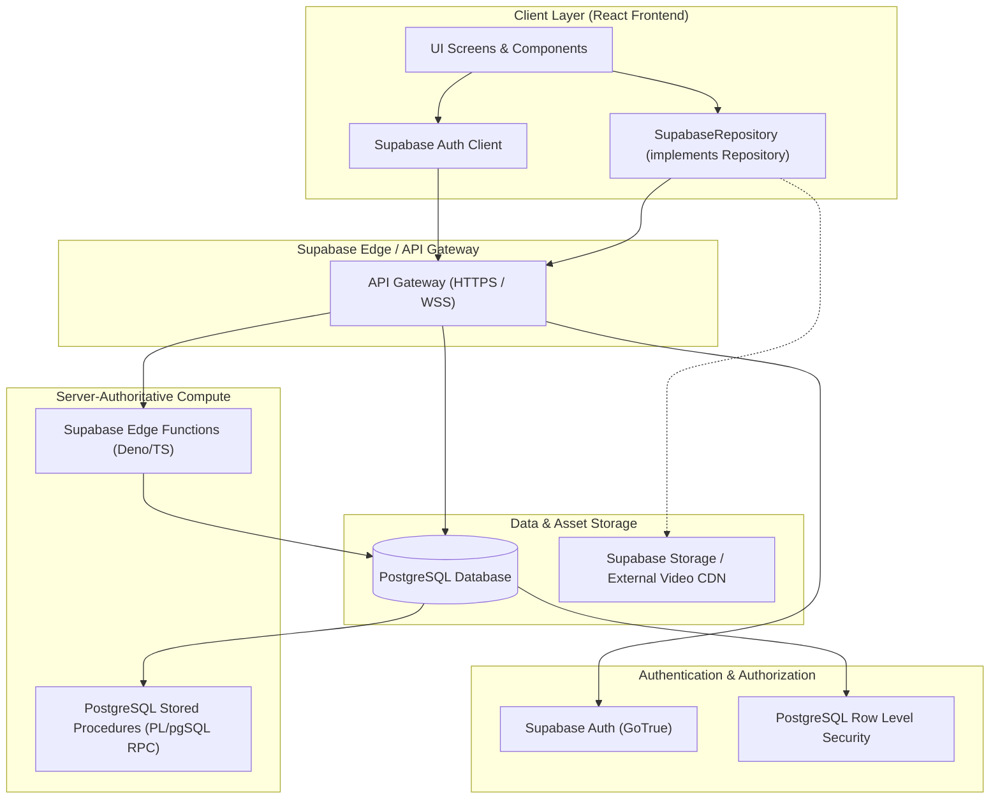
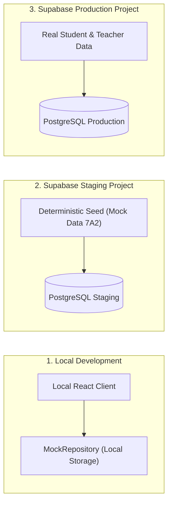

# MẦM VĂN – PHASE 2.1
# TÀI LIỆU 01: KIẾN TRÚC TỔNG THỂ SUPABASE (SUPABASE ARCHITECTURE SPECIFICATION)

---

## THÔNG TIN KIỂM SOÁT TÀI LIỆU (DOCUMENT CONTROL)

| Mục | Nội dung |
| :--- | :--- |
| **Dự án** | Mầm Văn – Nền tảng Học Ngữ văn Lớp 7 (EdTech) |
| **Giai đoạn** | Phase 2.1 – Supabase Architecture & Logical Database Design |
| **Phiên bản** | v1.0 (Phase 2.1 Design Baseline) |
| **Trạng thái** | **PROPOSED TECHNICAL ARCHITECTURE – PENDING PO REVIEW** |
| **Tác giả** | Senior Database & Security Architect, Technical Lead |
| **Nguồn quy chuẩn** | `docs/phase-1/MAM_VAN_BUSINESS_DATA_SPEC_V1.1.md` |
| **Quy tắc an toàn** | **DOCUMENTATION ONLY** – Không sửa mã nguồn, không tạo migration, không kết nối DB thật |

---

## 1. BASELINE VERIFICATION & BỐI CẢNH DỰ ÁN

### 1.1. Kiểm tra Git Baseline
- **Current Working Directory:** `e:\APP_Education\MamVan_Education-main\MamVan_Education-main`
- **Trạng thái Git:** `SOURCE SNAPSHOT – GIT COMMIT UNVERIFIED`
- **Chi tiết:** Thư mục làm việc hiện tại được giải nén từ bản phân phối ZIP. Hệ thống tệp **không chứa thư mục `.git`** hoặc bất kỳ Git metadata nào (`fatal: not a git repository`).
- **Kho lưu trữ chính thức (Remote):** `https://github.com/DuongDADEV/MamVan_Education.git`
- **Cảnh báo kiến trúc:** Mọi tài liệu thiết kế tại Phase 2.1 chỉ đóng vai trò đặc tả thiết kế (Design Blueprint). Quá trình triển khai kỹ thuật (Phase 2.2+) **bắt buộc** phải được thực hiện trên một Git clone chuẩn xác có commit hash rõ ràng trên nhánh làm việc chính thức được Product Owner chỉ định.

### 1.2. Hiện trạng ứng dụng Frontend
- **Công nghệ:** React 18, TypeScript, Vite, Tailwind CSS.
- **Mô hình kiến trúc hiện tại:** Repository Pattern (`src/services/repository.ts`) với triển khai cục bộ `MockRepository` (`src/services/mockRepositories.ts`) lưu trữ trên `localStorage`.
- **Tập dữ liệu mẫu:** `src/data/mockData.ts` (1.106 dòng) chứa dữ liệu khởi tạo cho giáo viên, học sinh, chủ đề, bài học video, bài tập quiz và nhật ký học tập.
- **Mục tiêu chuyển đổi (Target State):** Từng bước chuyển đổi từ `MockRepository` sang `SupabaseRepository` thông qua Dependency Injection mà không làm gián đoạn hoặc phá vỡ các component giao diện người dùng (UI Components).

---

## 2. NGUYÊN TẮC BẢO TOÀN VÀ RANH GIỚI NGHIỆP VỤ

### 2.1. Bảo toàn 11 Quyết định Nghiệp vụ (BR-01 đến BR-11)
Toàn bộ kiến trúc Supabase phải tuân thủ tuyệt đối 11 Business Rules đã được Product Owner phê duyệt trong v1.1:
1. **BR-01 [APPROVED]:** Giáo viên toàn quyền quản lý học liệu; UI đọc học liệu qua Repository; mock/seed chỉ là dữ liệu ban đầu.
2. **BR-02 [APPROVED]:** Học sinh chủ động điểm danh để nhận +2 XP; hệ thống không tự động điểm danh khi đăng nhập.
3. **BR-03 [APPROVED]:** Câu hỏi tự luận (Essay) nằm trong Quiz; nộp bài chỉ nhận XP của Quiz; điểm Mastery của câu tự luận chỉ được tính sau khi giáo viên chấm bài chính thức.
4. **BR-04 [APPROVED]:** Lưu đầy đủ từng lượt làm bài (`attempt`), từng câu trả lời (`attempt_answer`), điểm số, phiên bản đề thi và mốc thời gian.
5. **BR-05 [APPROVED]:** Nội dung đã xuất bản (Published) phải bất biến (Immutable Versioning); chỉnh sửa tạo bản nháp mới, không ghi đè bản cũ.
6. **BR-06 [APPROVED]:** Dữ liệu Demo/Mock và dữ liệu Production phải cô lập tuyệt đối; Analytics không trộn lẫn dữ liệu thử nghiệm.
7. **BR-07 [APPROVED]:** Kho học liệu chung khối 7 theo chủ đề; bài tập/kiểm tra được giao (`assignments`) theo lớp hoặc cá nhân học sinh.
8. **BR-08 [APPROVED]:** Luyện tập tự do không giới hạn số lượt; bài kiểm tra chính thức giới hạn lượt do giáo viên cấu hình.
9. **BR-09 [APPROVED]:** Học liệu lưu trữ (Archived) ẩn khỏi danh mục chung nhưng học sinh đã từng học vẫn truy cập lại được lịch sử.
10. **BR-10 [APPROVED]:** Tự lưu tiến trình làm bài; F5 khôi phục trạng thái và giữ nguyên đồng hồ đếm ngược phía server.
11. **BR-11 [APPROVED]:** Video yêu cầu xem tích lũy đủ $\ge 80\%$ thời lượng thực tế (unique playback intervals); tuyệt đối cấm timer ảo.

---

## 3. CÁC THÀNH PHẦN KIẾN TRÚC SUPABASE (BUILDING BLOCKS)

### 3.1. PostgreSQL Database
- **Phiên bản mục tiêu:** PostgreSQL 15+ (mặc định trên Supabase).
- **Múi giờ chuẩn (Timezone):** `UTC` lưu trữ trên toàn bộ bảng database; múi giờ nghiệp vụ hiển thị và tính toán ngày học tập là `Asia/Ho_Chi_Minh` (UTC+7).
- **Khóa chính (Primary Key):** Sử dụng `UUIDv4` cho toàn bộ các thực thể giao dịch, phiên bản và người dùng; sử dụng cột `code` / `legacy_id` duy nhất có chỉ mục để ánh xạ dữ liệu mock/seed cũ (`hs001`, `gv001`, `topic_tho_bon_nam`).

### 3.2. Supabase Auth (GoTrue Engine)
- Quản trị danh tính trung tâm (`auth.users`).
- Cơ chế xác thực chuyên biệt cho học sinh THCS: Hỗ trợ ánh xạ Tên đăng nhập học sinh (`student_code` / `username`) sang tài khoản danh tính an toàn do hệ thống kiểm soát mà không làm lộ mật khẩu hoặc yêu cầu email cá nhân thực.
- Ngăn chặn triệt để hành vi mạo danh vai trò (Role Spoofing) bằng cách quản lý Role trong bảng dữ liệu nghiệp vụ `user_roles`, không dựa vào `user_metadata` của Client.

### 3.3. PostgreSQL Row Level Security (RLS) & Column Security
- **Bảo vệ hàng (Row-level):** RLS Policy thực thi cho mọi truy vấn trực tiếp từ Client (`authenticated` role).
- **Bảo vệ cột & Dữ liệu nhạy cảm (Table Separation):** 
  - Do PostgreSQL RLS không hỗ trợ che giấu từng cột trong cùng một hàng dữ liệu được `SELECT`, toàn bộ dữ liệu bí mật được tách rời sang bảng riêng biệt:
    - Bảng `reward_secrets` tách khỏi `reward_catalog`.
    - Bảng `secure_answer_keys` tách khỏi `question_versions`.
    - Bảng `essay_ai_evaluations` tách khỏi `essay_submissions`.
    - Bảng `essay_teacher_reviews` tách khỏi `essay_submissions`.
- Truy cập vào các bảng bí mật chỉ được thực thi thông qua **Database RPC (SECURITY DEFINER)** hoặc **Edge Functions** sau khi kiểm tra đầy đủ điều kiện nghiệp vụ.

### 3.4. Server-Authoritative Logic (RPC & Edge Functions)
- **Database Functions (RPC - PL/pgSQL):** Dành cho các giao dịch ACID nội bộ đòi hỏi độ trễ thấp và tính toàn vẹn cao:
  - `claim_daily_attendance`: Điểm danh và cộng XP có đối soát Idempotency.
  - `submit_quiz_attempt`: Nộp bài, chấm điểm trắc nghiệm server-side, cập nhật XP và Mastery.
  - `publish_quiz_version`: Đóng băng bản nháp thành phiên bản bất biến.
- **Supabase Edge Functions (Deno Runtime):** Dành cho các tác vụ tích hợp bên ngoài hoặc xử lý phức tạp:
  - AI Evaluation Worker: Gọi Google Gemini API để chấm gợi ý bài tự luận và lưu vào `essay_ai_evaluations` an toàn (không lộ API key về client).
  - External Video Verification: Tích hợp xác thực thời lượng video từ YouTube API hoặc nhà cung cấp streaming chuyên dụng.

### 3.5. Storage Service (Trừu tượng hóa lưu trữ)
- **Tài liệu & Hình ảnh học liệu:** Supabase Storage (Bucket riêng biệt `lesson-assets`, `avatars` có RLS).
- **Video bài giảng:** Thiết kế theo mô hình trừu tượng hóa `Video Provider / Storage Service`. Không gán cứng vào Supabase Storage; hỗ trợ YouTube Unlisted, Video Streaming CDN hoặc Cloud Storage trong tương lai thông qua trường `provider` và `provider_asset_id`.

---

## 4. PHÂN TÁCH BẢY MIỀN DỮ LIỆU LOGICAL (7 DOMAINS OVERVIEW)

| Miền Dữ liệu (Domain) | Tên miền | Mục đích nghiệp vụ cốt lõi | Các bảng chính |
| :--- | :--- | :--- | :--- |
| **DOMAIN A** | **Identity & Classroom** | Quản lý danh tính, phân quyền giáo viên/học sinh, cấu trúc lớp học và quan hệ thành viên. | `users`, `user_roles`, `teacher_profiles`, `student_profiles`, `classes`, `class_memberships` |
| **DOMAIN B** | **Learning Content** | Quản lý cây học liệu khối 7: chủ đề, bài giảng video, bài đọc lý thuyết, trạng thái phát hành. | `topics`, `video_lessons`, `video_focus_points`, `theory_lessons`, `theory_blocks` |
| **DOMAIN C** | **Question Bank & Versioning** | Ngân hàng câu hỏi, đề kiểm tra, phiên bản bất biến và đáp án bảo mật. | `questions`, `question_versions`, `secure_answer_keys`, `quizzes`, `quiz_versions`, `quiz_version_questions`, `quiz_assignments` |
| **DOMAIN D** | **Attempt & Grading** | Lưu vết lịch sử làm bài, câu trả lời chi tiết, bài viết tự luận, AI đánh giá và giáo viên chấm bài. | `quiz_attempts`, `attempt_answers`, `essay_submissions`, `essay_ai_evaluations`, `essay_teacher_reviews` |
| **DOMAIN E** | **Learning Progress** | Quản lý tiến trình học tập, lịch sử xem video, điểm danh, sổ cái XP và bằng chứng Mastery. | `video_watch_progress`, `attendance_records`, `xp_ledger`, `mastery_evidence`, `student_mastery_snapshots` |
| **DOMAIN F** | **Rewards & Gamification** | Kho quà đổi thưởng, bí mật quà tặng được che giấu và lịch sử đổi quà của học sinh. | `reward_catalog`, `reward_secrets`, `reward_claims` |
| **DOMAIN G** | **Administration & Audit** | Cấu hình tham số hệ thống toàn cục và nhật ký kiểm toán hành vi quản trị của giáo viên. | `system_settings`, `audit_logs` |

---

## 5. MÔ HÌNH CÔ LẬP MÔI TRƯỜNG (ENVIRONMENT ISOLATION)

Để đảm bảo tuân thủ nghiêm ngặt **BR-06** (Không trộn lẫn dữ liệu Demo và Production):

1. **Tách biệt hoàn toàn ở tầng Project:**
   - Môi trường Staging/Demo và Production là **hai Supabase Project độc lập** với Project Reference, Database URL và JWT Secret hoàn toàn khác nhau.
   - Tuyệt đối không dùng chung một Database và dựa vào cờ `is_demo` để lọc dữ liệu trong cùng một bảng Production.
2. **Deterministic Seeding cho Demo/Staging:**
   - Tập dữ liệu `src/data/mockData.ts` (lớp 7A2, giáo viên `gv001`, học sinh `hs001`) được biên dịch thành một script seed dữ liệu mẫu chỉ chạy trên môi trường Staging/Dev.
3. **Analytics Isolation:**
   - Các truy vấn thống kê, biểu đồ và báo cáo học tập của giáo viên chạy trực tiếp trên schema Production, bảo đảm 100% không bị ảnh hưởng bởi dữ liệu kiểm thử.

---

## 6. RANH GIỚI BẢO MẬT & QUYỀN TRUY CẬP (SECURITY BOUNDARIES)

1. **Nguyên tắc Đặc quyền Tối thiểu (Principle of Least Privilege):**
   - Vô hiệu hóa quyền truy cập trực tiếp (`GRANT`) vào các bảng nhạy cảm đối với vai trò `anon` và `authenticated`.
   - Bảng `secure_answer_keys` và `reward_secrets` không có bất kỳ RLS policy nào cho phép role `student` thực hiện lệnh `SELECT`.
2. **Không tin cậy dữ liệu Client (Zero-Trust Frontend):**
   - Frontend không được gửi điểm số (`score`), tỷ lệ thành thạo (`scoreRatio`), số XP được nhận (`earned_xp`) lên backend. Client chỉ gửi danh sách lựa chọn câu hỏi (`chosen_option_index`, `essay_text`) và mốc thời gian. Mọi logic chấm điểm và thưởng phạt phải chạy bên trong Transaction của Database Function.
3. **Chống giả mạo định danh (Anti-Spoofing):**
   - Mọi RPC và RLS Policy kiểm tra quyền hạn học sinh đều sử dụng `auth.uid()` được giải mã an toàn từ JWT Token của Supabase Gateway, loại bỏ hoàn toàn việc truyền `studentId` trong payload để vượt quyền.

---
*(Xem tiếp Tài liệu 02 để biết chi tiết đặc tả 24 bảng dữ liệu logic và ràng buộc khóa ngoại).*
