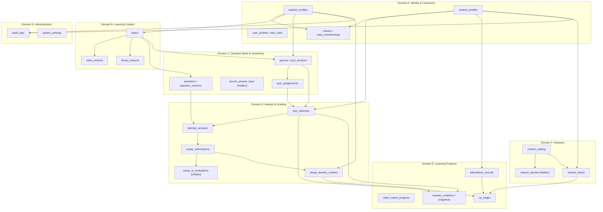
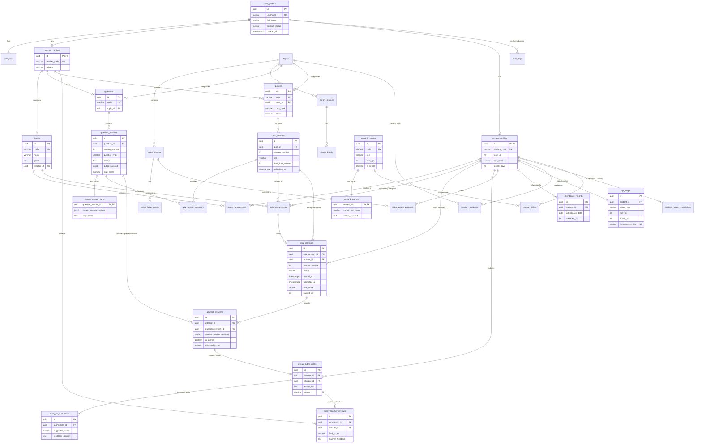
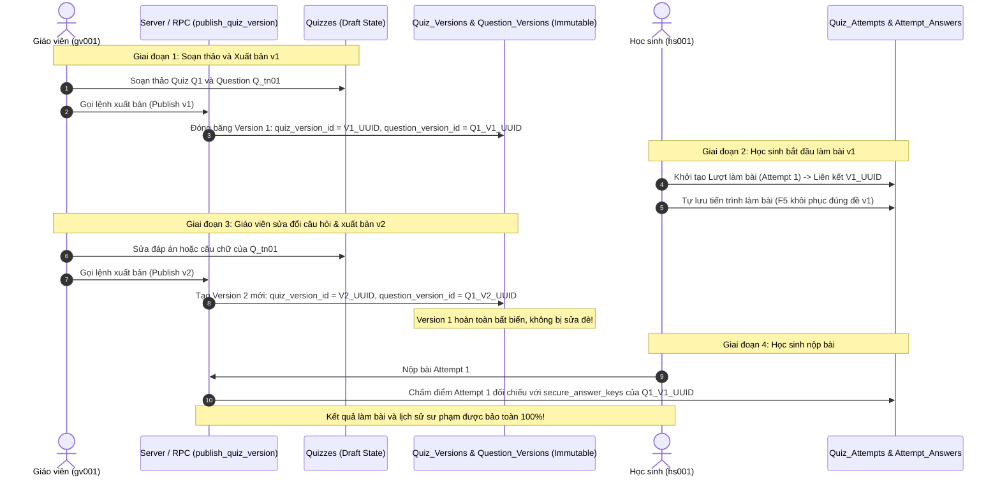

# MẦM VĂN – PHASE 2.1
# TÀI LIỆU 03: SƠ ĐỒ QUAN HỆ THỰC THỂ (ENTITY RELATIONSHIP DIAGRAMS - ERD)

---

## THÔNG TIN KIỂM SOÁT TÀI LIỆU (DOCUMENT CONTROL)

| Mục | Nội dung |
| :--- | :--- |
| **Dự án** | Mầm Văn – Nền tảng Học Ngữ văn Lớp 7 (EdTech) |
| **Giai đoạn** | Phase 2.1 – Supabase Architecture & Logical Database Design |
| **Phiên bản** | v1.0 (ERD Specification) |
| **Trạng thái** | **PROPOSED TECHNICAL DESIGN – PENDING PO REVIEW** |
| **Tác giả** | Senior Database Architect |
| **Nguồn quy chuẩn** | `docs/phase-1/MAM_VAN_BUSINESS_DATA_SPEC_V1.1.md` |

---

## 1. SƠ ĐỒ LIÊN MIỀN TỔNG THỂ (HIGH-LEVEL DOMAIN RELATIONSHIP)

---

## 2. CHI TIẾT ERD TOÀN DIỆN HỆ THỐNG (DETAILED MERMAID ERD)

---

## 3. THIẾT KẾ CHUYÊN BIỆT: IMMUTABLE VERSIONING ARCHITECTURE

Cơ chế này hiện thực hóa toàn diện **BR-04, BR-05 và BR-10**, giải quyết dứt điểm lỗi nghiêm trọng của Mock Data cũ (sửa nội dung làm thay đổi đề thi lịch sử và làm sai lệch bài thi của học sinh đang làm dở).

### 3.1. Sơ đồ Luồng Dữ liệu Phiên bản Bất biến (Data Flow)

### 3.2. Hai Kịch bản Kiểm chứng Tính Bất biến (Validation Scenarios)

#### Kịch bản 1: Giáo viên sửa đáp án sau khi đã có học sinh làm bài
- **Thực tế:** Giáo viên phát hiện câu hỏi trắc nghiệm số 3 trong đề Kiểm tra 15 phút (v1) bị sai đáp án. Đã có 10 học sinh hoàn thành bài làm trên v1.
- **Cách xử lý của hệ thống:**
  1. Bản ghi `quiz_versions (v1)` và `question_versions (v1)` cùng `secure_answer_keys (v1)` không bị thay đổi.
  2. Kết quả điểm số, đáp án chọn và bài thi của 10 học sinh cũ vẫn giữ nguyên tính toàn vẹn lịch sử.
  3. Giáo viên tạo phiên bản mới `question_versions (v2)` với `secure_answer_keys (v2)` đã sửa đáp án đúng, sau đó phát hành `quiz_versions (v2)`.
  4. Các lượt làm bài mới kể từ thời điểm này sẽ liên kết với `v2`.
  5. Nếu giáo viên muốn phúc khảo hoặc tính lại điểm cho 10 học sinh cũ, hệ thống cung cấp công cụ tính lại có ghi nhật ký kiểm toán trong `audit_logs`, tuyệt đối không ghi đè dữ liệu gốc.

#### Kịch bản 2: Xuất bản v2 khi học sinh đang làm dở v1
- **Thực tế:** Học sinh A đang làm bài thi giữa kỳ (v1) được 15 phút (còn 30 phút). Giáo viên bất ngờ xuất bản v2 để sửa một lỗi chính tả.
- **Cách xử lý của hệ thống:**
  1. Lượt làm bài của học sinh A trong `quiz_attempts` đang gắn cứng với `quiz_version_id = V1_UUID`.
  2. Khi học sinh A ấn F5 hoặc gửi yêu cầu auto-save, hệ thống truy vấn theo `quiz_version_id` của lượt làm bài hiện tại, do đó học sinh vẫn tiếp tục làm đề v1 với đồng hồ đếm ngược được tính từ `started_at` phía server.
  3. Khi học sinh A nộp bài, hệ thống đối soát với `secure_answer_keys` của v1. Học sinh hoàn toàn không bị ảnh hưởng hay văng bài thi giữa chừng.

---

## 4. QUY TẮC RÀNG BUỘC TOÀN VẸN (CARDINALITY & NO-CASCADE RULES)

| Cặp Quan hệ (Relationship) | Bậc quan hệ (Cardinality) | Khóa ngoại | Chính sách Xóa (Delete Policy) | Giải thích lý do sư phạm |
| :--- | :--- | :--- | :--- | :--- |
| `student_profiles` $\rightarrow$ `quiz_attempts` | 1 - Nhiều ($1:N$) | `student_id` | **`ON DELETE RESTRICT`** | Bài thi là hồ sơ học tập pháp lý của học sinh, cấm xóa cascade khi xóa tài khoản. |
| `quiz_attempts` $\rightarrow$ `attempt_answers` | 1 - Nhiều ($1:N$) | `attempt_id` | **`ON DELETE RESTRICT`** | Từng câu trả lời phải được bảo tồn cùng lượt làm bài để phục vụ phúc khảo. |
| `student_profiles` $\rightarrow$ `xp_ledger` | 1 - Nhiều ($1:N$) | `student_id` | **`ON DELETE RESTRICT`** | Sổ cái tài chính gamification; biến động điểm phải bất biến vĩnh viễn. |
| `student_profiles` $\rightarrow$ `attendance_records` | 1 - Nhiều ($1:N$) | `student_id` | **`ON DELETE RESTRICT`** | Nhật ký chuyên cần của học sinh không được phép biến mất. |
| `quiz_versions` $\rightarrow$ `quiz_attempts` | 1 - Nhiều ($1:N$) | `quiz_version_id` | **`ON DELETE RESTRICT`** | Không cho phép xóa phiên bản đề thi khi đã có học sinh làm bài. |
| `question_versions` $\rightarrow$ `attempt_answers` | 1 - Nhiều ($1:N$) | `question_version_id` | **`ON DELETE RESTRICT`** | Đáp án học sinh phải luôn soi chiếu được nội dung câu hỏi tại thời điểm làm. |
| `teacher_profiles` $\rightarrow$ `audit_logs` | 1 - Nhiều ($1:N$) | `actor_id` | **`ON DELETE RESTRICT`** | Nhật ký kiểm toán hành vi của giáo viên phải tồn tại độc lập để điều tra sự cố. |

---
*(Xem tiếp Tài liệu 04 để biết chi tiết Thiết kế Xác thực Authentication và Ma trận Quyền RLS).*
