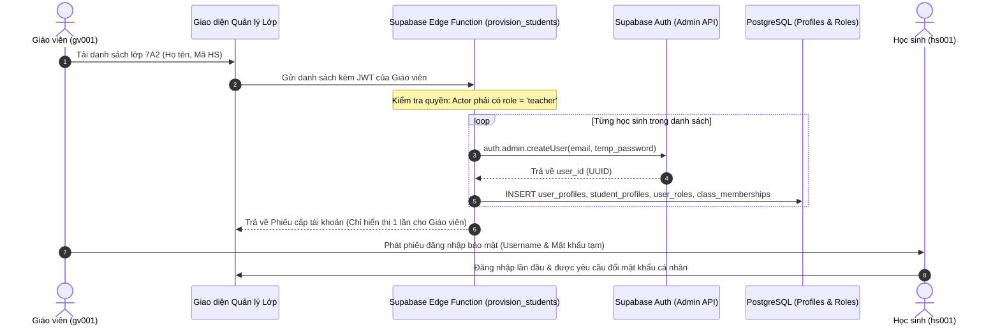

# MẦM VĂN – PHASE 2.1
# TÀI LIỆU 04: THIẾT KẾ XÁC THỰC & PHÂN QUYỀN ROW LEVEL SECURITY (RLS)

---

## THÔNG TIN KIỂM SOÁT TÀI LIỆU (DOCUMENT CONTROL)

| Mục | Nội dung |
| :--- | :--- |
| **Dự án** | Mầm Văn – Nền tảng Học Ngữ văn Lớp 7 (EdTech) |
| **Giai đoạn** | Phase 2.1 – Supabase Architecture & Logical Database Design |
| **Phiên bản** | v1.0 (Auth & RLS Architecture) |
| **Trạng thái** | **PROPOSED TECHNICAL DESIGN – PENDING PO REVIEW** |
| **Tác giả** | Senior Security & Supabase Architect |
| **Nguồn quy chuẩn** | `docs/phase-1/MAM_VAN_BUSINESS_DATA_SPEC_V1.1.md` |

---

## 1. BỐI CẢNH & THÁCH THỨC XÁC THỰC NGƯỜI DÙNG LỚP 7

1. **Đối tượng học sinh THCS (12 - 13 tuổi):** Đa số học sinh lớp 7 chưa có email cá nhân hợp thức hoặc số điện thoại riêng. Việc bắt buộc đăng ký bằng Email thực sẽ tạo rào cản tiếp cận rất lớn.
2. **Quy trình sư phạm thực tế:** Giáo viên tạo danh sách học sinh theo lớp, cấp phát mã học sinh (Username) và mật khẩu ban đầu cho học sinh.
3. **Nguyên tắc an toàn bảo mật:**
   - Tuyệt đối không lưu trữ plaintext password trong cơ sở dữ liệu ứng dụng.
   - Không được để lộ mật khẩu khởi tạo trong log hệ thống hoặc mạng (Network Tracing).
   - Ngăn chặn hoàn toàn việc học sinh tự ý can thiệp vào Client State để đổi Role từ `student` thành `teacher`.
   - Vai trò Phụ huynh (Parent) là mục tiêu tương lai (Phase 3+), không đưa vào phạm vi xác thực của MVP.

---

## 2. SO SÁNH VÀ LỰA CHỌN PHƯƠNG ÁN XÁC THỰC (AUTHENTICATION ARCHITECTURE)

| Tiêu chí so sánh | Phương án A: Email/Password thực tế | Phương án B: Internal Identifier Mapping (Đề xuất) | Phương án C: Phone / OTP SMS |
| :--- | :--- | :--- | :--- |
| **Trải nghiệm học sinh** | Phức tạp (Học sinh phải tự tạo email hoặc dùng email phụ huynh). | **Rất thuận tiện:** Đăng nhập bằng Mã học sinh (ví dụ: `hs001`, `mamvan7a2_01`). | Khó khăn (Tốn chi phí SMS OTP, phụ thuộc SIM phụ huynh). |
| **Khả năng tương thích Supabase GoTrue** | Tự nhiên (GoTrue mặc định dùng email). | **Hoàn toàn tương thích** thông qua cơ chế Domain Mapping phía sau Server/Edge Function. | Phải đăng ký dịch vụ Twilio/MessageBird tốn kém. |
| **Chi phí vận hành** | Miễn phí. | Miễn phí. | Tốn phí SMS trên từng lần gửi OTP. |
| **Quản trị lớp học của Giáo viên** | Thụ động (Chờ học sinh đăng ký tài khoản). | **Chủ động:** Giáo viên nhập danh sách lớp, hệ thống tạo sẵn tài khoản và xuất phiếu đăng nhập. | Thụ động. |
| **Đánh giá kiến trúc** | KHÔNG KHẢ THI cho khối 7. | **ĐỀ XUẤT ÁP DỤNG CHO MẦM VĂN MVP.** | LOẠI BỎ do chi phí cao. |

### 2.1. Cơ chế Hoạt động của Phương án B (Internal Identifier Mapping)
Học sinh chỉ cần nhìn thấy ô nhập: **"Tên đăng nhập" (Username)** và **"Mật khẩu"**.
1. **Quy ước ánh xạ danh tính:**
   - Mỗi học sinh có một mã duy nhất: `student_code` (ví dụ: `hs001`, `hs002`).
   - Tầng ứng dụng hoặc Edge Function ánh xạ sang định danh email nội bộ chuẩn: `hs001@student.mamvan.edu.vn`.
   - Tài khoản `auth.users` của Supabase được khởi tạo với email nội bộ này và một mật khẩu được băm an toàn bằng thuật toán bcrypt mặc định của GoTrue.
2. **Quy trình đăng nhập của Học sinh:**
   - Học sinh nhập: `hs001` + `Mật khẩu`.
   - Repository gọi hàm đăng nhập:
     `supabase.auth.signInWithPassword({ email: `${username}@student.mamvan.edu.vn`, password })`
   - Quá trình ánh xạ diễn ra hoàn toàn tự động, học sinh không cần biết email nội bộ phía sau.
3. **Giáo viên đăng nhập:**
   - Giáo viên sử dụng **Email thực tế của mình** (ví dụ: `giaovien.mai@mamvan.edu.vn`) để đăng nhập nhằm hỗ trợ tính năng reset mật khẩu qua email khi cần.

---

## 3. QUY TRÌNH QUẢN TRỊ DANH TÍNH AN TOÀN (LIFECYCLE)



### 3.1. Chống mạo danh vai trò (Role Spoofing Prevention)
- Tuyệt đối **không lưu vai trò người dùng trong `app_metadata` hay `user_metadata`** được cấp phép sửa đổi từ phía client.
- Bảng `user_roles` được bảo vệ: chỉ có Database Functions (hoặc Service Role) mới có quyền ghi.
- Mọi hàm kiểm tra quyền truy cập của PostgreSQL RLS đều đọc trực tiếp từ bảng cơ sở dữ liệu:
  ```sql
  -- Khái niệm kiểm tra vai trò an toàn trong RLS (Logical Concept)
  EXISTS (
    SELECT 1 FROM public.user_roles 
    WHERE user_id = auth.uid() AND role = 'teacher'
  )
  ```

---

## 4. CHIẾN LƯỢC BẢO MẬT CẤP BẢNG (TABLE-LEVEL ISOLATION)

> [!CAUTION]
> **Giới hạn kỹ thuật của PostgreSQL RLS:**
> PostgreSQL Row Level Security (RLS) hoạt động theo cơ chế lọc **từng hàng (Row filtering)**. Khi một câu lệnh `SELECT` thỏa mãn điều kiện RLS của một hàng, người dùng sẽ đọc được **toàn bộ các cột** trong hàng đó. PostgreSQL RLS **không thể che giấu có điều kiện từng cột** trong cùng một bảng.

Do đó, để bảo mật dữ liệu nhạy cảm theo đúng yêu cầu v1.1, hệ thống áp dụng chiến lược **Tách rời Bảng (Physical Table Separation)**:

```mermaid
graph TD
    subgraph PublicAccessible ["Truy cập Công khai (Học sinh có quyền SELECT)"]
        RC["reward_catalog (Thông tin quà)"]
        QV["question_versions (Đề bài, Options)"]
        ES["essay_submissions (Bài viết học sinh)"]
    end

    subgraph StrictlyProtected ["Cô lập Tuyệt đối (CẤM HỌC SINH SELECT)"]
        RS["reward_secrets (Món quà bí mật)"]
        SAK["secure_answer_keys (Đáp án đúng & Thang điểm)"]
        AE["essay_ai_evaluations (Điểm & Gợi ý của Gemini AI)"]
        TR["essay_teacher_reviews (Điểm & Nhận xét của GV)"]
    end

    StudentRole((Học sinh)) -->|SELECT có RLS| PublicAccessible
    StudentRole -.->|BỊ CẤM TRUY CẬP (0 Policy)| StrictlyProtected
    TeacherRole((Giáo viên)) -->|SELECT & MANAGE| StrictlyProtected
    RPC_Engine[("Hàm RPC / Edge Function (SECURITY DEFINER)")] -->|Đọc/Ghi có kiểm soát| StrictlyProtected
```

1. **Bảo vệ Đáp án đúng (`secure_answer_keys`):**
   - Học sinh chỉ có quyền đọc `question_versions` (nội dung đề bài, các phương án lựa chọn đã xáo trộn).
   - Bảng `secure_answer_keys` hoàn toàn không có RLS Policy cho phép `student` đọc.
   - Khi học sinh nộp bài, Client gửi danh sách lựa chọn lên hàm RPC `submit_quiz_attempt`. Hàm này chạy với quyền `SECURITY DEFINER`, tự đọc `secure_answer_keys` để chấm điểm và chỉ trả về điểm số tổng hợp.
2. **Bảo vệ Điểm gợi ý của AI (`essay_ai_evaluations`):**
   - AI chỉ đóng vai trò trợ lý sư phạm cho giáo viên. Kết quả gợi ý chấm điểm từ Gemini được lưu vào `essay_ai_evaluations`.
   - Bảng này chỉ cho phép giáo viên đọc để tham khảo khi chấm bài. Học sinh không có quyền truy cập, tránh gây hoang mang hoặc tranh cãi về điểm số tự động.
3. **Bảo vệ Quà tặng bí mật (`reward_secrets`):**
   - Bảng `reward_catalog` chứa tên hiển thị bí ẩn (ví dụ: "Hộp quà may mắn").
   - Bảng `reward_secrets` chứa tên thật và mã quà tặng. Chỉ khi học sinh gọi hàm RPC `claim_reward` và hệ thống trừ điểm XP thành công, nội dung bí mật mới được giải mã và trả về một lần duy nhất.

---

## 5. MA TRẬN PHÂN QUYỀN TRUY CẬP ROW LEVEL SECURITY (RLS MATRIX)

Dưới đây là ma trận phân quyền chi tiết cho toàn bộ 32 bảng dữ liệu logic trong hệ thống:

| Tên bảng | Vai trò Học sinh (Student) | Vai trò Giáo viên (Teacher) | Cơ chế thực thi kỹ thuật |
| :--- | :--- | :--- | :--- |
| `user_profiles` | SELECT (chính mình) | SELECT (học sinh trong lớp mình quản lý) | RLS: `auth.uid() = id` hoặc quản lý qua `classes` |
| `user_roles` | SELECT (chính mình) | SELECT (học sinh trong lớp) | RLS: `auth.uid() = user_id` |
| `teacher_profiles` | SELECT (thông tin công khai) | SELECT / UPDATE (chính mình) | RLS |
| `student_profiles` | SELECT (chính mình) | SELECT (học sinh lớp mình dạy) | RLS: Cấm Client UPDATE `total_xp` |
| `classes` | SELECT (lớp mình đang học) | ALL (lớp do mình tạo/phụ trách) | RLS: Check `class_memberships` hoặc `teacher_id` |
| `class_memberships` | SELECT (thông tin của mình) | ALL (lớp do mình quản lý) | RLS |
| `topics` | SELECT (`status = 'published'`) | ALL (quản lý học liệu chung) | RLS: Lọc trạng thái published |
| `video_lessons` | SELECT (`status = 'published'`) | ALL | RLS |
| `video_focus_points` | SELECT (theo video published) | ALL | RLS |
| `theory_lessons` | SELECT (`status = 'published'`) | ALL | RLS |
| `theory_blocks` | SELECT (theo bài lý thuyết) | ALL | RLS |
| `questions` | SELECT (logic ID liên quan) | ALL | RLS |
| `question_versions` | SELECT (câu hỏi trong đề đã giao/luyện tập) | ALL | RLS: Chỉ payload công khai, không có đáp án |
| **`secure_answer_keys`** | **CẤM TRUY CẬP (NO SELECT)** | SELECT (phục vụ chuyên môn) | **Cô lập bảng; Chấm điểm qua RPC** |
| `quizzes` | SELECT (`status = 'published'`) | ALL | RLS |
| `quiz_versions` | SELECT (các phiên bản đã xuất bản) | ALL | RLS |
| `quiz_version_questions` | SELECT (theo quiz version công khai) | ALL | RLS |
| `quiz_assignments` | SELECT (bài giao cho lớp/mình) | ALL (bài do mình giao) | RLS |
| `quiz_attempts` | SELECT / INSERT (bài của chính mình) | SELECT (bài của học sinh lớp mình) | RLS: Học sinh không được sửa sau khi submit |
| `attempt_answers` | SELECT / INSERT (đáp án của mình) | SELECT (bài của học sinh lớp mình) | RLS |
| `essay_submissions` | SELECT / INSERT (bài viết của mình) | SELECT (bài học sinh lớp mình) | RLS: Nộp bài qua RPC hoặc INSERT kiểm soát |
| **`essay_ai_evaluations`** | **CẤM TRUY CẬP (NO SELECT)** | SELECT (tham khảo chấm bài) | **Cô lập bảng; Edge Function ghi bằng service_role** |
| `essay_teacher_reviews` | SELECT (chỉ khi `is_final_round=true`) | ALL (chấm và sửa nhận xét) | RLS: Học sinh chỉ xem kết quả đã chốt |
| `video_watch_progress` | SELECT / UPDATE (tiến trình của mình) | SELECT (tiến trình học sinh lớp mình) | RLS: Update heartbeat kiểm soát |
| `attendance_records` | SELECT (lịch sử của mình) | SELECT (chuyên cần lớp mình) | RLS: **Cấm INSERT trực tiếp, chỉ gọi RPC** |
| `xp_ledger` | SELECT (sổ cái của mình) | SELECT (sổ cái học sinh lớp mình) | RLS: **Cấm INSERT/UPDATE từ Client, chỉ qua RPC** |
| `mastery_evidence` | SELECT (bằng chứng của mình) | SELECT (học sinh lớp mình) | RLS: Chỉ hệ thống ghi |
| `student_mastery_snapshots` | SELECT (điểm của mình) | SELECT (học sinh lớp mình) | RLS: Chỉ hệ thống ghi |
| `reward_catalog` | SELECT (`is_active = true`) | ALL | RLS |
| **`reward_secrets`** | **CẤM TRUY CẬP (NO SELECT)** | ALL (cấu hình quà tặng) | **Cô lập bảng; Mở quà qua RPC** |
| `reward_claims` | SELECT (quà của mình đã đổi) | SELECT (học sinh lớp mình) | RLS: Tạo giao dịch qua RPC |
| `system_settings` | SELECT (cấu hình công khai) | ALL | RLS |
| `audit_logs` | **CẤM TRUY CẬP (NO ACCESS)** | SELECT (nhật ký hành vi của mình) | RLS: Chỉ hệ thống ghi |

---
*(Xem tiếp Tài liệu 05 để biết chi tiết Thiết kế Server-Authoritative Logic và các giao dịch RPC).*
