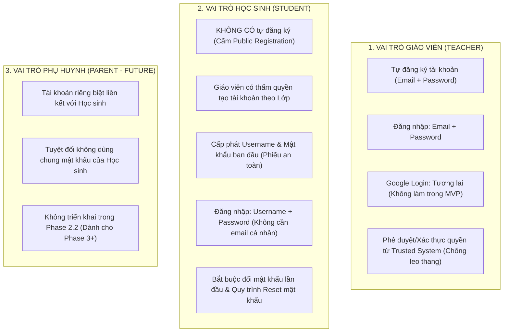
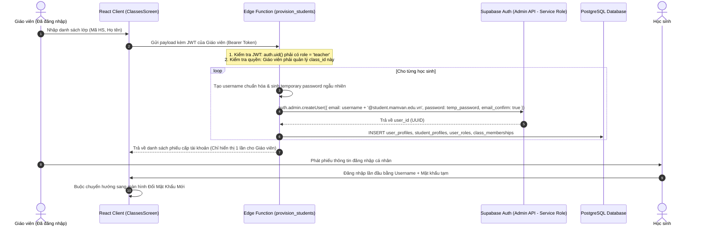

# MẦM VĂN – PHASE 2.1 / 2.2
# TÀI LIỆU 04 (PHIÊN BẢN HIỆU CHỈNH V1.1): THIẾT KẾ XÁC THỰC & PHÂN QUYỀN RLS
# (RECONCILED AUTHENTICATION & ROW LEVEL SECURITY DESIGN)

---

## THÔNG TIN KIỂM SOÁT TÀI LIỆU (DOCUMENT CONTROL)

| Mục | Nội dung |
| :--- | :--- |
| **Dự án** | Mầm Văn – Nền tảng Học Ngữ văn Lớp 7 (EdTech) |
| **Giai đoạn** | Phase 2.2 Preparation – Authentication Finalization |
| **Phiên bản** | **v1.1 (Reconciled Authentication Architecture Specification)** |
| **Trạng thái** | **APPROVED PRODUCT REQUIREMENT (ADR-01 & ADR-08)** |
| **Tác giả** | Security Architect & Senior Software Engineer |
| **Nguồn quy chuẩn** | `docs/phase-1/MAM_VAN_BUSINESS_DATA_SPEC_V1.1.md`, `docs/phase-2/08_CROSS_DOCUMENT_CONSISTENCY_REVIEW.md` và Quyết định phê duyệt ADR-01 của Product Owner |
| **Quy tắc an toàn** | **GIỮ NGUYÊN BẢN GỐC V1.0**; Tài liệu v1.1 tích hợp toàn diện yêu cầu nghiệp vụ ADR-01 vừa được phê duyệt |

---

## 1. MÔ HÌNH XÁC THỰC THEO VAI TRÒ (APPROVED AUTHENTICATION REQUIREMENTS)

Product Owner đã chính thức phê duyệt các nguyên tắc xác thực cho 3 nhóm đối tượng:



---

## 2. PHÂN TÁCH GIỮA YÊU CẦU NGHIỆP VỤ & GIẢI PHÁP KỸ THUẬT

### 2.1. Yêu cầu Nghiệp vụ đã Phê duyệt (`APPROVED PRODUCT REQUIREMENT`)
1. **Giáo viên:**
   - Được phép tự đăng ký bằng Email và Mật khẩu.
   - Khi vừa đăng ký thành công, tài khoản **chưa tự động có quyền truy cập dữ liệu học sinh** cho đến khi được xác minh và được gán phụ trách lớp học cụ thể (`classes.teacher_id`).
   - Ngăn chặn hoàn toàn việc người dùng tự gắn role `teacher` từ phía client.
2. **Học sinh:**
   - Hoàn toàn không có form tự đăng ký công khai ngoài trang chủ.
   - Tài khoản được giáo viên khởi tạo theo danh sách lớp học.
   - Học sinh đăng nhập bằng Mã học sinh / Username do giáo viên cấp kèm mật khẩu tạm thời.
   - Không bắt buộc học sinh phải sở hữu email cá nhân hoặc số điện thoại.
   - Bắt buộc đổi mật khẩu ở lần đăng nhập đầu tiên. Nếu quên mật khẩu, giáo viên phụ trách là người cấp lại mật khẩu mới thông qua hệ thống an toàn.

### 2.2. Giải pháp Kỹ thuật Internal Identifier Mapping (`PROPOSED TECHNICAL DESIGN`)
- **Nguyên lý:** Supabase Auth (GoTrue) yêu cầu một chuỗi định danh dạng email làm username đăng nhập nội bộ.
- **Cơ chế:** Hệ thống tự động ánh xạ username của học sinh sang định danh kỹ thuật:
  `internal_identifier = <student_code>@student.mamvan.edu.vn`
- **Ranh giới an toàn:**
  - Chuỗi email nội bộ này **không phải là hộp thư nhận email thật**.
  - Hệ thống **tuyệt đối không gửi email kích hoạt, email OTP hay email reset mật khẩu** đến địa chỉ nội bộ này.
  - Khi học sinh quên mật khẩu, quy trình khôi phục diễn ra thông qua chức năng "Cấp lại mật khẩu tạm" của giáo viên phụ trách trên giao diện Quản lý Lớp học.

---

## 3. QUY TRÌNH KHỞI TẠO TÀI KHOẢN HỌC SINH QUA TRUSTED SERVER (EDGE FUNCTION)

> [!CRITICAL]
> **Nguyên tắc Bảo mật Tối cao về Khóa API:**
> Hàm quản trị tài khoản `auth.admin.createUser` của Supabase bắt buộc phải sử dụng `service_role` key.
> **TUYỆT ĐỐI KHÔNG ĐƯỢC ĐƯA SERVICE ROLE KEY HOẶC ADMIN API VÀO TRÌNH DUYỆT (REACT CLIENT).**
> Mọi thao tác cấp tài khoản học sinh phải được đóng gói bên trong một **Supabase Edge Function** chạy phía máy chủ tin cậy.



---

## 4. QUY TRÌNH ĐĂNG KÝ VÀ PHÊ DUYỆT TÀI KHOẢN GIÁO VIÊN

1. **Đăng ký (Self-Registration):**
   - Người dùng đăng ký bằng Email thật và Mật khẩu qua `supabase.auth.signUp()`.
   - Tài khoản được tạo trong `auth.users` nhưng bảng `user_roles` gán cờ trạng thái `role = 'teacher'`, `verification_status = 'pending_approval'`.
2. **Ngăn chặn Leo thang Đặc quyền (Anti-Spoofing & Privilege Boundary):**
   - Khi tài khoản ở trạng thái `pending_approval`, tài khoản **hoàn toàn không được gán bất kỳ lớp học nào** trong bảng `classes`.
   - Các RLS Policies của bảng `student_profiles`, `quiz_attempts`, `essay_submissions` đều kiểm tra:
     ```sql
     -- Giáo viên chỉ được xem học sinh thuộc lớp do mình phụ trách
     EXISTS (
       SELECT 1 FROM public.classes c
       JOIN public.class_memberships cm ON c.id = cm.class_id
       WHERE c.teacher_id = auth.uid() AND cm.student_id = student_profiles.id
     )
     ```
   - Do chưa được gán lớp, giáo viên mới đăng ký không thể xem hoặc can thiệp vào dữ liệu của bất kỳ học sinh nào trên hệ thống.

---

## 5. MA TRẬN PHÂN QUYỀN TRUY CẬP RLS (RECONCILED RLS MATRIX)

| Tên bảng | Vai trò Học sinh (Student) | Vai trò Giáo viên (Teacher) | Cơ chế kiểm tra an toàn |
| :--- | :--- | :--- | :--- |
| `user_profiles` | SELECT (chính mình) | SELECT (học sinh trong lớp mình quản lý) | RLS: `auth.uid() = id` hoặc kiểm tra qua `class_memberships` |
| `user_roles` | SELECT (chính mình) | SELECT (chính mình) | RLS: Chỉ hệ thống trusted server được INSERT/UPDATE |
| `teacher_profiles` | SELECT (thông tin cơ bản) | SELECT / UPDATE (chính mình) | RLS |
| `student_profiles` | SELECT (chính mình) | SELECT (học sinh trong lớp mình) | RLS: Cấm Client UPDATE `total_xp` |
| `classes` | SELECT (lớp mình đang học) | ALL (lớp do mình quản lý) | RLS: Kiểm tra `teacher_id = auth.uid()` |
| `class_memberships` | SELECT (thông tin của mình) | ALL (lớp do mình quản lý) | RLS |
| `topics` | SELECT (`status = 'published'`) | ALL | RLS |
| `video_lessons` | SELECT (`status = 'published'`) | ALL | RLS |
| `theory_lessons` | SELECT (`status = 'published'`) | ALL | RLS |
| `questions` | SELECT (logic ID) | ALL | RLS |
| `question_versions` | SELECT (bản ghi công khai) | ALL | RLS: Chỉ payload công khai, không có đáp án đúng |
| **`secure_answer_keys`** | **CẤM TRUY CẬP (0 POLICY)** | SELECT (phục vụ chuyên môn) | **Cô lập bảng vật lý; Chấm điểm qua Stored Procedure** |
| `quizzes` | SELECT (`status = 'published'`) | ALL | RLS |
| `quiz_versions` | SELECT (phiên bản đã xuất bản) | ALL | RLS |
| `quiz_assignments` | SELECT (bài giao cho mình/lớp) | ALL (bài do mình giao) | RLS |
| `quiz_attempts` | SELECT / INSERT (bài của mình) | SELECT (bài học sinh lớp mình) | RLS: Cấm sửa sau khi đã nộp hoặc timed_out |
| `attempt_answers` | SELECT / INSERT (đáp án của mình) | SELECT (đáp án học sinh lớp mình) | RLS |
| `essay_submissions` | SELECT / INSERT (bài viết của mình) | SELECT (bài học sinh lớp mình) | RLS |
| **`essay_ai_evaluations`** | **CẤM TRUY CẬP (0 POLICY)** | SELECT (tham khảo chấm bài) | **Cô lập bảng; Edge Function ghi bằng service_role** |
| `essay_teacher_reviews` | SELECT (chỉ khi `is_final_round=true`) | ALL (chấm bài và sửa nhận xét) | RLS: Học sinh chỉ xem kết quả đã chốt |
| `attendance_records` | SELECT (lịch sử của mình) | SELECT (chuyên cần lớp mình) | RLS: Cấm INSERT trực tiếp, chỉ gọi Stored Procedure |
| `xp_ledger` | SELECT (sổ cái của mình) | SELECT (sổ cái học sinh lớp mình) | RLS: Cấm INSERT/UPDATE từ Client |
| `mastery_evidence` | SELECT (bằng chứng của mình) | SELECT (học sinh lớp mình) | RLS: Chỉ Stored Procedure được ghi |
| `student_mastery_snapshots` | SELECT (điểm của mình) | SELECT (học sinh lớp mình) | RLS: Chỉ Stored Procedure được ghi |
| `student_learning_progress` | SELECT / UPDATE (tiến trình của mình) | SELECT (học sinh lớp mình) | RLS: Học sinh cập nhật resume state của mình |
| `reward_catalog` | SELECT (`is_active = true`) | ALL | RLS |
| **`reward_secrets`** | **CẤM TRUY CẬP (0 POLICY)** | ALL | **Cô lập bảng vật lý; Mở quà qua Stored Procedure** |
| `reward_claims` | SELECT (quà của mình) | SELECT (học sinh lớp mình) | RLS: Giao dịch đổi quà qua Stored Procedure |
| `system_settings` | SELECT (tham số công khai) | ALL | RLS |
| `audit_logs` | **CẤM TRUY CẬP (0 POLICY)** | SELECT (nhật ký của mình) | RLS: Chỉ hệ thống ghi |

---
*(Tài liệu này là quy chuẩn thiết kế an ninh chính thức cho việc lập trình Supabase Auth Foundation ở Phase 2.2).*
