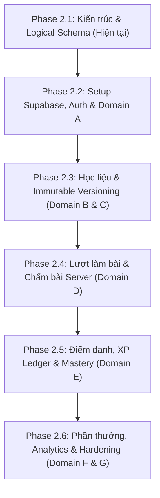

# MẦM VĂN – PHASE 2.1
# TÀI LIỆU 06: LỘ TRÌNH TRIỂN KHAI CHI TIẾT (PHASE 2 IMPLEMENTATION ROADMAP)

---

## THÔNG TIN KIỂM SOÁT TÀI LIỆU (DOCUMENT CONTROL)

| Mục | Nội dung |
| :--- | :--- |
| **Dự án** | Mầm Văn – Nền tảng Học Ngữ văn Lớp 7 (EdTech) |
| **Giai đoạn** | Phase 2.1 – Supabase Architecture & Logical Database Design |
| **Phiên bản** | v1.0 (Implementation Roadmap) |
| **Trạng thái** | **PROPOSED TECHNICAL ROADMAP – PENDING PO REVIEW** |
| **Tác giả** | Technical Lead & Senior Software Architect |
| **Chiến lược cutover** | **DUAL-REPOSITORY GRADUAL CUTOVER (KHÔNG CHUYỂN ĐỔI ĐỒNG LOẠT)** |

---

## 1. NGUYÊN TẮC CHUYỂN ĐỔI DẦN DẦN (DUAL-REPOSITORY STRATEGY)

Để đảm bảo an toàn tuyệt đối và duy trì khả năng hoạt động ổn định của ứng dụng React:
1. **Không chuyển đổi đồng loạt (No Big-Bang Migration):** Không thay thế toàn bộ `MockRepository` sang `SupabaseRepository` trong một bước duy nhất.
2. **Chiến lược Kho lưu trữ Song song (Dual-Repository):**
   - Tạo `SupabaseRepository.ts` hiện thực hóa interface `Repository` (`src/services/repository.ts`).
   - Cung cấp cờ cấu hình môi trường `VITE_DATA_SOURCE = 'mock' | 'supabase'`.
   - Mỗi phương thức trong `SupabaseRepository` được chuyển giao từng bước; các màn hình chưa chuyển đổi vẫn tiếp tục đọc từ `MockRepository` mà không gây lỗi giao diện.
3. **Bảo tồn Giao diện Người dùng (Preserve UI):** Tầng UI (`src/screens/`, `src/components/`) chỉ phụ thuộc vào interface `Repository`, do đó không cần phải viết lại giao diện khi chuyển sang Supabase.

---

## 2. PHÂN KỲ TRIỂN KHAI CHI TIẾT (PHASE 2.2 ĐẾN 2.6)

---

### GIAI ĐOẠN 2.2: SUPABASE SETUP, AUTH FOUNDATION & CORE SCHEMA (DOMAIN A)

- **Mục tiêu:** Khởi tạo môi trường Supabase, thiết lập DDL cho Domain A (Identity & Classroom), xây dựng luồng đăng nhập định danh cho học sinh và giáo viên.
- **Sản phẩm bàn giao (Deliverables):**
  1. Script DDL `01_domain_a_identity.sql`: Tạo `user_profiles`, `user_roles`, `teacher_profiles`, `student_profiles`, `classes`, `class_memberships`.
  2. RLS Policies cơ bản cho Domain A.
  3. Edge Function `provision_student_accounts`: Hỗ trợ giáo viên tạo danh sách học sinh theo lớp và sinh mật khẩu tạm an toàn.
  4. Seed script nạp dữ liệu mẫu ban đầu (Lớp 7A2, `gv001`, `hs001`).
  5. Triển khai phương thức Auth trong `SupabaseRepository`: `getCurrentUser()`, `login()`, `logout()`.
- **Ràng buộc phụ thuộc:** Product Owner hoàn tất khởi tạo Supabase Project và cung cấp thông tin kết nối qua `.env.local` an toàn.
- **Kiểm thử chấp nhận (Acceptance Tests):**
  - Học sinh đăng nhập bằng mã `hs001` thành công, nhận JWT hợp lệ.
  - Giáo viên đăng nhập bằng email thành công và xem được danh sách lớp 7A2.
  - Học sinh không thể đọc hồ sơ của học sinh lớp khác hoặc tự đổi quyền thành teacher.
- **Kế hoạch Rollback:** Đặt lại `VITE_DATA_SOURCE = 'mock'`; ứng dụng lập tức quay về sử dụng `MockRepository` trên localStorage.
- **Git Checkpoint:** `git commit -m "feat(phase-2.2): supabase auth foundation and domain a schema"`

---

### GIAI ĐOẠN 2.3: LEARNING CONTENT & IMMUTABLE VERSIONING (DOMAIN B & C)

- **Mục tiêu:** Xây dựng kho học liệu khối 7, triển khai hệ thống câu hỏi, đề thi và cơ chế đóng băng phiên bản bất biến (BR-01, BR-05, BR-07, BR-09).
- **Sản phẩm bàn giao (Deliverables):**
  1. Script DDL `02_domain_b_c_content_versioning.sql`: Tạo các bảng Topics, Videos, Theory, Questions, Question Versions, Quizzes, Quiz Versions, Quiz Version Questions, Quiz Assignments.
  2. Script bảo mật: Tạo bảng `secure_answer_keys` và cấu hình chặn toàn bộ quyền SELECT của role `student`.
  3. Stored Procedure `publish_quiz_version(p_quiz_id, ...)` để đóng băng đề thi.
  4. Seed dữ liệu học liệu khối 7 (Chủ đề Thơ bốn chữ - năm chữ, câu hỏi mẫu).
  5. Chuyển đổi các phương thức đọc học liệu trong Repository: `getTopics()`, `getVideoLesson()`, `getTheoryLesson()`, `getQuiz()`.
- **Ràng buộc phụ thuộc:** Hoàn thành Phase 2.2.
- **Kiểm thử chấp nhận (Acceptance Tests):**
  - Học sinh mở xem đề thi chỉ nhận được `public_payload`, kiểm tra tab Network không thấy trường đáp án đúng.
  - Giáo viên chỉnh sửa đề thi tạo ra `quiz_versions (v2)`, bản ghi `v1` cũ không bị thay đổi dữ liệu.
  - Bài kiểm tra đã giao (`quiz_assignments`) hiển thị đúng phiên bản đề được ghim.
- **Kế hoạch Rollback:** Tắt cờ đọc Content từ Supabase, tiếp tục đọc mock content.
- **Git Checkpoint:** `git commit -m "feat(phase-2.3): content repository and immutable versioning schema"`

---

### GIAI ĐOẠN 2.4: ATTEMPT, ANSWER, ESSAY & SERVER-SIDE GRADING (DOMAIN D)

- **Mục tiêu:** Lưu vết đầy đủ lượt làm bài, câu trả lời chi tiết của học sinh, chấm trắc nghiệm server-side và hỗ trợ quy trình giáo viên chấm bài tự luận (BR-03, BR-04, BR-08, BR-10).
- **Sản phẩm bàn giao (Deliverables):**
  1. Script DDL `03_domain_d_attempts_grading.sql`: Tạo `quiz_attempts`, `attempt_answers`, `essay_submissions`, `essay_ai_evaluations`, `essay_teacher_reviews`.
  2. Stored Procedure `submit_quiz_attempt`: Chấm điểm trắc nghiệm server-side đối chiếu với `secure_answer_keys`.
  3. Stored Procedure `grade_essay_submission`: Giáo viên chấm bài tự luận và chốt điểm chính thức.
  4. Edge Function `evaluate_essay_gemini`: Tự động gọi Gemini AI sinh điểm gợi ý và nhận xét nội bộ cho giáo viên.
  5. Chuyển đổi màn hình `QuizRunner` và `TeacherGradingScreen` sang gọi Supabase.
- **Ràng buộc phụ thuộc:** Hoàn thành Phase 2.3.
- **Kiểm thử chấp nhận (Acceptance Tests):**
  - Học sinh nộp bài: Dữ liệu câu trả lời chi tiết được lưu trong `attempt_answers` (khắc phục dứt điểm GAP-01).
  - Học sinh nộp bài có câu tự luận: Điểm trắc nghiệm được tính, câu tự luận chờ giáo viên chấm; Mastery năng lực viết chưa bị tăng trước khi giáo viên duyệt (khắc phục GAP-02 và GAP-03).
  - Học sinh không thể xem bảng `essay_ai_evaluations`.
- **Kế hoạch Rollback:** Giữ nguyên dữ liệu database; cấu hình màn hình Quiz đọc ghi tạm thời trên local state nếu phát hiện lỗi tính điểm.
- **Git Checkpoint:** `git commit -m "feat(phase-2.4): attempts tracking and server-authoritative grading"`

---

### GIAI ĐOẠN 2.5: ATTENDANCE, XP LEDGER, MASTERY & LEARNING PROGRESS (DOMAIN E)

- **Mục tiêu:** Hiện thực hóa sổ cái XP bất biến, điểm danh chủ động +2 XP theo ngày học tập Việt Nam, theo dõi xem video $\ge 80\%$ chống timer ảo và tính toán Mastery (BR-02, BR-11).
- **Sản phẩm bàn giao (Deliverables):**
  1. Script DDL `04_domain_e_progress_xp.sql`: Tạo `attendance_records`, `xp_ledger`, `video_watch_progress`, `mastery_evidence`, `student_mastery_snapshots`.
  2. Stored Procedure `claim_daily_attendance`: Điểm danh chống gian lận và cộng XP có đối soát Idempotency theo múi giờ `Asia/Ho_Chi_Minh`.
  3. Stored Procedure `verify_video_completion`: Hợp nhất các khoảng thời gian xem thực tế $\ge 80\%$ thời lượng video.
  4. Stored Procedure `recalculate_student_mastery`: Tổng hợp bằng chứng năng lực cập nhật Cây Trưởng Thành.
- **Ràng buộc phụ thuộc:** Hoàn thành Phase 2.4.
- **Kiểm thử chấp nhận (Acceptance Tests):**
  - Học sinh đăng nhập không tự động được cộng XP. Bấm "Điểm danh" nhận đúng +2 XP. Bấm lần thứ hai trong ngày báo lỗi `ALREADY_CLAIMED_TODAY`.
  - Mở video và tua nhanh đến cuối: Hệ thống từ chối xác nhận hoàn thành vì tổng thời gian xem duy nhất $< 80\%$.
  - Sổ cái `xp_ledger` ghi nhận đầy đủ `raw_xp` và `actual_xp`.
- **Git Checkpoint:** `git commit -m "feat(phase-2.5): xp ledger, attendance and video verification"`

---

### GIAI ĐOẠN 2.6: REWARDS, ANALYTICS, AUDIT & SECURITY HARDENING (DOMAIN F & G)

- **Mục tiêu:** Cửa hàng quà tặng bảo mật, báo cáo thống kê Analytics lớp học cô lập với dữ liệu kiểm thử, nhật ký kiểm toán và rà soát an ninh toàn diện (BR-01, BR-06).
- **Sản phẩm bàn giao (Deliverables):**
  1. Script DDL `05_domain_f_g_rewards_audit.sql`: Tạo `reward_catalog`, `reward_secrets`, `reward_claims`, `system_settings`, `audit_logs`.
  2. Stored Procedure `unlock_reward_secret`: Đổi quà trừ XP và trả về bí mật an toàn.
  3. Database Views phục vụ Analytics giáo viên chạy trực tiếp trên schema Production đã cô lập.
  4. Rà soát an ninh tổng thể: Chạy kiểm thử thâm nhập tự động (Pen-testing) trên RLS policies.
- **Ràng buộc phụ thuộc:** Hoàn thành Phase 2.5.
- **Kiểm thử chấp nhận (Acceptance Tests):**
  - Học sinh không thể đọc nội dung bảng `reward_secrets` khi chưa đủ điểm và chưa gọi RPC đổi quà.
  - Analytics của giáo viên chỉ hiển thị dữ liệu của học sinh trong lớp mình quản lý, không bị lẫn bài làm thử nghiệm của môi trường test.
- **Git Checkpoint:** `git commit -m "feat(phase-2.6): rewards vault, analytics views and security hardening"`

---
*(Xem tiếp Tài liệu 07 để biết Danh mục các Quyết định Kiến trúc Mở cần Product Owner phê duyệt).*
